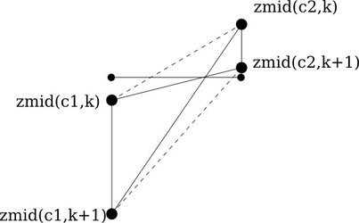

.. _dev_ocean_framework:

Ocean framework
===============

The ``ocean`` core contains a small amount of shared framework code that we
expect to expand in the future as new test cases are added.

Namelist replacements and streams files
---------------------------------------

The modules ``compass.ocean.namelists`` and ``compass.ocean.streams`` contain
namelist replacements and streams files that are similar to core-level
templates in :ref:`legacy_compass`.  Current templates are for adjusting sea
surface height in ice-shelf cavities, and outputting variables related to
frazil ice and land-ice fluxes.

.. _dev_ocean_framework_vertical:

Vertical coordinate
-------------------

The ``compass.ocean.vertical`` module provides support for computing general
vertical coordinates for MPAS-Ocean test cases.

The ``compass.ocean.vertical.grid_1d`` module provides 1D vertical
coordinates.  To create 1D vertical grids, test cases should call
:py:func:`compass.ocean.vertical.grid_1d.generate_1d_grid()` with the desired
config options set in the ``vertical_grid`` section (as described in
:ref:`ocean_vertical`).

The z-level and z-star coordinates are also controlled by config options from
this section of the config file. The function
:py:func:`compass.ocean.vertical.init_vertical_coord()` can be used to compute
``minLevelCell``, ``maxLevelCell``, ``cellMask``, ``layerThickness``, ``zMid``,
and ``restingThickness`` variables for :ref:`ocean_z_level` and
:ref:`ocean_z_star` coordinates using the ``ssh`` and ``bottomDepth`` as well
as config options from ``vertical_grid``.

.. _dev_ocean_framework_mesh:

Mesh
----

The ``compass.ocean.mesh`` package includes modules for modifying spherical
ocean meshes shared across test groups.

.. _dev_ocean_framework_remap_topography:

Remapping Topography
~~~~~~~~~~~~~~~~~~~~

After building a base spherical mesh (see :ref:`dev_spherical_meshes`),
the global ocean :ref:`dev_ocean_global_ocean_mesh` includes a step for
remapping topography data (bathymetry, ocean mask, land-ice draft, land-ice
thickness, grounded and floating land-ice masks, etc.) to the MPAS mesh.  This
step is controlled by config options described in
:ref:`ocean_remap_topography`.

By default, the step creates a partitioned SCRIP file and generates a mapping
file using the `tempest <https://github.com/ClimateGlobalChange/tempestremap>`_
and `MOAB <https://sigma.mcs.anl.gov/moab-library/>`_
tools. It can optionally use ESMF's
`ESMF_RegridWeightGen <https://earthsystemmodeling.org/docs/release/ESMF_8_4_1/ESMF_refdoc/node3.html#SECTION03020000000000000000>`_
tool to generate a mapping files. In either case, the step then uses
`ncremap <https://nco.sourceforge.net/nco.html#ncremap-netCDF-Remapper>`_
to perform remapping to the MPAS mesh.  Finally, it renames the
topography variables to the following names, expected in MPAS-Ocean's init mode
for the global ocean:

.. code-block:: python

    rename = {'bathymetry_var': 'bed_elevation',
              'ice_draft_var': 'landIceDraftObserved',
              'ice_thickness_var': 'landIceThkObserved',
              'ice_frac_var': 'landIceFracObserved',
              'grounded_ice_frac_var': 'landIceGroundedFracObserved',
              'ocean_frac_var': 'oceanFracObserved'}

.. _dev_ocean_framework_cull_mesh:

Culling Meshes
~~~~~~~~~~~~~~

The ``compass.ocean.mesh.cull`` module is for culling land cells from
global ocean meshes.

The class :py:class:`compass.ocean.mesh.cull.CullMeshStep` culls out land
cells by calling ``cull_mesh()``.

:py:func:`compass.ocean.mesh.cull.cull_mesh()` uses a number of
capabilities from `MPAS-Tools <http://mpas-dev.github.io/MPAS-Tools/stable/>`_
and `geometric_features <http://mpas-dev.github.io/geometric_features/stable/>`_
to cull the mesh.  It performs the following steps:

1. combining Natural Earth land coverage north of 60S with Antarctic
   ice coverage or grounded ice coverage from BedMachineAntarctica

2. combining transects defining critical passages (if
   ``with_critical_passages=True``)

3. combining points used to seed a flood fill of the global ocean.

4. create masks from land coverage

5. add land-locked cells to land coverage mask.

6. create masks from transects (if ``with_critical_passages=True``)

7. cull cells based on land coverage but with transects present

8. create flood-fill mask based on seeds

9. cull cells based on flood-fill mask

10. create masks from transects on the final culled mesh (if
    ``with_critical_passages=True``)

.. _dev_ocean_framework_floodplain:

Including a Floodplain
~~~~~~~~~~~~~~~~~~~~~~

The ``compass.ocean.mesh.floodplain`` module is for adding support for a
floodplain to a base global ocean mesh.

The class :py:class:`compass.ocean.mesh.floodplain.FloodplainMeshStep`
descends from :py:class:`compass.mesh.QuasiUniformSphericalMeshStep`, adding
an attribute:

``self.preserve_floodplain``
    A ``bool`` defining whether the mesh includes land cells

and including topography in the base mesh from the
`SRTM15_plus_earth_relief_15s.nc` file in the `bathymetry_database`.  The
``run()`` method uses the config option:

.. code-block:: ini

    # options for spherical meshes
    [spherical_mesh]

    # Elevation threshold to use for including land cells
    floodplain_elevation = 10.0

to determine the elevation of the floodplain to maintain above sea level.
The bathymetry and the floodplain are added to the mesh using
:py:func:`mpas_tools.ocean.inject_bathymetry()` and
:py:func:`mpas_tools.ocean.inject_preserve_floodplain()`, respectively.

.. _dev_ocean_framework_haney:

Haney number
------------

The module ``compass.ocean.haney`` defines a function
:py:func:`compass.ocean.haney.compute_haney_number()` for computing the Haney
number (`Haney 1991 <https://doi.org/10.1175/1520-0485(1991)021%3C0610:OTPGFO%3E2.0.CO;2>`_).
The Haney number is a measure of how large pressure-gradient errors are likely
to be based on how thin and tilted the model layers have become.

.. math::

    r_{x1}(e,k+1/2) =
        \frac{\left|z_\textrm{mid}(c_2, k) − z_\textrm{mid}(c_1 , k)
                    + z_\textrm{mid}(c_2, k+1) − z_\textrm{mid}(c_1, k+1)\right|}
             {z_\textrm{mid}(c_2, k) − z_\textrm{mid}(c_2 , k+1)
              + z_\textrm{mid}(c_1, k) − z_\textrm{mid}(c_1, k+1)},

where the computation is centered at edge :math:`e` and at the interface
between layers :math:`k` and :math:`k+1`, adjacent to cells :math:`c_1` and
:math:`c_2`.  The elevation of the middle of layer :math:`k` at the center of
cell :math:`c` is :math:`z_\textrm{mid}(c, k)`.

    The locations of four adjacent cell centers used in the computation of the
    Haney number (and the horizontal pressure-gradient force).

.. _dev_ocean_framework_iceshelf:

Ice-shelf cavities
------------------

The module ``compass.ocean.iceshelf`` defines two functions that are used to
set up domains with ice-shelf cavities.

:py:func:`compass.ocean.iceshelf.compute_land_ice_pressure_and_draft()`
computes the ``landIcePressure`` and ``landIceDraft`` fields based on the
sea-surface height (SSH) and a reference density (typically the the Boussinesq
reference density).

:py:func:`compass.ocean.iceshelf.adjust_ssh()` performs a series of forward
runs with MPAS-Ocean to detect and correct imbalances between the SSH and the
land-ice pressure.  In each forward run, the SSH is allowed to evolve forward
in time for a short period (typically 1 hour), then the resulting change in
SSH is translated into a compensating change in land-ice pressure that is
expected to reduce the change in SSH.  The initial land-ice pressure is updated
accordingly and the process is repeated for a fixed number of iterations,
typically leading to smaller and smaller changes in the land-ice pressure.
This process does not completely eliminate the dynamical adjustment of the
ocean to the overlying weight of the ice shelf but it tends to reduce it
substantially and to prevent it from causing numerical instabilities.  This
procedure is also largely agnostic to the equation of state being used or the
method for implementing the horizontal pressure-gradient force.

.. _dev_ocean_framework_particles:

Particles
---------

The ``compass.ocean.particles`` module contains functionality for initializing
particles for the `LIGHT framework <https://doi.org/10.1175/JPO-D-14-0260.1>`_.

:py:func:`compass.ocean.particles.write()` creates an initial condition for
particles partitioned across cores.  There are 3 possible particle types (or
``all`` to indicate that all 3 types will be generated):

``buoyancy``
  Particles are constrained to buoyancy (isopycnal) surfaces

``passive``
  Particles move both horizontally and vertically as passive tracers

``surface``
  Particles are constrained to the top ocean level

:py:func:`compass.ocean.particles.remap_particles()` is used to remap particles
onto a new grid decomposition.  This might be useful, for example, if you wish
to change the number of cores that a particle initial condition should run on.

.. _dev_ocean_framework_plot:

Plotting
--------

The ``compass.ocean.plot`` contains functionality for plotting the initial
state and 1D vertical grid.

:py:func:`compass.ocean.plot.plot_initial_state()` creates histogram plots of
salinity, temperature, bottom depth, ``maxLevelCell``, layer thickness and the
Haney number from global initial condition.  This is useful for providing a
quick sanity check that these values have the expected range and distribution,
based on previous meshes.

:py:func:`compass.ocean.plot.plot_vertical_grid()` plot the vertical grid in
3 ways: layer mid-depth vs. vertical index; layer mid-depth vs. layer thickness;
and layer thickness vs. vertical index.  Again, this provides a quick sanity
check that the grid has the expected bounds (both in thickness and in depth)
and number of layers.
