.. _dev_tutorial_add_rrm:

Developer Tutorial: Adding a new ocean/sea ice regionally refined mesh (RRM)
============================================================================

This tutorial presents a step-by-step guide to adding a new mesh to the
``global_ocean`` test group in ``compass`` (see the :ref:`glossary` for
definitions of some relevant terms).  In this tutorial, I will add a new
mesh called YAM ("yet another mesh") that is based on techniques used to build
the existing :ref:`dev_ocean_global_ocean_sowisc12to30` as well as
:ref:`dev_ocean_global_ocean_wc14` meshes.

.. _dev_tutorial_add_rrm_getting_started:

Getting started
---------------

To begin with, you will need to check out the compass repo and create a new
branch from ``main`` for developing the new mesh.  For this purpose, we
will stick with the simpler approach in :ref:`dev_compass_repo` here, but feel
free to use the ``worktree`` approach instead if you are comfortable with it.

.. code-block:: bash

    git clone git@github.com:MPAS-Dev/compass.git add-yet-another-mesh
    cd add-yet-another-mesh
    git checkout -b add-yet-another-mesh

Now, you will need to create a conda environment for developing compass, as
described in :ref:`dev_conda_env`.  We will assume a simple situation where
you are working on a "supported" machine and using the default compilers and
MPI libraries, but consult the documentation to make an environment to suit
your needs.

.. code-block:: bash

  # this one will take a while the first time
  ./conda/configure_compass_env.py --conda $HOME/miniforge --env_name compass_yam

If you don't already have Miniforge3 installed in the directory pointed to by
``--conda``, it will be installed automatically for you.  If all goes well, you
will have a file named ``load_compass_yam*.sh``, where the details of the
``*`` depend on your specific machine and compilers.  For example, on
Chrysalis, you will have ``load_compass_yam_chrysalis_intel_openmpi.sh``,
which will be the example used here:

.. code-block:: bash

  source load_compass_yam_chrysalis_intel_openmpi.sh

Now, we're ready to get the MPAS-Ocean source code from the E3SM repository:

.. code-block:: bash

  # Get the E3SM code -- this one takes a while every time
  git submodule update --init --recursive

Next, we're ready to build the MPAS-Ocean executable:

.. code-block:: bash

  cd E3SM-Project/components/mpas-ocean/
  make ifort
  cd ../../..

The make target will be different depending on the machine and compilers, see
:ref:`dev_supported_machines` or :ref:`dev_other_machines` for the right one
for your machine.

Now, we're ready to start developing!

.. _dev_tutorial_add_rrm_add_mesh:

Adding a new mesh
-----------------

Use any method you like for editing code.  If you haven't settled on a method
and are working on your own laptop or desktop, you may want to try an
integrated development environment (`PyCharm <https://www.jetbrains.com/pycharm/>`_
is a really nice one).  They have features to make sure your code adheres to
the style required for compass (see :ref:`dev_style`).  ``vim``, ``emacs`` or
a similar tool will work fine on supercomputers.  Keep in mind that you can
edit code on your laptop or desktop but you will need to use a high-performance
computing (HPC) machine to generate a mesh.  One step requires >=360 cores to
remap a high resolution topography dataset to the MPAS mesh.

Your new mesh will be defined in a directory within the ``global_ocean`` test
group's ``mesh`` package.  For this example, we create a new ``yam10to60``
directory in ``compass/ocean/tests/global_ocean/mesh``.  The directory name
should be all lowercase with no underscores.  The convention is to give your
mesh a short prefix (``yam`` for "yet another mesh" in our case) and then
the finest and coarsest resolutions in km.  In that directory, we
will make a new file called ``__init__.py``.  In that file, we will start to
define a ``YAM10to60BaseMesh`` class.

.. code-block:: bash

    cd compass/ocean/tests/global_ocean/mesh
    mkdir yam10to60
    cd yam10to60
    vim __init__.py

We define the resolution as a function of space using a regular
latitude-longitude map of the distance between cell centers in km.  To begin
with , we will start out with something really simple: a quasi-uniform 60 km
mesh.  We will make a 2D field called ``cellWidth`` on a 0.1 degree, regular
latitude-longitude grid.

.. code-block:: python

    import numpy as np

    from compass.mesh import QuasiUniformSphericalMeshStep

    class YAM10to60BaseMesh(QuasiUniformSphericalMeshStep):
        """
        A step for creating YAM10to60 meshes
        """

        def build_cell_width_lat_lon(self):
            """
            Create cell width array for this mesh on a regular latitude-longitude
            grid

            Returns
            -------
            cellWidth : numpy.array
                m x n array of cell width in km

            lon : numpy.array
                longitude in degrees (length n and between -180 and 180)

            lat : numpy.array
                longitude in degrees (length m and between -90 and 90)
            """

            dlon = 0.1
            dlat = dlon
            nlon = int(360. / dlon) + 1
            nlat = int(180. / dlat) + 1
            lon = np.linspace(-180., 180., nlon)
            lat = np.linspace(-90., 90., nlat)

            cell_width = 60.0 * np.ones((nlat, nlon))

            return cell_width, lon, lat

We also need a config file for the mesh.  For now, it can just be empty:

.. code-block:: bash

    touch yam10to60.cfg

Next, we need to add this mesh to the list of known meshes:

.. code-block:: bash

    cd ..
    vim __init__.py

.. code-block:: python
    :emphasize-lines: 5, 24-25

    ...

    from compass.ocean.tests.global_ocean.mesh.so12to30 import SO12to30BaseMesh
    from compass.ocean.tests.global_ocean.mesh.wc14 import WC14BaseMesh
    from compass.ocean.tests.global_ocean.mesh.yam10to60 import YAM10to60BaseMesh
    from compass.ocean.tests.global_ocean.metadata import (
        get_author_and_email_from_git,
    )

    ...

    class Mesh(TestCase):

    ...

        def __init__(self, test_group, mesh_name, remap_topography):

        ...

            elif mesh_name.startswith('Kuroshio'):
                base_mesh_step = KuroshioBaseMesh(self, name=name, subdir=subdir)
            elif mesh_name in ['WC14', 'WCwISC14']:
                base_mesh_step = WC14BaseMesh(self, name=name, subdir=subdir)
            elif mesh_name in ['YAM10to60', 'YAMwISC10to60']:
                base_mesh_step = YAM10to60BaseMesh(self, name=name, subdir=subdir)
            else:
                raise ValueError(f'Unknown mesh name {mesh_name}')

In compass, we support 2 versions of nearly every mesh, 1 where everything
south of the Antarctic coast is treated as land and 1 where we include the
ocean cavities below Antarctic ice shelves (``wISC``, meaning "with ice-shelf
cavities")

Next, we add a test case for making this mesh to the ``global_ocean`` test
group:

.. code-block:: bash

    cd ..
    vim __init__.py

.. code-block:: python
    :emphasize-lines: 18-22

    ...

    class GlobalOcean(TestGroup):

        ...

        def __init__(self, mpas_core):

            ...

            self._add_tests(mesh_names=['WC14', 'WCwISC14'],
                            DynamicAdjustment=WC14DynamicAdjustment)

            # Kuroshio meshes without ice-shelf cavities
            self._add_tests(mesh_names=['Kuroshio12to60', 'Kuroshio8to60'],
                            DynamicAdjustment=KuroshioDynamicAdjustment)

            for mesh_name in ['YAM10to60', 'YAMwISC10to60']:
                mesh_test = Mesh(test_group=self, mesh_name=mesh_name,
                                 remap_topography=True)
                self.add_test_case(mesh_test)

            # A test case for making E3SM support files from an existing mesh
            self.add_test_case(FilesForE3SM(test_group=self))

Okay, great!  We're ready to test this out!

.. _dev_tutorial_add_rrm_test_mesh:

Running the mesh test case
--------------------------

First, let's make sure the mesh exists when we list the available test cases
in compass:

.. code-block:: bash

    compass list

You should see something like:

.. code-block::
    :emphasize-lines: 7-8

     ...

     250: ocean/global_ocean/Kuroshio8to60/WOA23/init
     251: ocean/global_ocean/Kuroshio8to60/WOA23/performance_test
     252: ocean/global_ocean/Kuroshio8to60/WOA23/dynamic_adjustment
     253: ocean/global_ocean/Kuroshio8to60/WOA23/files_for_e3sm
     254: ocean/global_ocean/YAM10to60/mesh
     255: ocean/global_ocean/YAMwISC10to60/mesh
     256: ocean/global_ocean/files_for_e3sm
     257: ocean/gotm/default

     ...

On one of the supported HPC machines, let's try setting up and running the mesh
step.  We will concentrate on the mesh without ice-shelf cavities ``YAM10to60``
for now because it is a little simpler.  Here's an example that should work on
Chrysalis or Anvil:

.. code-block:: bash

    compass setup -n 254 \
        -p E3SM-Project/components/mpas-ocean/ \
        -w /lcrc/group/e3sm/${USER}/compass_tests/tests_20230527/yam10to60_uniform60km

The number provided (e.g. ``254``) is the number of the test case in
``compass list`` above.  Since these numbers change frequently, you should
check each time you check out or rebase the code with something like
``compass list | grep YAM``

The directory you point to with ``-p`` is where you build MPAS-Ocean.  We don't
actually need that quite yet but we will soon when we add an initial condition
on the mesh.  The base work directory you point to with ``-w`` should be a
location in a scratch space where you can set up temporary tests.  We recommend
including a date somewhere in the path just to keep things organized but that
is up to you.

For simplicity, it is a good idea to open a new terminal for running the test.
In the new terminal window:

.. code-block:: bash

    cd /lcrc/group/e3sm/${USER}/compass_tests/tests_20230527/yam10to60_uniform60km
    vim job_script.custom.sh
    sbatch job_script.custom.sh

If you prefer, you can get an interactive node and run the same commands as
in the job script:

.. code-block:: bash

    source load_compass_env.sh
    compass run custom

Assuming you submitted the job script as above, you can monitor the output
file:

.. code-block::

    $ tail -f compass.o*

    Loading conda environment
    Done.

    Loading Spack environment...
    Done.

    ocean/global_ocean/YAM10to60/mesh
      * step: base_mesh
      * step: remap_topography
      * step: cull_mesh
      test execution:      SUCCESS
      test runtime:        11:31
    Test Runtimes:
    11:31 PASS ocean_global_ocean_YAM10to60_mesh
    Total runtime 11:32
    PASS: All passed successfully!

If things don't go well, you might see something like:

.. code-block::

    Loading conda environment
    Done.

    Loading Spack environment...
    Done.

    ocean/global_ocean/YAM10to60/mesh
      * step: base_mesh
          Failed
      test execution:      ERROR
      see: case_outputs/ocean_global_ocean_YAM10to60_mesh.log
      test runtime:        00:00
    Test Runtimes:
    00:00 FAIL ocean_global_ocean_YAM10to60_mesh
    Total runtime 00:01
    FAIL: 1 test failed, see above.

Hopefully, the contents of the log file, in this case
``case_outputs/ocean_global_ocean_YAM10to60_mesh.log``, can help you debug
what went wrong.

Once the ``base_mesh`` step has completed, you should see:

.. code-block:: bash

    $ ls ocean/global_ocean/YAM10to60/mesh/base_mesh/
    base_mesh.nc          geom.msh             mesh.cfg           opts.log
    base_mesh_vtk         graph.info           mesh.msh           spac.msh
    cellWidthGlobal.png   job_script.sh        mesh_triangles.nc  step.pickle
    cellWidthVsLatLon.nc  load_compass_env.sh  opts.jig

The main result is the file ``base_mesh.nc``

.. code-block:: bash

    $ cd ocean/global_ocean/YAM10to60/mesh/base_mesh/
    $ source load_compass_env.sh
    $ ncdump -h base_mesh.nc

    netcdf base_mesh {
    dimensions:
        Time = UNLIMITED ; // (0 currently)
        nCells = 165049 ;
        nEdges = 495141 ;
        nVertices = 330094 ;
        maxEdges = 8 ;
        maxEdges2 = 16 ;
        TWO = 2 ;
        vertexDegree = 3 ;
    variables:
        int edgesOnEdge(nEdges, maxEdges2) ;

    ...

You can get take a look at the map of resolution in ``cellWidthGlobal.png``:

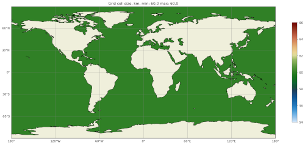

Not very interesting so far but it will be informative once we start to
vary the resolution later.

If you want to view the mesh, you can copy the file
``base_mesh_vtk/staticFieldsOnCells.vtp`` over to your laptop or desktop and
open it in ParaView.  See
`ParaView VTK Extractor <http://mpas-dev.github.io/MPAS-Tools/stable/visualization.html#paraview-vtk-extractor>`_
for more details on the tool used to extract the mesh VTK file.

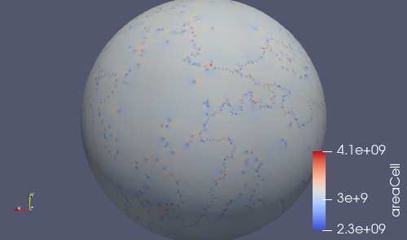

The ``remap_topography`` step will produce:

.. code-block:: bash

    $ cd ../remap_topography/
    $ ls
    base_mesh.nc                                    src_mesh.nc
    dst_mesh.nc                                     step.pickle
    job_script.sh                                   topography.nc
    load_compass_env.sh                             topography_ncremap.nc
    map_0.013x0.013degree_to_YAM10to60_conserve.nc  topography_remapped.nc
    mesh.cfg

Here, the main result is ``topography_remapped.nc``, the ocean bathymetry and
Antarctic ice topography remapped to the mesh defined in ``base_mesh.nc``.

Finally, the ``cull_mesh`` step will remove land cells from the mesh:

The ``remap_topography`` step will produce:

.. code-block:: bash

    $ cd ../cull_mesh/
    $ ls
    base_mesh.nc                     job_script.sh
    critical_blockages.geojson       land_mask.nc
    critical_blockages.nc            land_mask_with_land_locked_cells.nc
    critical_passages.geojson        load_compass_env.sh
    critical_passages_mask_final.nc  mesh.cfg
    critical_passages.nc             step.pickle
    culled_graph.info                topography_culled.nc
    culled_mesh.nc                   topography.nc
    culled_mesh_vtk

Here, the main output is ``culled_mesh.nc``.  Similarly to the base mesh, you
can look at the the culled mesh in ParaVeiw by copying
``culled_mesh_vtk/staticFieldsOnCells.vtp`` to your laptop or desktop.

.. image:: images/qu60_culled_paraview.png
   :width: 500 px
   :align: center

Here, we have placed a white sphere inside the mesh so the land regions are
easier to see.  After culling, the land just appears as holes in the mesh.

.. _dev_tutorial_add_rrm_ec_base_mesh:

Switching to an EC30to60 base resolution
----------------------------------------

Returning to the terminal where we are developing the code, let's make the mesh
more interesting.

So far, all E3SM ocean and sea-ice RRMs start with the EC30to60 (eddy-closure
30 to 60 km) mesh as their base resolution.  Let's do the same here. Starting
from the base of your development branch:

.. code-block:: bash

    cd compass/ocean/tests/global_ocean/mesh/yam10to60
    vim __init__.py

We will replace the constant 60-km mesh resolution with a latitude-dependent
function from the
`mesh_definition_tools <http://mpas-dev.github.io/MPAS-Tools/stable/mesh_creation.html#mesh-definition-tools>`_
module from MPAS-Tools. The default EC mesh has resolutions of 35 km at the
poles, 60 km at mid-latitudes and 30 km at the equator.

.. code-block:: python
    :emphasize-lines: 1, 17-18

    import mpas_tools.mesh.creation.mesh_definition_tools as mdt
    import numpy as np

    from compass.mesh import QuasiUniformSphericalMeshStep

    class YAM10to60BaseMesh(QuasiUniformSphericalMeshStep):

        ...

        def build_cell_width_lat_lon(self):

            ...

            lat = np.linspace(-90., 90., nlat)

            cell_width_vs_lat = mdt.EC_CellWidthVsLat(lat)
            cell_width = np.outer(cell_width_vs_lat, np.ones([1, lon.size]))

            return cell_width, lon, lat

At this point, you can set up and test again like you did in
:ref:`dev_tutorial_add_rrm_test_mesh`, but this time you will want to use
a different work directory name, e.g.:

.. code-block:: bash

    compass setup -n 254 \
        -p E3SM-Project/components/mpas-ocean/ \
        -w /lcrc/group/e3sm/${USER}/compass_tests/tests_20230527/yam10to60_ec

Switch back to your other terminal to submit the job and look at the results.
The map of resolution in ``base_mesh/cellWidthGlobal.png`` should look like:

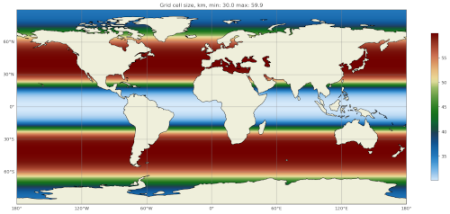

After culling, the mesh in ``culled_mesh/culled_mesh_vtk/staticFieldsOnCells.vtp``
should look like:

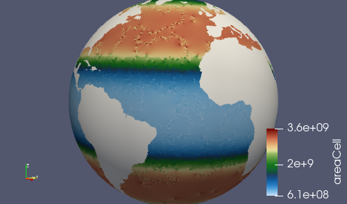

.. _dev_tutorial_add_rrm_add_high_res:

Adding regions of higher resolution
-----------------------------------

Now, let's add some regions of higher resolution to the mesh.

We typically define these regions using `geojson <https://geojson.org/>`_
files.  The easiest way to create them is to go to `geojson.io <https://geojson.io/>`_.
There, you can find your way to the part of the globe you want to refine
and use the polygon tool to make a shape that will act as the boundary for your
high resolution region.

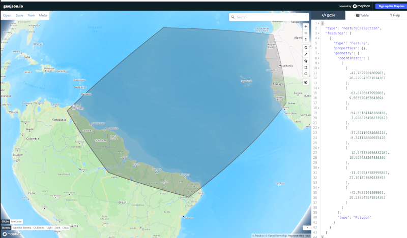

In my case, I have defined a region across the south Atlantic ocean with its
western side centered around the outlet of the Amazon river.  My plan is to
define a region of moderately higher resolution across a fairly broad region
first, then define a region of higher resolution close to the Amazon delta
in a subsequent step.

Let's make an actual ``geojson`` file with this contents.  In your terminal for
editing code, from the root of the branch where we're developing:

.. code-block:: bash

    cd compass/ocean/tests/global_ocean/mesh/yam10to60
    vim northern_south_atlantic.geojson

Copy the contents of the json code on the right-hand side of the geojson.io
window and paste it into the file:

.. code-block:: json

    {
      "type": "FeatureCollection",
      "features": [
        {
          "type": "Feature",
          "properties": {},
          "geometry": {
            "coordinates": [
              [
                [
                  -42.7022201869903,
                  28.229943571814303
                ],
                [
                  -63.8408547092003,
                  9.565520467643694
                ],
                [
                  -54.35184148160458,
                  -3.0088254981339873
                ],
                [
                  -37.52116934686214,
                  -8.341138860925426
                ],
                [
                  -12.947354056832182,
                  10.997433207836309
                ],
                [
                  -11.493517385995887,
                  27.701423680235493
                ],
                [
                  -42.7022201869903,
                  28.229943571814303
                ]
              ]
            ],
            "type": "Polygon"
          }
        }
      ]
    }

Then, modify the ``properties`` dictionary similarly to this example:

.. code-block::
    :emphasize-lines: 6-11

    {
      "type": "FeatureCollection",
      "features": [
        {
          "type": "Feature",
          "properties": {
            "name": "Northern South Atlantic",
            "component": "ocean",
            "object": "region",
            "author": "Xylar Asay-Davis"
          },

          ...

These 4 fields are required for compass to be able to use the file.  The
``name`` and ``author`` are entirely up to you and are intended to help
document the file in some useful way.  The ``component`` must be ``"ocean"``
and the ``object`` must be ``"region"``.

Next, let's make the shape available in the code so we can use it later to make
a higher resolution region:

.. code-block:: bash

    vim __init__.py

.. code-block:: python
    :emphasize-lines: 3, 11-20, 29

    import mpas_tools.mesh.creation.mesh_definition_tools as mdt
    import numpy as np
    from geometric_features import read_feature_collection

    from compass.mesh import QuasiUniformSphericalMeshStep

    class YAM10to60BaseMesh(QuasiUniformSphericalMeshStep):
        """
        A step for creating YAM10to60 meshes
        """
        def setup(self):
            """
            Add some input files
            """
            package = 'compass.ocean.tests.global_ocean.mesh.yam10to60'
            self.add_input_file(filename='northern_south_atlantic.geojson',
                                package=package)
            super().setup()

        def build_cell_width_lat_lon(self):

            ...

            cell_width_vs_lat = mdt.EC_CellWidthVsLat(lat)
            cell_width = np.outer(cell_width_vs_lat, np.ones([1, lon.size]))

            # read the shape
            fc = read_feature_collection('northern_south_atlantic.geojson')

            return cell_width, lon, lat

In the ``setup()`` method above, we add the geojson file as an input to the
step that creates the base mesh.  This is how compass finds the geojson file
when it's setting up the work directory where we will build the base mesh.

In the ``build_cell_width_lat_lon()`` method, we read in a the geojson file
into a "feature collection" (``fc``) object that we will use below to define
the higher resolution region.

Now, let's make further changes to the same file to use the shape to add a
higher resolution region:

.. code-block:: bash

    vim __init__.py

.. code-block:: python
    :emphasize-lines: 4-7, 24-46

    import mpas_tools.mesh.creation.mesh_definition_tools as mdt
    import numpy as np
    from geometric_features import read_feature_collection
    from mpas_tools.cime.constants import constants
    from mpas_tools.mesh.creation.signed_distance import (
        signed_distance_from_geojson,
    )

    from compass.mesh import QuasiUniformSphericalMeshStep

    class YAM10to60BaseMesh(QuasiUniformSphericalMeshStep):

        def build_cell_width_lat_lon(self):

            ...

            cell_width_vs_lat = mdt.EC_CellWidthVsLat(lat)
            cell_width = np.outer(cell_width_vs_lat, np.ones([1, lon.size]))

            # read the shape
            fc = read_feature_collection('northern_south_atlantic.geojson')

            # How wide in meters the smooth transition between the background
            #   resolution and the finer resolution regions should be.
            # 1200 km is equivalent to about 10 degrees latitude
            trans_width = 1200e3

            # The resolution in km of the finer resolution region
            fine_cell_width = 20.

            # the radius of the earth defined in E3SM's shared constants
            earth_radius = constants['SHR_CONST_REARTH']

            # A field defined on the lat-long grid with the signed distance away
            # from the boundary of the shape (positive outside and negative inside)
            atlantic_signed_distance = signed_distance_from_geojson(
                fc, lon, lat, earth_radius, max_length=0.25)

            # A field that goes smoothly from zero inside the shape to one outside
            # the shape over the given transition width.
            weights = 0.5 * (1 + np.tanh(atlantic_signed_distance / trans_width))

            # The cell width in km becomes a blend of the background cell width
            # and the finer cell width using the weights
            cell_width = fine_cell_width * (1 - weights) + cell_width * weights

            return cell_width, lon, lat

The function ``signed_distance_from_geojson()`` creates a functon on the
lat-lon grid that is the distance from any given point on the globe to the
boundary of the shape defined by the geojson file.  The distance is positive
outside the shape and negative inside it.  For better accuracy in computing the
distance, we subdivide the shape into segments of ``max_length=0.25`` degrees
latitude or longitude.  We use the ``earth_radius`` defined in E3SM's shared
constants.

Using the signed distance, we create a blending function ``weights`` that goes
from zero inside the shape smoothly to one outside the shape over a distance of
``trans_width`` meters.  Then, we use the weights to blend from the fine
resolution inside the shape to the EC30to60 background resolution outside the
shape.

There are also fancier ways to define gradients in resolution, for example
using the relative distance between the boundaries of 2 shapes.  These are not
covered in the tutorial but you can get in touch with the E3SM Ocean Team to
discuss ways to define more complex maps of mesh resolution.

Once, again, let's set up and run the mesh test case like we did in
:ref:`dev_tutorial_add_rrm_test_mesh`:

.. code-block:: bash

    compass setup -n 254 \
        -p E3SM-Project/components/mpas-ocean/ \
        -w /lcrc/group/e3sm/${USER}/compass_tests/tests_20230527/yam10to60_alt20km

As before, switch back to your other terminal to submit the job and look at the
results.

.. code-block:: bash

    cd /lcrc/group/e3sm/${USER}/compass_tests/tests_20230527/yam10to60_alt20km
    sbatch job_script.custom.sh
    tail -f compass.o*

The map of resolution in ``base_mesh/cellWidthGlobal.png`` should look
like:

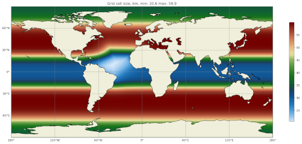

After culling, the mesh in ``culled_mesh/culled_mesh_vtk/staticFieldsOnCells.vtp``
should look like:

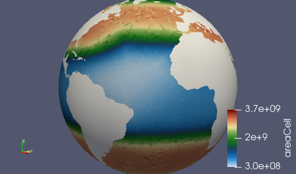

.. _dev_tutorial_add_rrm_add_very_high_res:

Adding a very high resolution region
------------------------------------

Using the same approach as in the previous section, we can define another
region where we will increase the resolution to 10 km.

I used geojson.io to create a region around the Amazon River delta:

.. image:: images/geojson_io_amazon_delta.png
   :width: 800 px
   :align: center

Then, I copied the code and pasted it into a file:

.. code-block:: bash

    cd compass/ocean/tests/global_ocean/mesh/yam10to60
    vim amazon_delta.geojson

I added the ``properties`` dictionary like in the previous example.

.. code-block:: json

    {
      "type": "FeatureCollection",
      "features": [
        {
          "type": "Feature",
          "properties": {
            "name": "Amazon Delta",
            "component": "ocean",
            "object": "region",
            "author": "Xylar Asay-Davis"
          },
          "geometry": {
            "coordinates": [
              [
                [
                  -33.27493467565196,
                  9.398029362516667
                ],
                [
                  -44.499833304073974,
                  11.7502737267192
                ],
                [
                  -54.422618869265236,
                  8.655607226691274
                ],
                [
                  -60.654712683354944,
                  0.9780614705966428
                ],
                [
                  -54.56296235335806,
                  -9.767487562476404
                ],
                [
                  -41.34251704331987,
                  -9.500764493003032
                ],
                [
                  -36.85005485733731,
                  -3.655530642645047
                ],
                [
                  -33.03465151175149,
                  4.644399816423899
                ],
                [
                  -33.27493467565196,
                  9.398029362516667
                ]
              ]
            ],
            "type": "Polygon"
          }
        }
      ]
    }

Using this feature, I added a 10-km region:

.. code-block:: bash

    vim __init__.py

.. code-block:: python
    :emphasize-lines: 11-12, 27-48

    ...

    class YAM10to60BaseMesh(QuasiUniformSphericalMeshStep):
        def setup(self):
            """
            Add some input files
            """
            package = 'compass.ocean.tests.global_ocean.mesh.yam10to60'
            self.add_input_file(filename='northern_south_atlantic.geojson',
                                package=package)
            self.add_input_file(filename='amazon_delta.geojson',
                                package=package)
            super().setup()

        def build_cell_width_lat_lon(self):

            ...

            # A field that goes smoothly from zero inside the shape to one outside
            # the shape over the given transition width.
            weights = 0.5 * (1 + np.tanh(atlantic_signed_distance / trans_width))

            # The cell width in km becomes a blend of the background cell width
            # and the finer cell width using the weights
            cell_width = fine_cell_width * (1 - weights) + cell_width * weights

            # read the shape
            fc = read_feature_collection('amazon_delta.geojson')

            # 400 km is equivalent to about 3 degrees latitude
            trans_width = 400e3

            # The resolution in km of the finer resolution region
            fine_cell_width = 10.

            # A field defined on the lat-long grid with the signed distance away
            # from the boundary of the shape (positive outside and negative inside)
            amazon_delta_signed_distance = signed_distance_from_geojson(
                fc, lon, lat, earth_radius, max_length=0.25)

            # A field that goes smoothly from zero inside the shape to one outside
            # the shape over the given transition width.
            weights = 0.5 * (1 + np.tanh(
                amazon_delta_signed_distance / trans_width))

            # The cell width in km becomes a blend of the background cell width
            # and the finer cell width using the weights
            cell_width = fine_cell_width * (1 - weights) + cell_width * weights

            return cell_width, lon, lat

Same procedure as before, set up the test case:

.. code-block:: bash

    compass setup -n 254 \
        -p E3SM-Project/components/mpas-ocean/ \
        -w /lcrc/group/e3sm/${USER}/compass_tests/tests_20230527/yam10to60_final

Switch back to your other terminal to submit the job and look at the results.

.. code-block:: bash

    cd /lcrc/group/e3sm/${USER}/compass_tests/tests_20230527/yam10to60_final
    sbatch job_script.custom.sh
    tail -f compass.o*

The map of resolution in ``base_mesh/cellWidthGlobal.png`` should look
like:

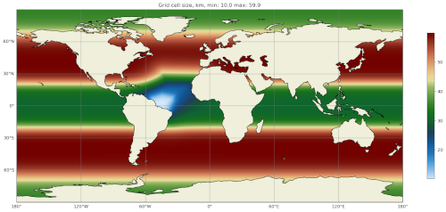

After culling, the mesh in ``culled_mesh/culled_mesh_vtk/staticFieldsOnCells.vtp``
should look like:

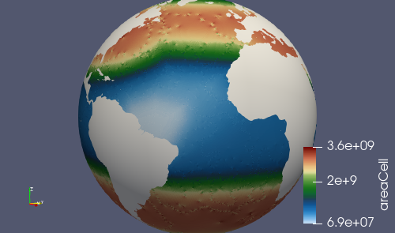

.. _dev_tutorial_add_rrm_add_init:

Adding an initial condition and performance test
------------------------------------------------

We now have a horizontal ocean mesh, but there are several more steps in
compass before we can start to integrate the new mesh into E3SM.

First, we need to add an ``init`` test case that will create the vertical
coordinate and the initial condition.  Most of what we need to define for the
initial condition is set with config options:

.. code-block:: bash

    cd compass/ocean/tests/global_ocean/mesh/yam10to60
    vim yam10to60.cfg

.. code-block:: ini

    # Options related to the vertical grid
    [vertical_grid]

    # the type of vertical grid
    grid_type = index_tanh_dz

    # Number of vertical levels
    vert_levels = 64

    # Depth of the bottom of the ocean
    bottom_depth = 5500.0

    # The minimum layer thickness
    min_layer_thickness = 10.0

    # The maximum layer thickness
    max_layer_thickness = 250.0

    # The characteristic number of levels over which the transition between
    # the min and max occurs
    transition_levels = 28

The standard E3SM v3 vertical grid is defined with these parameters.  It
transitions from 10 m resolution at the surface to 250 m resolution at a depth
of 5500 m over 64 vertical levels.  The transition is centered around the 28th
vertical level.  You can modify these parameters or use a different vertical
coordinate (at your own risk).

Next, we add a section with some required config options including some
metadata:

.. code-block:: bash

    vim yam10to60.cfg

.. code-block:: ini
    :emphasize-lines: 8-43

    ...

    # The characteristic number of levels over which the transition between
    # the min and max occurs
    transition_levels = 28

    # options for global ocean testcases
    [global_ocean]

    # the approximate number of cells in the mesh
    approx_cell_count = 270000

    ## metadata related to the mesh
    # the prefix (e.g. QU, EC, WC, SO)
    prefix = YAM
    # a description of the mesh and initial condition
    mesh_description = Yet Another Mesh (YAM) is regionally refined around the Amazon
                       River delta.  It is used in E3SM version ${e3sm_version} for
                       studies of blah, blah.  It has Enhanced resolution (${min_res} km)
                       around the Amazon delta, 20-km resolution in the northern South
                       Atlantic, 35-km resolution at the poles, 60-km at mid
                       latitudes, and 30-km at the equator.  This mesh has <<<levels>>>
                       vertical levels.
    # E3SM version that the mesh is intended for
    e3sm_version = 3
    # The revision number of the mesh, which should be incremented each time the
    # mesh is revised
    mesh_revision = 1
    # the minimum (finest) resolution in the mesh
    min_res = 10
    # the maximum (coarsest) resolution in the mesh, can be the same as min_res
    max_res = 60
    # The URL of the pull request documenting the creation of the mesh
    pull_request = https://github.com/MPAS-Dev/compass/pull/XXX

    # config options related to initial condition and diagnostics support files
    # for E3SM
    [files_for_e3sm]

    # CMIP6 grid resolution
    cmip6_grid_res = 180x360

The ``approx_cell_count`` is something you can only determine after you've
made the mesh.  In your terminal where you've been running tests:

.. code-block:: bash

    cd /lcrc/group/e3sm/${USER}/compass_tests/tests_20230527/yam10to60_final
    cd ocean/global_ocean/YAM10to60/mesh/cull_mesh
    source load_compass_env.sh
    ncdump -h culled_mesh.nc | more

This will tell you the numer of cells (``nCells``).  Round this to 2
significant digits and put this in ``approx_cell_count``.  This will be used
to determine an appropriate number of MPI tasks and nodes needed to perform
forward runs with this mesh.

The ``prefix`` should match the beginning fo the mesh name we have been using
all along, ``YAM`` in this case.

The ``description`` is used in the metadata of files produced by compass for
this mesh. It should be a fairly detailed description of how resolution is
distributed and what the intended purpose of the mesh is.

The ``e3sm_version`` is what E3SM version the mesh is intended to be used in.
Presumably, this is 3 for the time being, since no new meshes will be added
to v2 and we don't know much about v4 yet.

The ``mesh_revision`` should be 1 to begin with but should be incremented to
give each version of the mesh a unique number.  Typically, it is time to
increase the revision number if you are altering the mesh and the current
revision number has already been used in a simulation that might be published
or put to some other broader scientific or technical use.  If you are still at
the stage of tinkering with the mesh, it may be preferable not to increment the
revision number with each modification.

``min_res`` *must* be the minimum resolution of the mesh in km, and ``max_res``
should be the maximum.  (``min_res`` is used to determine the time step for
forward runs, so that is why it is required to be correct; ``max_res`` is only
used for metadata and in the mesh name.)

``pull_request`` points to a pull request (if there is one) where the mesh
was added to compass.  This is a useful piece of metadata so folks know where
to look for a discussion of the mesh.

``cmip6_grid_res`` is the CMIP6 (and presumably 7) resolution to which data
will be remapped for publication.  Typically, this is ``180x360`` (i.e. a
1 degree grid) for RRMs because a lot of space is otherwise wasted on
coarse-resolution regions.

We also need to override some default namelist options with values appropriate
for the mesh.  Many of these choices will depend on the details of the mesh
you are making.  However, here are some common ones:

.. code-block:: bash

    vim namelist.split_explicit

.. code-block::

    config_time_integrator = 'split_explicit'
    config_run_duration = '0000_01:00:00'
    config_use_mom_del2 = .true.
    config_mom_del2 = 10.0
    config_use_mom_del4 = .true.
    config_mom_del4 = 1.5e10
    config_hmix_scaleWithMesh = .true.
    config_use_GM = .true.
    config_GM_closure = 'constant'
    config_GM_constant_kappa = 600.0

The ``config_run_duration`` is the length of a performance test run, and should
only be a few time steps.

The ``config_mom_del2`` and ``config_mom_del4`` are the eddy viscosity and
eddy hyperviscosity, and typically scale in proportion to the cell size and
the cell size cubed, respectively.  These are appropriate values for a minimum
resolution of 10 km as in this example.  We scale these coefficients with the
cell resolution when ``config_hmix_scaleWithMesh = .true.``.

The GM coefficients can probably be left as they are here for a typical RRM.

Next, we will add the ``init`` and ``performance_tests`` test cases for the
new mesh:

.. code-block:: bash

    cd ../..
    vim __init__.py

.. code-block:: python
    :emphasize-lines: 16-24

    ...

    class GlobalOcean(TestGroup):

        ...

        def __init__(self, mpas_core):

            ...

            for mesh_name in ['YAM10to60', 'YAMwISC10to60']:
                mesh_test = Mesh(test_group=self, mesh_name=mesh_name,
                                 remap_topography=True)
                self.add_test_case(mesh_test)

                init_test = Init(test_group=self, mesh=mesh_test,
                                 initial_condition='WOA23')
                self.add_test_case(init_test)

                self.add_test_case(
                    PerformanceTest(
                        test_group=self, mesh=mesh_test, init=init_test,
                        time_integrator='split_explicit'))

            # A test case for making E3SM support files from an existing mesh
            self.add_test_case(FilesForE3SM(test_group=self))

We have indicated that we want an initial condition interpolated from the
World Ocean Atlas 2023 (WOA23) data set and that we want to use the
split-explicit time integrator (the E3SM default) in our performance test.

Let's see if the test cases show up:

.. code-block:: bash

    compass list | grep YAM

You should see something like:

.. code-block::

     254: ocean/global_ocean/YAM10to60/mesh
     255: ocean/global_ocean/YAM10to60/WOA23/init
     256: ocean/global_ocean/YAM10to60/WOA23/performance_test
     257: ocean/global_ocean/YAMwISC10to60/mesh
     258: ocean/global_ocean/YAMwISC10to60/WOA23/init
     259: ocean/global_ocean/YAMwISC10to60/WOA23/performance_test

Okay, everything looks good. Let's set up and run the 2 remaining tests:

.. code-block:: bash

    compass setup -n 255 256 \
        -p E3SM-Project/components/mpas-ocean/ \
        -w /lcrc/group/e3sm/${USER}/compass_tests/tests_20230527/yam10to60_final

We can save the time of rerunning the ``mesh`` test by setting up in the same
work directory as our final mesh run with 10-km finest resolution.

Switch back to your other terminal to alter the job script and submit the job.

.. code-block:: bash

    cd /lcrc/group/e3sm/${USER}/compass_tests/tests_20230527/yam10to60_final
    sbatch job_script.custom.sh
    tail -f compass.o*

You should see something a lot like this:

.. code-block::

    Loading conda environment
    Done.

    Loading Spack environment...
    Done.

    ocean/global_ocean/YAM10to60/WOA23/init
      * step: initial_state
      test execution:      SUCCESS
      test runtime:        01:07
    ocean/global_ocean/YAM10to60/WOA23/performance_test
      * step: forward
      test execution:      SUCCESS
      test runtime:        01:35
    Test Runtimes:
    01:07 PASS ocean_global_ocean_YAM10to60_WOA23_init
    01:35 PASS ocean_global_ocean_YAM10to60_WOA23_performance_test
    Total runtime 02:42
    PASS: All passed successfully!

If these tests aren't successful, you'll probably need some expert help from
the E3SM Ocean Team, but you can take a look at the log files and see if you
can diagnose any issues yourself.

.. _dev_tutorial_add_rrm_add_dyn_adj:

Adding a dynamic adjustment test
--------------------------------

The initial condition we generated in the last section starts with the ocean
at rest.  This state is not consistent with the density profile, so there
will be a period of a few months of rapid adjustment involving dissipation of
energetic wave dissipation and acceleration of currents.  We call this period
"dynamic adjustment" because the term "spin up" is reserved in Earth system
modeling for reaching a quasi-equilibrium over many centuries.

Dynamic adjustment is something of an art, and requires some trial and error
in many cases.  The basic idea is that we begin with a shorter time step than
we hope to be able to use in production simulations and also with some fairly
strong momentum dissipation.  We run forward in time, monitoring the CFL
number and the kinetic energy, which can each tell us if things are going
awry. After several days of simulation, waves have hopefully dissipated to
the point that we can increase the time step and/or decrease the level of
damping.

We need to create a new subdirectory and add a new class for the dynamic
adjustment test case.  From the branch root:

.. code-block:: bash

    cd compass/ocean/tests/global_ocean/mesh/yam10to60
    mkdir dynamic_adjustment
    cd dynamic_adjustment
    vim __init__.py

.. code-block:: python

    from compass.ocean.tests.global_ocean.dynamic_adjustment import (
        DynamicAdjustment,
    )
    from compass.ocean.tests.global_ocean.forward import ForwardStep

    class YAM10to60DynamicAdjustment(DynamicAdjustment):
        """
        A test case performing dynamic adjustment (dissipating fast-moving waves)
        from an initial condition on the YAM10to60 MPAS-Ocean mesh

        Attributes
        ----------
        restart_filenames : list of str
            A list of restart files from each dynamic-adjustment step
        """

        def __init__(self, test_group, mesh, init, time_integrator):
            """
            Create the test case

            Parameters
            ----------
            test_group : compass.ocean.tests.global_ocean.GlobalOcean
                The global ocean test group that this test case belongs to

            mesh : compass.ocean.tests.global_ocean.mesh.Mesh
                The test case that produces the mesh for this run

            init : compass.ocean.tests.global_ocean.init.Init
                The test case that produces the initial condition for this run

            time_integrator : {'split_explicit', 'RK4'}
                The time integrator to use for the forward run
            """
            if time_integrator != 'split_explicit':
                raise ValueError(f'{mesh.mesh_name} dynamic adjustment not '
                                 f'defined for {time_integrator}')

            restart_times = ['0001-01-03_00:00:00']
            restart_filenames = [
                f'restarts/rst.{restart_time.replace(":", ".")}.nc'
                for restart_time in restart_times]

            super().__init__(test_group=test_group, mesh=mesh, init=init,
                             time_integrator=time_integrator,
                             restart_filenames=restart_filenames)

            module = self.__module__

            shared_options = \
                {'config_AM_globalStats_enable': '.true.',
                 'config_AM_globalStats_compute_on_startup': '.true.',
                 'config_AM_globalStats_write_on_startup': '.true.',
                 'config_use_activeTracers_surface_restoring': '.true.'}

            # first step
            step_name = 'damped_adjustment_1'
            step = ForwardStep(test_case=self, mesh=mesh, init=init,
                               time_integrator=time_integrator, name=step_name,
                               subdir=step_name, get_dt_from_min_res=False)

            namelist_options = {
                'config_run_duration': "'00-00-02_00:00:00'",
                'config_dt': "'00:03:00'",
                'config_btr_dt': "'00:00:06'",
                'config_implicit_bottom_drag_type': "'constant_and_rayleigh'",
                'config_Rayleigh_damping_coeff': '1.0e-4'}
            namelist_options.update(shared_options)
            step.add_namelist_options(namelist_options)

            stream_replacements = {
                'output_interval': '00-00-10_00:00:00',
                'restart_interval': '00-00-02_00:00:00'}
            step.add_streams_file(module, 'streams.template',
                                  template_replacements=stream_replacements)

            step.add_output_file(filename=f'../{restart_filenames[0]}')
            self.add_step(step)

This sets up one step called ``damped_adjustment_1`` that runs for 2 days
with 3-minute time steps (we hope to run with a 5 or 6 minute time steps once
we're fully adjusted, given the 10-km minimum resolution), 6-second
subcycling (barotropic or ``btr``) time step, and a strong Rayleigh damping
of 1e-4.  Since we're running for 2 days, we set the restart interval to 2
days.

You should be able to pick a time step in proprotion to the highest resolution
in your mesh.  If a 3-minute time steps works well for a 10 km mesh (and that's
a little on the safe side), the time step for a 1 km mesh would need to be on
the order of 20 seconds.  The barotropic time step needs to be 20-30 times
shorter than the full time step.

We have enabled global stats (``config_AM_globalStats_enable = .true.``) so
we can monitor the progress more easily.

We have also set up a set of streams for writing out data as we go.  The
``streams.template`` file that we will modify looks something like this:

.. code-block:: bash

    vim streams.template

.. code-block:: xml

    <streams>

    <stream name="output"
            output_interval="{{ output_interval }}"/>
    <immutable_stream name="restart"
                      filename_template="../restarts/rst.$Y-$M-$D_$h.$m.$s.nc"
                      output_interval="{{ restart_interval }}"/>

    <stream name="globalStatsOutput"
            output_interval="0000_00:00:01"/>

    </streams>

The ``output_interval`` and ``restart_interval`` will get replaced with
different values in different steps as we add them.

We need to add the dynamic adjustment test case to the ``global_ocean`` test
group:

.. code-block:: bash

    cd ../../../
    vim __init__.py

.. code-block:: python
    :emphasize-lines: 6-8, 38-42

    ...

    from compass.ocean.tests.global_ocean.mesh.wc14.dynamic_adjustment import (
        WC14DynamicAdjustment,
    )
    from compass.ocean.tests.global_ocean.mesh.yam10to60.dynamic_adjustment import ( # noqa: E501
        YAM10to60DynamicAdjustment,
    )
    from compass.ocean.tests.global_ocean.monthly_output_test import (
        MonthlyOutputTest,
    )

    ...

    class GlobalOcean(TestGroup):

        ...

        def __init__(self, mpas_core):

            ...

            for mesh_name in ['YAM10to60', 'YAMwISC10to60']:
                mesh_test = Mesh(test_group=self, mesh_name=mesh_name,
                                 remap_topography=True)
                self.add_test_case(mesh_test)

                init_test = Init(test_group=self, mesh=mesh_test,
                                 initial_condition='WOA23')
                self.add_test_case(init_test)

                self.add_test_case(
                    PerformanceTest(
                        test_group=self, mesh=mesh_test, init=init_test,
                        time_integrator='split_explicit'))

                dynamic_adjustment_test = YAM10to60DynamicAdjustment(
                    test_group=self, mesh=mesh_test, init=init_test,
                    time_integrator='split_explicit')
                self.add_test_case(dynamic_adjustment_test)

            # A test case for making E3SM support files from an existing mesh
            self.add_test_case(FilesForE3SM(test_group=self))

        ...

Let's see if the test cases show up:

.. code-block:: bash

    compass list | grep YAM

You should see something like:

.. code-block::

     254: ocean/global_ocean/YAM10to60/mesh
     255: ocean/global_ocean/YAM10to60/WOA23/init
     256: ocean/global_ocean/YAM10to60/WOA23/performance_test
     257: ocean/global_ocean/YAM10to60/WOA23/dynamic_adjustment
     258: ocean/global_ocean/YAMwISC10to60/mesh
     259: ocean/global_ocean/YAMwISC10to60/WOA23/init
     260: ocean/global_ocean/YAMwISC10to60/WOA23/performance_test
     261: ocean/global_ocean/YAMwISC10to60/WOA23/dynamic_adjustment

Okay, everything looks good. Let's set up and run the ``dynamic_adjustment`` test:

.. code-block:: bash

    compass setup -n 257 \
        -p E3SM-Project/components/mpas-ocean/ \
        -w /lcrc/group/e3sm/${USER}/compass_tests/tests_20230527/yam10to60_final

Switch back to your other terminal to submit the job.

.. code-block:: bash

    cd /lcrc/group/e3sm/${USER}/compass_tests/tests_20230527/yam10to60_final
    sbatch job_script.custom.sh
    tail -f compass.o*

This time, the output should look like:

.. code-block::

    Loading conda environment
    Done.

    Loading Spack environment...
    Done.

    ocean/global_ocean/YAM10to60/WOA23/dynamic_adjustment
      * step: damped_adjustment_1
      test execution:      ERROR
      see: case_outputs/ocean_global_ocean_YAM10to60_WOA23_dynamic_adjustment.log
      test runtime:        06:03
    Test Runtimes:
    06:03 FAIL ocean_global_ocean_YAM10to60_WOA23_dynamic_adjustment
    Total runtime 06:03
    FAIL: 1 test failed, see above.

This error isn't a big deal.  It's related to the fact that we're not done
implementing the test case and it's expecting a step called ``simulation`` that
we haven't added yet:

.. code-block::

    $ tail -n 20 case_outputs/ocean_global_ocean_YAM10to60_WOA23_dynamic_adjustment.log

    Running: srun -c 1 -N 6 -n 768 ./ocean_model -n namelist.ocean -s streams.ocean

    compass calling: compass.ocean.tests.global_ocean.mesh.yam10to60.dynamic_adjustment.YAM10to60DynamicAdjustment.validate()
      inherited from: compass.ocean.tests.global_ocean.dynamic_adjustment.DynamicAdjustment.validate()
      in /gpfs/fs1/home/ac.xylar/compass/add-rrm-tutorial/compass/ocean/tests/global_ocean/dynamic_adjustment.py

    Exception raised in the test case's validate() method
    Traceback (most recent call last):
      File "/gpfs/fs1/home/ac.xylar/compass/add-rrm-tutorial/compass/run/serial.py", line 335, in _log_and_run_test
        test_case.validate()
      File "/gpfs/fs1/home/ac.xylar/compass/add-rrm-tutorial/compass/ocean/tests/global_ocean/dynamic_adjustment.py", line 63, in validate
        compare_variables(test_case=self, variables=variables,
      File "/gpfs/fs1/home/ac.xylar/compass/add-rrm-tutorial/compass/validate.py", line 94, in compare_variables
        raise ValueError('{} does not appear to be an output of any step '
    ValueError: simulation/output.nc does not appear to be an output of any step in this test case.

You can also monitor the result by looking at the global statistics:

.. code-block:: bash

    cd ocean/global_ocean/YAM10to60/WOA23/dynamic_adjustment/damped_adjustment_1
    source load_compass_env.sh
    ncdump -v kineticEnergyCellMax analysis_members/globalStats*.nc
    ncdump -v CFLNumberGlobal analysis_members/globalStats*.nc

The kinetic energy should increase gradually (and then likely decrease because
of the damping) but shouldn't spike up during a damped adjustment step.  The
CFL number ideally shouldn't exceed about 0.1 during damped adjustment, though
we tend to push it a bit higher during the simulation phase to see how large
we can make it while maintaining stability.

You can also monitor the MPAS-Ocean progress (e.g. the time stepping) with:

.. code-block:: bash

    tail log.ocean.0000.out

If the ``damped_adjustment_1`` step is successful, it's time to add more steps
in which we will ramp down damping and then increase the time step. Let's add a
second step that runs longer (8 days) with less damping:

.. code-block:: bash

    vim __init__.py

.. code-block:: python
    :emphasize-lines: 11, 18-43

    ...

    class YAM10to60DynamicAdjustment(DynamicAdjustment):

        ...

        def __init__(self, test_group, mesh, init, time_integrator):

            ...

            restart_times = ['0001-01-03_00:00:00', '0001-01-11_00:00:00']

            ...

            step.add_output_file(filename=f'../{restart_filenames[0]}')
            self.add_step(step)

             # second step
            step_name = 'damped_adjustment_2'
            step = ForwardStep(test_case=self, mesh=mesh, init=init,
                               time_integrator=time_integrator, name=step_name,
                               subdir=step_name, get_dt_from_min_res=False)

            namelist_options = {
                'config_run_duration': "'00-00-08_00:00:00'",
                'config_dt': "'00:03:00'",
                'config_btr_dt': "'00:00:05'",
                'config_implicit_bottom_drag_type': "'constant_and_rayleigh'",
                'config_Rayleigh_damping_coeff': '1.0e-5',
                'config_do_restart': '.true.',
                'config_start_time': f"'{restart_times[0]}'"}
            namelist_options.update(shared_options)
            step.add_namelist_options(namelist_options)

            stream_replacements = {
                'output_interval': '00-00-10_00:00:00',
                'restart_interval': '00-00-02_00:00:00'}
            step.add_streams_file(module, 'streams.template',
                                  template_replacements=stream_replacements)

            step.add_input_file(filename=f'../{restart_filenames[0]}')
            step.add_output_file(filename=f'../{restart_filenames[1]}')
            self.add_step(step)

You can set up again and test the second step.  In your coding terminal:

.. code-block:: bash

    compass setup -n 257 \
        -p E3SM-Project/components/mpas-ocean/ \
        -w /lcrc/group/e3sm/${USER}/compass_tests/tests_20230527/yam10to60_final

Back in your terminal in the work directory:

.. code-block:: bash

    cd /lcrc/group/e3sm/${USER}/compass_tests/tests_20230527/yam10to60_final
    cd ocean/global_ocean/YAM10to60/WOA23/dynamic_adjustment/damped_adjustment_2
    sbatch job_script.sh
    tail -f compass.o*

Again, you will get errors about the missing ``simulation/output.nc`` file,
but don't worry about those.

If that goes okay, let's add a third step that runs for 10 days with even less
damping.  We can also write out less frequent restarts (every 10 days).  In
the coding terminal, which should still be in the ``dynamic_adjustment``
subdirectory:

.. code-block:: bash

    vim __init__.py

.. code-block:: python
    :emphasize-lines: 11-12, 19-43

    ...

    class YAM10to60DynamicAdjustment(DynamicAdjustment):

        ...

        def __init__(self, test_group, mesh, init, time_integrator):

            ...

            restart_times = ['0001-01-03_00:00:00', '0001-01-11_00:00:00',
                             '0001-01-21_00:00:00']

            ...

            step.add_input_file(filename=f'../{restart_filenames[0]}')
            step.add_output_file(filename=f'../{restart_filenames[1]}')
            self.add_step(step)

            # third step
            step_name = 'damped_adjustment_3'
            step = ForwardStep(test_case=self, mesh=mesh, init=init,
                               time_integrator=time_integrator, name=step_name,
                               subdir=step_name, get_dt_from_min_res=False)

            namelist_options = {
                'config_run_duration': "'00-00-10_00:00:00'",
                'config_dt': "'00:03:00'",
                'config_btr_dt': "'00:00:06'",
                'config_implicit_bottom_drag_type': "'constant_and_rayleigh'",
                'config_Rayleigh_damping_coeff': '1.0e-6',
                'config_do_restart': '.true.',
                'config_start_time': f"'{restart_times[1]}'"}
            namelist_options.update(shared_options)
            step.add_namelist_options(namelist_options)

            stream_replacements = {
                'output_interval': '00-00-10_00:00:00',
                'restart_interval': '00-00-10_00:00:00'}
            step.add_streams_file(module, 'streams.template',
                                  template_replacements=stream_replacements)

            step.add_input_file(filename=f'../{restart_filenames[1]}')
            step.add_output_file(filename=f'../{restart_filenames[2]}')
            self.add_step(step)

Set up again in the coding terminal:

.. code-block:: bash

    compass setup -n 257 \
        -p E3SM-Project/components/mpas-ocean/ \
        -w /lcrc/group/e3sm/${USER}/compass_tests/tests_20230527/yam10to60_final

And run this step in the work-directory terminal:

.. code-block:: bash

    cd /lcrc/group/e3sm/${USER}/compass_tests/tests_20230527/yam10to60_final
    cd ocean/global_ocean/YAM10to60/WOA23/dynamic_adjustment/damped_adjustment_3
    sbatch job_script.sh
    tail -f compass.o*

Now, we add a fourth that runs for 20 days without any damping, back in the
coding terminal:

.. code-block:: bash

    vim __init__.py

.. code-block:: python
    :emphasize-lines: 11-12, 19-43

    ...

    class YAM10to60DynamicAdjustment(DynamicAdjustment):

        ...

        def __init__(self, test_group, mesh, init, time_integrator):

            ...

            restart_times = ['0001-01-03_00:00:00', '0001-01-11_00:00:00',
                             '0001-01-21_00:00:00', '0001-02-10_00:00:00']

            ...

            step.add_input_file(filename=f'../{restart_filenames[1]}')
            step.add_output_file(filename=f'../{restart_filenames[2]}')
            self.add_step(step)

            # fourth step
            step_name = 'damped_adjustment_4'
            step = ForwardStep(test_case=self, mesh=mesh, init=init,
                               time_integrator=time_integrator, name=step_name,
                               subdir=step_name, get_dt_from_min_res=False)

            namelist_options = {
                'config_run_duration': "'00-00-20_00:00:00'",
                'config_dt': "'00:03:00'",
                'config_btr_dt': "'00:00:06'",
                'config_do_restart': '.true.',
                'config_start_time': f"'{restart_times[2]}'"}
            namelist_options.update(shared_options)
            step.add_namelist_options(namelist_options)

            stream_replacements = {
                'output_interval': '00-00-10_00:00:00',
                'restart_interval': '00-00-10_00:00:00'}
            step.add_streams_file(module, 'streams.template',
                                  template_replacements=stream_replacements)

            step.add_input_file(filename=f'../{restart_filenames[2]}')
            step.add_output_file(filename=f'../{restart_filenames[3]}')
            self.add_step(step)

Set up again in the coding terminal:

.. code-block:: bash

    compass setup -n 257 \
        -p E3SM-Project/components/mpas-ocean/ \
        -w /lcrc/group/e3sm/${USER}/compass_tests/tests_20230527/yam10to60_final

And run this step in the work-directory terminal:

.. code-block:: bash

    cd /lcrc/group/e3sm/${USER}/compass_tests/tests_20230527/yam10to60_final
    cd ocean/global_ocean/YAM10to60/WOA23/dynamic_adjustment/damped_adjustment_4
    sbatch job_script.sh
    tail -f compass.o*

Finally, we add one more step where we run for 10 more days with a longer
time step:

.. code-block:: bash

    vim __init__.py

.. code-block:: python
    :emphasize-lines: 11-13, 20-45

    ...

    class YAM10to60DynamicAdjustment(DynamicAdjustment):

        ...

        def __init__(self, test_group, mesh, init, time_integrator):

            ...

            restart_times = ['0001-01-03_00:00:00', '0001-01-11_00:00:00',
                             '0001-01-21_00:00:00', '0001-02-10_00:00:00',
                             '0001-02-20_00:00:00']

            ...

            step.add_input_file(filename=f'../{restart_filenames[2]}')
            step.add_output_file(filename=f'../{restart_filenames[3]}')
            self.add_step(step)

            # final step
            step_name = 'simulation'
            step = ForwardStep(test_case=self, mesh=mesh, init=init,
                               time_integrator=time_integrator, name=step_name,
                               subdir=step_name, get_dt_from_min_res=False)

            namelist_options = {
                'config_run_duration': "'00-00-10_00:00:00'",
                'config_dt': "'00:08:00'",
                'config_btr_dt': "'00:00:15'",
                'config_do_restart': '.true.',
                'config_start_time': f"'{restart_times[3]}'"}
            namelist_options.update(shared_options)
            step.add_namelist_options(namelist_options)

            stream_replacements = {
                'output_interval': '00-00-10_00:00:00',
                'restart_interval': '00-00-10_00:00:00'}
            step.add_streams_file(module, 'streams.template',
                                  template_replacements=stream_replacements)

            step.add_input_file(filename=f'../{restart_filenames[3]}')
            step.add_output_file(filename=f'../{restart_filenames[4]}')
            step.add_output_file(filename='output.nc')
            self.add_step(step)

            self.restart_filenames = restart_filenames

Set up again in the coding terminal:

.. code-block:: bash

    compass setup -n 257 \
        -p E3SM-Project/components/mpas-ocean/ \
        -w /lcrc/group/e3sm/${USER}/compass_tests/tests_20230527/yam10to60_final

And run this step in the work-directory terminal:

.. code-block:: bash

    cd /lcrc/group/e3sm/${USER}/compass_tests/tests_20230527/yam10to60_final
    cd ocean/global_ocean/YAM10to60/WOA23/dynamic_adjustment/simulation
    sbatch job_script.sh
    tail -f compass.o*

The art of this process goes into how you choose to adjust the time step,
duration of each of these runs, and the amount of damping.  You may add more
steps or remove some if 5 doesn't work well for your mesh.  Make sure that
the restart file that is an output of the previous step is the input to the
next one.

It's also a good idea to take a look at a few output fields in ParaVeiw. First,
run:

.. code-block:: bash

    paraview_vtk_field_extractor.py -m init.nc \
        -f output.nc -v normalVelocity,temperature,salinity \
        -d nVertLevels=0

Then, transfer the contents of ``vtk_files`` to your laptop or desktop and open
the file ``fieldsOnCells.pvd`` or ``fieldsOnEdges.pvd`` in ParaView.

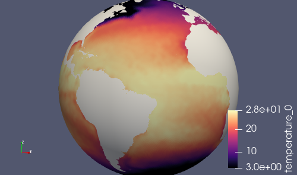

Note that ``normalVelocity`` is a pretty noisy field because its orientation
differs by on the order of 60 degrees between adjacent edges.  It helps to take
the absolute value as shown below, in which case it it can indicate where
strong currents are present.

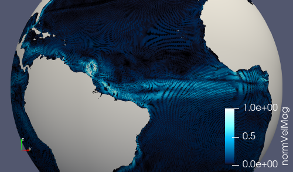

Alternatively, you can add fields like ``kineticEnergyCell`` to the ``output``
stream in ``streams.ocean`` before running the step, and then you will have
this field available to visualize.

.. _dev_tutorial_add_rrm_add_files_for_e3sm:

Adding a files for E3SM test
----------------------------

The final test case to add for a new RRM mesh is ``files_for_e3sm``.  This test
case creates a number of important files in the format they are needed for
E3SM or diagnostic software used to analysis E3SM simulations.  No additional
customization should be needed for this mesh beyond the config options we
already set up earlier in the tutorial.  We just need to add the test case
itself for this mesh to the ``global_ocean`` test group.

Starting from the root of our development branch:

.. code-block:: bash

    cd compass/ocean/tests/global_ocean
    vim __init__.py

.. code-block:: python
    :emphasize-lines: 15-16

    ...

    class GlobalOcean(TestGroup):

        ...

        def __init__(self, mpas_core):

            ...

            # Kuroshio meshes without ice-shelf cavities
            self._add_tests(mesh_names=['Kuroshio12to60', 'Kuroshio8to60'],
                            DynamicAdjustment=KuroshioDynamicAdjustment)

            self._add_tests(mesh_names=['YAM10to60', 'YAMwISC10to60'],
                            DynamicAdjustment=YAM10to60DynamicAdjustment)

            # A test case for making E3SM support files from an existing mesh
            self.add_test_case(FilesForE3SM(test_group=self))

        ...

We delete the whole ``for`` loop over ``mesh_name`` and instead take advantage
of the fact that the ``_add_tests()`` method of ``GlobalOcean`` will
add the 5 test cases we want by default.  (We added them manually, one by one
before so we could test them one or two at a time.)

Now, when you list the tests, you should see:

.. code-block::

    $ compass list | grep YAM
     254: ocean/global_ocean/YAM10to60/mesh
     255: ocean/global_ocean/YAM10to60/WOA23/init
     256: ocean/global_ocean/YAM10to60/WOA23/performance_test
     257: ocean/global_ocean/YAM10to60/WOA23/dynamic_adjustment
     258: ocean/global_ocean/YAM10to60/WOA23/files_for_e3sm
     259: ocean/global_ocean/YAMwISC10to60/mesh
     260: ocean/global_ocean/YAMwISC10to60/WOA23/init
     261: ocean/global_ocean/YAMwISC10to60/WOA23/performance_test
     262: ocean/global_ocean/YAMwISC10to60/WOA23/dynamic_adjustment
     263: ocean/global_ocean/YAMwISC10to60/WOA23/files_for_e3sm

Once again, you can take advantage of the test cases you've already run,
setting up just the new ``files_for_e3sm`` test from the coding terminal:

.. code-block:: bash

    compass setup -n 258 \
        -p E3SM-Project/components/mpas-ocean/ \
        -w /lcrc/group/e3sm/${USER}/compass_tests/tests_20230527/yam10to60_final

And run this test case in the work-directory terminal:

.. code-block:: bash

    cd /lcrc/group/e3sm/${USER}/compass_tests/tests_20230527/yam10to60_final
    cd ocean/global_ocean/YAM10to60/WOA23/files_for_e3sm
    sbatch job_script.sh
    tail -f compass.o*

If this goes well, you are ready to ask for help from members of the E3SM
Ocean Team to add support for your mesh to E3SM itself, including uploading
the files produced by the ``files_for_e3sm`` test case to the E3SM
``inputdata`` and ``diagnostics`` directories on our data server.  This is
beyond the scope of this tutorial and is not typically something a non-expert
can take on on their own.
