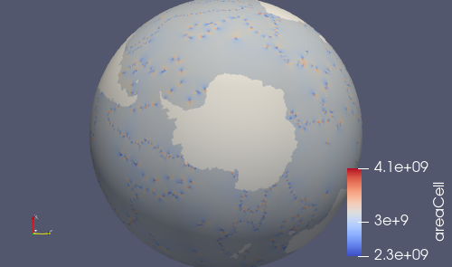
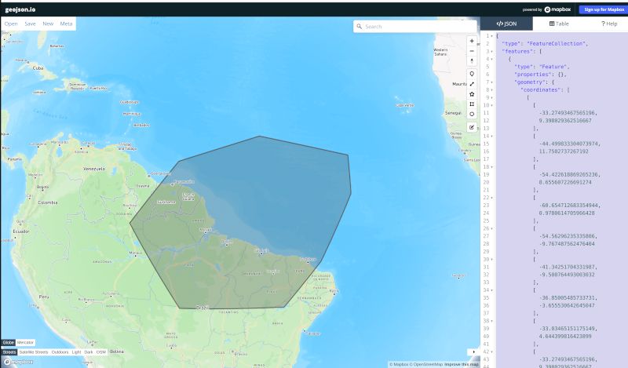

.. _dev_tutorial_add_rrm:

Developer Tutorial: Adding a new ocean/sea ice regionally refined mesh (RRM)
============================================================================

This tutorial presents a step-by-step guide to adding a new mesh to the
``global_ocean`` test group in ``compass`` (see the :ref:`glossary` for
definitions of some relevant terms).  In this tutorial, I will add a new
mesh called YAM ("yet another mesh") that is based on techniques used to build
the existing :ref:`dev_ocean_global_ocean_sowisc12to60` as well as
:ref:`dev_ocean_global_ocean_wc14` meshes.

.. _dev_tutorial_add_rrm_getting_started:

Getting started
---------------

To begin with, you will need to check out the compass repo and create a new
branch from ``main`` for developing the new mesh.  For this purpose, we
will stick with the simpler approach in :ref:`dev_compass_repo` here, but feel
free to use the ``worktree`` approach instead if you are comfortable with it.

.. code-block:: bash

    git clone git@github.com:MPAS-Dev/compass.git add-yet-another-mesh
    cd add-yet-another-mesh
    git checkout -b add-yet-another-mesh

Now, you will need to create a conda environment for developing compass, as
described in :ref:`dev_conda_env`.  We will assume a simple situation where
you are working on a "supported" machine and using the default compilers and
MPI libraries, but consult the documentation to make an environment to suit
your needs.

.. code-block:: bash

  # this one will take a while the first time
  ./conda/configure_compass_env.py --conda $HOME/mambaforge --env_name compass_yam

If you don't already have Mambaforge installed in the directory pointed to by
``--conda``, it will be installed automatically for you.  If all goes well, you
will have a file named ``load_compass_yam*.sh``, where the details of the
``*`` depend on your specific machine and compilers.  For example, on
Chrysalis, you will have ``load_compass_yam_chrysalis_intel_openmpi.sh``,
which will be the example used here:

.. code-block:: bash

  source load_compass_yam_chrysalis_intel_openmpi.sh

Now, we're ready to get the MPAS-Ocean source code from the E3SM repository:

.. code-block:: bash

  # Get the E3SM code -- this one takes a while every time
  git submodule update --init --recursive

Next, we're ready to build the MPAS-Ocean executable:

.. code-block:: bash

  cd E3SM-Project/components/mpas-ocean/
  make ifort
  cd ../../..

The make target will be different depending on the machine and compilers, see
:ref:`dev_supported_machines` or :ref:`dev_other_machines` for the right one
for your machine.

Now, we're ready to start developing!

.. _dev_tutorial_add_rrm_add_mesh:

Adding a new mesh
-----------------

Use any method you like for editing code.  If you haven't settled on a method
and are working on your own laptop or desktop, you may want to try an
integrated development environment (`PyCharm <https://www.jetbrains.com/pycharm/>`_
is a really nice one).  They have features to make sure your code adheres to
the style required for compass (see :ref:`dev_style`).  ``vim``, ``emacs`` or
a similar tool will work fine on supercomputers.  Keep in mind that you can
edit code on your laptop or desktop but you will need to use a high-performance
computing (HPC) machine to generate a mesh.  One step requires >=360 cores to
remap a high resolution topography dataset to the MPAS mesh.

Your new mesh will be defined in a directory within the ``global_ocean`` test
group's ``mesh`` package.  For this example, we create a new ``yam10to60``
directory in ``compass/ocean/tests/global_ocean/mesh``.  The directory name
should be all lowercase with no underscores.  The convention is to give your
mesh a short prefix (``yam`` for "yet another mesh" in our case) and then
the finest and coarsest resolutions in km.  In that directory, we
will make a new file called ``__init__.py``.  In that file, we will start to
define a ``YAM10to60BaseMesh`` class.

.. code-block:: bash

    cd compass/ocean/tests/global_ocean/mesh
    mkdir yam10to60
    cd yam10to60
    vim __init__.py

We define the resolution as a function of space using a regular
latitude-longitude map of the distance between cell centers in km.  To begin
with , we will start out with something really simple: a quasi-uniform 60 km
mesh.  We will make a 2D field called ``cellWidth`` on a 0.1 degree, regular
latitude-longitude grid.

.. code-block:: python

    import numpy as np

    from compass.mesh import QuasiUniformSphericalMeshStep

    class YAM10to60BaseMesh(QuasiUniformSphericalMeshStep):
        """
        A step for creating YAM10to60 meshes
        """

        def build_cell_width_lat_lon(self):
            """
            Create cell width array for this mesh on a regular latitude-longitude
            grid

            Returns
            -------
            cellWidth : numpy.array
                m x n array of cell width in km

            lon : numpy.array
                longitude in degrees (length n and between -180 and 180)

            lat : numpy.array
                longitude in degrees (length m and between -90 and 90)
            """

            dlon = 0.1
            dlat = dlon
            nlon = int(360. / dlon) + 1
            nlat = int(180. / dlat) + 1
            lon = np.linspace(-180., 180., nlon)
            lat = np.linspace(-90., 90., nlat)

            cell_width = 60.0 * np.ones((nlat, nlon))

            return cell_width, lon, lat

We also need a config file for the mesh.  For now, it can just be empty:

.. code-block:: bash

    touch yam10to60.cfg

Next, we need to add this mesh to the list of known meshes:

.. code-block:: bash

    cd ..
    vim __init__.py

.. code-block:: python
    :emphasize-lines: 5, 24-25

    ...

    from compass.ocean.tests.global_ocean.mesh.so12to60 import SO12to60BaseMesh
    from compass.ocean.tests.global_ocean.mesh.wc14 import WC14BaseMesh
    from compass.ocean.tests.global_ocean.mesh.yam10to60 import YAM10to60BaseMesh
    from compass.ocean.tests.global_ocean.metadata import (
        get_author_and_email_from_git,
    )

    ...

    class Mesh(TestCase):

    ...

        def __init__(self, test_group, mesh_name, remap_topography):

        ...

            elif mesh_name.startswith('Kuroshio'):
                base_mesh_step = KuroshioBaseMesh(self, name=name, subdir=subdir)
            elif mesh_name in ['WC14', 'WCwISC14']:
                base_mesh_step = WC14BaseMesh(self, name=name, subdir=subdir)
            elif mesh_name in ['YAM10to60', 'YAMwISC10to60']:
                base_mesh_step = YAM10to60BaseMesh(self, name=name, subdir=subdir)
            else:
                raise ValueError(f'Unknown mesh name {mesh_name}')

In compass, we support 2 versions of nearly every mesh, 1 where everything
south of the Antarctic coast is treated as land and 1 where we include the
ocean cavities below Antarctic ice shelves (``wISC``, meaning "with ice-shelf
cavities")

Next, we add a test case for making this mesh to the ``global_ocean`` test
group:

.. code-block:: bash

    cd ..
    vim __init__.py

.. code-block:: python
    :emphasize-lines: 18-22

    ...

    class GlobalOcean(TestGroup):

        ...

        def __init__(self, mpas_core):

            ...

            self._add_tests(mesh_names=['WC14', 'WCwISC14'],
                            DynamicAdjustment=WC14DynamicAdjustment)

            # Kuroshio meshes without ice-shelf cavities
            self._add_tests(mesh_names=['Kuroshio12to60', 'Kuroshio8to60'],
                            DynamicAdjustment=KuroshioDynamicAdjustment)

            for mesh_name in ['YAM10to60', 'YAMwISC10to60']:
                mesh_test = Mesh(test_group=self, mesh_name=mesh_name,
                                 remap_topography=True)
                self.add_test_case(mesh_test)

            # A test case for making E3SM support files from an existing mesh
            self.add_test_case(FilesForE3SM(test_group=self))

Okay, great!  We're ready to test this out!

.. _dev_tutorial_add_rrm_test_mesh:

Running the mesh test case
--------------------------

First, let's make sure the mesh exists when we list the available test cases
in compass:

.. code-block:: bash

    compass list

You should see something like:

.. code-block::
    :emphasize-lines: 7-8

     ...

     250: ocean/global_ocean/Kuroshio8to60/WOA23/init
     251: ocean/global_ocean/Kuroshio8to60/WOA23/performance_test
     252: ocean/global_ocean/Kuroshio8to60/WOA23/dynamic_adjustment
     253: ocean/global_ocean/Kuroshio8to60/WOA23/files_for_e3sm
     254: ocean/global_ocean/YAM10to60/mesh
     255: ocean/global_ocean/YAMwISC10to60/mesh
     256: ocean/global_ocean/files_for_e3sm
     257: ocean/gotm/default

     ...

On one of the supported HPC machines, let's try setting up and running the mesh
step.  Here's an example that should work on Chrysalis or Anvil:

.. code-block:: bash

    compass setup -n 254 \
        -p E3SM-Project/components/mpas-ocean/ \
        -w /lcrc/group/e3sm/${USER}/compass_tests/tests_20230527/yam10to60_uniform60km

The number provided (e.g. ``254``) is the number of the test case in
``compass list`` above.  Since these numbers change frequently, you should
check each time you check out or rebase the code with something like
``compass list | grep YAM``

The directory you point to with ``-p`` is where you build MPAS-Ocean.  We don't
actually need that quite yet but we will soon when we add an initial condition
on the mesh.  The base work directory you point to with ``-w`` should be a
location in a scratch space where you can set up temporary tests.  We recommend
including a date somewhere in the path just to keep things organized but that
is up to you.

For simplicity, it is a good idea to open a new terminal for running the test.
In the new terminal window:

.. code-block:: bash

    cd /lcrc/group/e3sm/${USER}/compass_tests/tests_20230527/yam10to60_uniform60km
    vim job_script.custom.sh
    sbatch job_script.custom.sh

If you prefer, you can get an interactive node and run the same commands as
in the job script:

.. code-block:: bash

    source load_compass_env.sh
    compass run custom

Assuming you submitted the job script as above, you can monitor the output
file:

.. code-block::

    $ tail -f compass.o*

    Loading conda environment
    Done.

    Loading Spack environment...
    Done.

    ocean/global_ocean/YAM10to60/mesh
      * step: base_mesh
      * step: remap_topography
      * step: cull_mesh
      test execution:      SUCCESS
      test runtime:        11:31
    Test Runtimes:
    11:31 PASS ocean_global_ocean_YAM10to60_mesh
    Total runtime 11:32
    PASS: All passed successfully!

If things don't go well, you might see something like:

.. code-block::

    Loading conda environment
    Done.

    Loading Spack environment...
    Done.

    ocean/global_ocean/YAM10to60/mesh
      * step: base_mesh
          Failed
      test execution:      ERROR
      see: case_outputs/ocean_global_ocean_YAM10to60_mesh.log
      test runtime:        00:00
    Test Runtimes:
    00:00 FAIL ocean_global_ocean_YAM10to60_mesh
    Total runtime 00:01
    FAIL: 1 test failed, see above.

Hopefully, the contents of the log file, in this case
``case_outputs/ocean_global_ocean_YAM10to60_mesh.log``, can help you debug
what went wrong.

Once the ``base_mesh`` step has completed, you should see:

.. code-block:: bash

    $ ls ocean/global_ocean/YAM10to60/mesh/base_mesh/
    base_mesh.nc          geom.msh             mesh.cfg           opts.log
    base_mesh_vtk         graph.info           mesh.msh           spac.msh
    cellWidthGlobal.png   job_script.sh        mesh_triangles.nc  step.pickle
    cellWidthVsLatLon.nc  load_compass_env.sh  opts.jig

The main result is the file ``base_mesh.nc``

.. code-block:: bash

    $ cd ocean/global_ocean/YAM10to60/mesh/base_mesh/
    $ source load_compass_env.sh
    $ ncdump -h base_mesh.nc

    netcdf base_mesh {
    dimensions:
        Time = UNLIMITED ; // (0 currently)
        nCells = 165049 ;
        nEdges = 495141 ;
        nVertices = 330094 ;
        maxEdges = 8 ;
        maxEdges2 = 16 ;
        TWO = 2 ;
        vertexDegree = 3 ;
    variables:
        int edgesOnEdge(nEdges, maxEdges2) ;

    ...

You can get take a look at the map of resolution in ``cellWidthGlobal.png``:

.. image:: images/qu60.png
   :width: 500 px
   :align: center

Not very interesting so far but it will be informative once we start to
vary the resolution later.

If you want to view the mesh, you can copy the file
``base_mesh_vtk/staticFieldsOnCells.vtp`` over to your laptop or desktop and
open it in ParaView.  See
`ParaView VTK Extractor <http://mpas-dev.github.io/MPAS-Tools/stable/visualization.html#paraview-vtk-extractor>`_
for more details on the tool used to extract the mesh VTK file.

The ``remap_topography`` step will produce:

.. code-block:: bash

    $ cd ../remap_topography/
    $ ls
    base_mesh.nc                                    src_mesh.nc
    dst_mesh.nc                                     step.pickle
    job_script.sh                                   topography.nc
    load_compass_env.sh                             topography_ncremap.nc
    map_0.013x0.013degree_to_YAM10to60_conserve.nc  topography_remapped.nc
    mesh.cfg

Here, the main result is ``topography_remapped.nc``, the ocean bathymetry and
Antarctic ice topography remapped to the mesh defined in ``base_mesh.nc``.

Finally, the ``cull_mesh`` step will remove land cells from the mesh:

The ``remap_topography`` step will produce:

.. code-block:: bash

    $ cd ../cull_mesh/
    $ ls
    base_mesh.nc                     job_script.sh
    critical_blockages.geojson       land_mask.nc
    critical_blockages.nc            land_mask_with_land_locked_cells.nc
    critical_passages.geojson        load_compass_env.sh
    critical_passages_mask_final.nc  mesh.cfg
    critical_passages.nc             step.pickle
    culled_graph.info                topography_culled.nc
    culled_mesh.nc                   topography.nc
    culled_mesh_vtk

Here, the main output is ``culled_mesh.nc``.  Similarly to the base mesh, you
can look at the the culled mesh in ParaVeiw by copying
``culled_mesh_vtk/staticFieldsOnCells.vtp`` to your laptop or desktop.

Here, we have placed a white sphere inside the mesh so the land regions are
easier to see.  After culling, the land just appears as holes in the mesh.

.. _dev_tutorial_add_rrm_ec_base_mesh:

Switching to an EC30to60 base resolution
----------------------------------------

Returning to the terminal where we are developing the code, let's make the mesh
more interesting.

So far, all E3SM ocean and sea-ice RRMs start with the EC30to60 (eddy-closure
30 to 60 km) mesh as their base resolution.  Let's do the same here. Starting
from the base of your development branch:

.. code-block:: bash

    cd compass/ocean/tests/global_ocean/mesh/yam10to60
    vim __init__.py

We will replace the constant 60-km mesh resolution with a latitude-dependent
function from the
`mesh_definition_tools <http://mpas-dev.github.io/MPAS-Tools/stable/mesh_creation.html#mesh-definition-tools>`_
module from MPAS-Tools. The default EC mesh has resolutions of 35 km at the
poles, 60 km at mid-latitudes and 30 km at the equator.

.. code-block:: python
    :emphasize-lines: 1, 17-18

    import mpas_tools.mesh.creation.mesh_definition_tools as mdt
    import numpy as np

    from compass.mesh import QuasiUniformSphericalMeshStep

    class YAM10to60BaseMesh(QuasiUniformSphericalMeshStep):

        ...

        def build_cell_width_lat_lon(self):

            ...

            lat = np.linspace(-90., 90., nlat)

            cell_width_vs_lat = mdt.EC_CellWidthVsLat(lat)
            cell_width = np.outer(cell_width_vs_lat, np.ones([1, lon.size]))

            return cell_width, lon, lat

At this point, you can set up and test again like you did in
:ref:`dev_tutorial_add_rrm_test_mesh`, but this time you will want to use
a different work directory name, e.g.:

.. code-block:: bash

    compass setup -n 254 \
        -p E3SM-Project/components/mpas-ocean/ \
        -w /lcrc/group/e3sm/${USER}/compass_tests/tests_20230527/yam10to60_ec

Switch back to your other terminal to submit the job and look at the results.
The map of resolution in ``base_mesh/cellWidthGlobal.png`` should look like:

After culling, the mesh in ``culled_mesh/culled_mesh_vtk/staticFieldsOnCells.vtp``
should look like:

.. image:: images/ec30to60_culled_paraview.png
   :width: 500 px
   :align: center

.. _dev_tutorial_add_rrm_add_high_res:

Adding regions of higher resolution
-----------------------------------

Now, let's add some regions of higher resolution to the mesh.

We typically define these regions using `geojson <https://geojson.org/>`_
files.  The easiest way to create them is to go to `geojson.io <https://geojson.io/>`_.
There, you can find your way to the part of the globe you want to refine
and use the polygon tool to make a shape that will act as the boundary for your
high resolution region.

In my case, I have defined a region across the south Atlantic ocean with its
western side centered around the outlet of the Amazon river.  My plan is to
define a region of moderately higher resolution across a fairly broad region
first, then define a region of higher resolution close to the Amazon delta
in a subsequent step.

Let's make an actual ``geojson`` file with this contents.  In your terminal for
editing code, from the root of the branch where we're developing:

.. code-block:: bash

    cd compass/ocean/tests/global_ocean/mesh/yam10to60
    vim northern_south_atlantic.geojson

Copy the contents of the json code on the right-hand side of the geojson.io
window and paste it into the file:

.. code-block:: json

    {
      "type": "FeatureCollection",
      "features": [
        {
          "type": "Feature",
          "properties": {},
          "geometry": {
            "coordinates": [
              [
                [
                  -42.7022201869903,
                  28.229943571814303
                ],
                [
                  -63.8408547092003,
                  9.565520467643694
                ],
                [
                  -54.35184148160458,
                  -3.0088254981339873
                ],
                [
                  -37.52116934686214,
                  -8.341138860925426
                ],
                [
                  -12.947354056832182,
                  10.997433207836309
                ],
                [
                  -11.493517385995887,
                  27.701423680235493
                ],
                [
                  -42.7022201869903,
                  28.229943571814303
                ]
              ]
            ],
            "type": "Polygon"
          }
        }
      ]
    }

Then, modify the ``properties`` dictionary similarly to this example:

.. code-block::
    :emphasize-lines: 6-11

    {
      "type": "FeatureCollection",
      "features": [
        {
          "type": "Feature",
          "properties": {
            "name": "Northern South Atlantic",
            "component": "ocean",
            "object": "region",
            "author": "Xylar Asay-Davis"
          },

          ...

These 4 fields are required for compass to be able to use the file.  The
``name`` and ``author`` are entirely up to you and are intended to help
document the file in some useful way.  The ``component`` must be ``"ocean"``
and the ``object`` must be ``"region"``.

Next, let's make the shape available in the code so we can use it later to make
a higher resolution region:

.. code-block:: bash

    vim __init__.py

.. code-block:: python
    :emphasize-lines: 3, 11-20, 29

    import mpas_tools.mesh.creation.mesh_definition_tools as mdt
    import numpy as np
    from geometric_features import read_feature_collection

    from compass.mesh import QuasiUniformSphericalMeshStep

    class YAM10to60BaseMesh(QuasiUniformSphericalMeshStep):
        """
        A step for creating YAM10to60 meshes
        """
        def setup(self):
            """
            Add some input files
            """
            package = 'compass.ocean.tests.global_ocean.mesh.yam10to60'
            self.add_input_file(filename='northern_south_atlantic.geojson',
                                package=package)
            super().setup()

        def build_cell_width_lat_lon(self):

            ...

            cell_width_vs_lat = mdt.EC_CellWidthVsLat(lat)
            cell_width = np.outer(cell_width_vs_lat, np.ones([1, lon.size]))

            # read the shape
            fc = read_feature_collection('northern_south_atlantic.geojson')

            return cell_width, lon, lat

In the ``setup()`` method above, we add the geojson file as an input to the
step that creates the base mesh.  This is how compass finds the geojson file
when it's setting up the work directory where we will build the base mesh.

In the ``build_cell_width_lat_lon()`` method, we read in a the geojson file
into a "feature collection" (``fc``) object that we will use below to define
the higher resolution region.

Now, let's make further changes to the same file to use the shape to add a
higher resolution region:

.. code-block:: bash

    vim __init__.py

.. code-block:: python
    :emphasize-lines: 4-7, 24-46

    import mpas_tools.mesh.creation.mesh_definition_tools as mdt
    import numpy as np
    from geometric_features import read_feature_collection
    from mpas_tools.cime.constants import constants
    from mpas_tools.mesh.creation.signed_distance import (
        signed_distance_from_geojson,
    )

    from compass.mesh import QuasiUniformSphericalMeshStep

    class YAM10to60BaseMesh(QuasiUniformSphericalMeshStep):

        def build_cell_width_lat_lon(self):

            ...

            cell_width_vs_lat = mdt.EC_CellWidthVsLat(lat)
            cell_width = np.outer(cell_width_vs_lat, np.ones([1, lon.size]))

            # read the shape
            fc = read_feature_collection('northern_south_atlantic.geojson')

            # How wide in meters the smooth transition between the background
            #   resolution and the finer resolution regions should be.
            # 1200 km is equivalent to about 10 degrees latitude
            trans_width = 1200e3

            # The resolution in km of the finer resolution region
            fine_cell_width = 20.

            # the radius of the earth defined in E3SM's shared constants
            earth_radius = constants['SHR_CONST_REARTH']

            # A field defined on the lat-long grid with the signed distance away
            # from the boundary of the shape (positive outside and negative inside)
            atlantic_signed_distance = signed_distance_from_geojson(
                fc, lon, lat, earth_radius, max_length=0.25)

            # A field that goes smoothly from zero inside the shape to one outside
            # the shape over the given transition width.
            weights = 0.5 * (1 + np.tanh(atlantic_signed_distance / trans_width))

            # The cell width in km becomes a blend of the background cell width
            # and the finer cell width using the weights
            cell_width = fine_cell_width * (1 - weights) + cell_width * weights

            return cell_width, lon, lat

The function ``signed_distance_from_geojson()`` creates a functon on the
lat-lon grid that is the distance from any given point on the globe to the
boundary of the shape defined by the geojson file.  The distance is positive
outside the shape and negative inside it.  For better accuracy in computing the
distance, we subdivide the shape into segments of ``max_length=0.25`` degrees
latitude or longitude.  We use the ``earth_radius`` defined in E3SM's shared
constants.

Using the signed distance, we create a blending function ``weights`` that goes
from zero inside the shape smoothly to one outside the shape over a distance of
``trans_width`` meters.  Then, we use the weights to blend from the fine
resolution inside the shape to the EC30to60 background resolution outside the
shape.

Once, again, let's set up and run the mesh test case like we did in
:ref:`dev_tutorial_add_rrm_test_mesh`:

.. code-block:: bash

    compass setup -n 254 \
        -p E3SM-Project/components/mpas-ocean/ \
        -w /lcrc/group/e3sm/${USER}/compass_tests/tests_20230527/yam10to60_alt20km

As before, switch back to your other terminal to submit the job and look at the
results.

.. code-block:: bash

    cd /lcrc/group/e3sm/${USER}/compass_tests/tests_20230527/yam10to60_alt20km
    sbatch job_script.custom.sh
    tail -f compass.o*

The map of resolution in ``base_mesh/cellWidthGlobal.png`` should look
like:

After culling, the mesh in ``culled_mesh/culled_mesh_vtk/staticFieldsOnCells.vtp``
should look like:

.. image:: images/atl20km_culled_paraview.png
   :width: 500 px
   :align: center

.. _dev_tutorial_add_rrm_add_very_high_res:

Adding a very high resolution region
------------------------------------

Using the same approach as in the previous section, we can define another
region where we will increase the resolution to 10 km.

I used geojson.io to create a region around the Amazon River delta:

Then, I copied the code and pasted it into a file:

.. code-block:: bash

    cd compass/ocean/tests/global_ocean/mesh/yam10to60
    vim amazon_delta.geojson

I added the ``properties`` dictionary like in the previous example.

.. code-block:: json

    {
      "type": "FeatureCollection",
      "features": [
        {
          "type": "Feature",
          "properties": {
            "name": "Amazon Delta",
            "component": "ocean",
            "object": "region",
            "author": "Xylar Asay-Davis"
          },
          "geometry": {
            "coordinates": [
              [
                [
                  -33.27493467565196,
                  9.398029362516667
                ],
                [
                  -44.499833304073974,
                  11.7502737267192
                ],
                [
                  -54.422618869265236,
                  8.655607226691274
                ],
                [
                  -60.654712683354944,
                  0.9780614705966428
                ],
                [
                  -54.56296235335806,
                  -9.767487562476404
                ],
                [
                  -41.34251704331987,
                  -9.500764493003032
                ],
                [
                  -36.85005485733731,
                  -3.655530642645047
                ],
                [
                  -33.03465151175149,
                  4.644399816423899
                ],
                [
                  -33.27493467565196,
                  9.398029362516667
                ]
              ]
            ],
            "type": "Polygon"
          }
        }
      ]
    }

Using this feature, I added a 10-km region:

.. code-block:: bash

    vim __init__.py

.. code-block:: python
    :emphasize-lines: 11-12, 27-48

    ...

    class YAM10to60BaseMesh(QuasiUniformSphericalMeshStep):
        def setup(self):
            """
            Add some input files
            """
            package = 'compass.ocean.tests.global_ocean.mesh.yam10to60'
            self.add_input_file(filename='northern_south_atlantic.geojson',
                                package=package)
            self.add_input_file(filename='amazon_delta.geojson',
                                package=package)
            super().setup()

        def build_cell_width_lat_lon(self):

            ...

            # A field that goes smoothly from zero inside the shape to one outside
            # the shape over the given transition width.
            weights = 0.5 * (1 + np.tanh(atlantic_signed_distance / trans_width))

            # The cell width in km becomes a blend of the background cell width
            # and the finer cell width using the weights
            cell_width = fine_cell_width * (1 - weights) + cell_width * weights

            # read the shape
            fc = read_feature_collection('amazon_delta.geojson')

            # 400 km is equivalent to about 3 degrees latitude
            trans_width = 400e3

            # The resolution in km of the finer resolution region
            fine_cell_width = 10.

            # A field defined on the lat-long grid with the signed distance away
            # from the boundary of the shape (positive outside and negative inside)
            amazon_delta_signed_distance = signed_distance_from_geojson(
                fc, lon, lat, earth_radius, max_length=0.25)

            # A field that goes smoothly from zero inside the shape to one outside
            # the shape over the given transition width.
            weights = 0.5 * (1 + np.tanh(
                amazon_delta_signed_distance / trans_width))

            # The cell width in km becomes a blend of the background cell width
            # and the finer cell width using the weights
            cell_width = fine_cell_width * (1 - weights) + cell_width * weights

            return cell_width, lon, lat

Same procedure as before, set up the test case:

.. code-block:: bash

    compass setup -n 254 \
        -p E3SM-Project/components/mpas-ocean/ \
        -w /lcrc/group/e3sm/${USER}/compass_tests/tests_20230527/yam10to60_final

Switch back to your other terminal to submit the job and look at the results.

.. code-block:: bash

    cd /lcrc/group/e3sm/${USER}/compass_tests/tests_20230527/yam10to60_final
    sbatch job_script.custom.sh
    tail -f compass.o*

The map of resolution in ``base_mesh/cellWidthGlobal.png`` should look
like:

.. image:: images/yam10to60.png
   :width: 500 px
   :align: center

After culling, the mesh in ``culled_mesh/culled_mesh_vtk/staticFieldsOnCells.vtp``
should look like:

