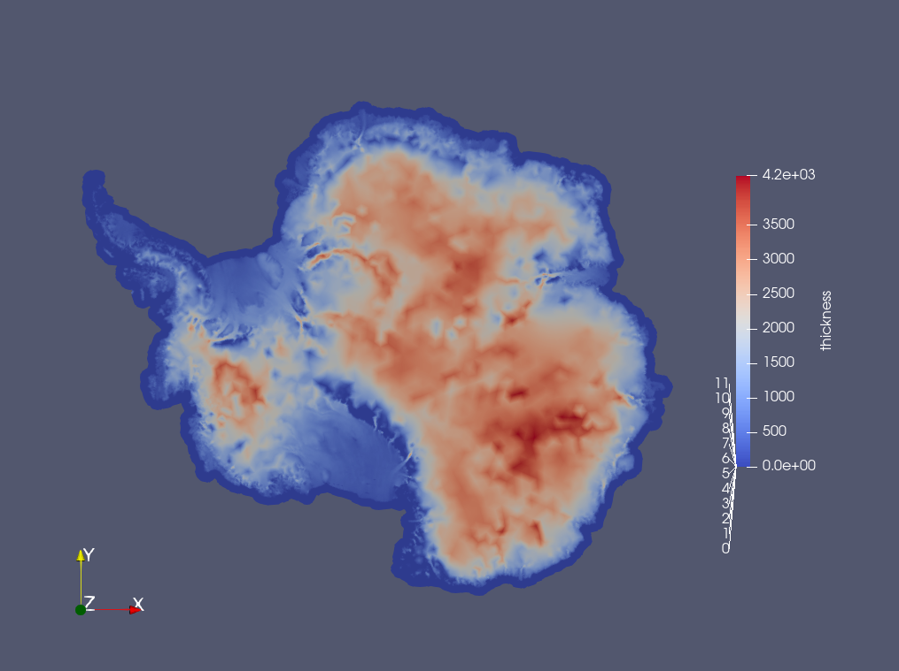

.. _landice_antarctica:

antarctica
==========

The ``landice/antarctica`` test group includes a test case for creating a
mesh for Antarctica.

   Ice thickness on Antarctica 8-80km variable resolution mesh.

config options
--------------

The test group uses the following default config options.  At this point only
the mesh generation options are adjusted through the config file.

.. code-block:: cfg

    # config options for antarctica test cases
    [mesh]

    # number of levels in the mesh
    levels = 5

    # Bounds of Antarctic mesh
    x_min = -3333500.
    x_max = 3330500.
    y_min = -3333500.
    y_max = 3330500.

    # distance from ice margin to cull (km).
    # Set to a value <= 0 if you do not want
    # to cull based on distance from margin.
    cull_distance = 50.0

    # mesh density parameters
    # minimum cell spacing (meters)
    min_spac = 4.e3
    # maximum cell spacing (meters)
    max_spac = 2.e4
    # log10 of max speed (m/yr) for cell spacing
    high_log_speed = 2.5
    # log10 of min speed (m/yr) for cell spacing
    low_log_speed = 0.5
    # distance to ice edge or grounding line at which cell spacing = max_spac (meters)
    high_dist = 2.e5
    # distance to ice edge or grounding line within which cell spacing = min_spac (meters)
    low_dist = 4.e4

    # These will not be applied unless use_bed = True.
    # They are taken from the humboldt.mesh_gen test case
    # and have not been evaluated for Antarctica.
    # distance at which bed topography has no effect
    high_dist_bed = 1.e5
    # distance within which bed topography has maximum effect
    low_dist_bed = 7.5e4
    # Bed elev beneath which cell spacing is minimized
    low_bed = 50.0
    # Bed elev above which cell spacing is maximized
    high_bed = 100.0

    # mesh density functions
    use_speed = True
    use_dist_to_grounding_line = True
    use_dist_to_edge = False
    use_bed = False

    [antarctica]
    # path to directory containing BedMachine and Measures datasets
    # (default value is for Perlmutter)
    data_path = /global/cfs/cdirs/fanssie/standard_datasets/AIS_datasets
    
    # filename of the BedMachine thickness and bedTopography dataset
    # (default value is for Perlmutter)
    bedmachine_filename = BedMachineAntarctica_2020-07-15_v02_edits_floodFill_extrap_fillVostok.nc
    
    # filename of the MEASURES ice velocity dataset
    # (default value is for Perlmutter)
    measures_filename = antarctica_ice_velocity_450m_v2_edits_extrap.nc
    
    # projection of the source datasets, according to the dictionary keys
    # create_SCRIP_file_from_planar_rectangular_grid.py from MPAS_Tools
    src_proj = ais-bedmap2
    
    # number of processors to use for ESMF_RegridWeightGen
    nProcs = 128

mesh_gen
--------

``landice/antarctica/mesh_gen`` creates a 4-20km variable resolution mesh with
the mesh file name `Antarctica.nc`. In addition, two region masks are
generated based on the IMBIE1 (http://imbie.org/imbie-2016/drainage-basins/)
and ISMIP6 basins (defined in Jourdain et al. 2020).

The test case performs interpolation of observational data from gridded datasets
to the Antarctic mesh. This takes care of the peculiarities of the current gridded
compilation dataset (antarctica_8km_2020_10_20.nc), as well as using conservative
remapping directly from the high-resolution BedMachineAntarctica and MeASUReS
velocity datasets. There is a fairly heavy degree of pre-processing done to get
the BedMachine and MeASUReS datasets ready to be used here. The pre-processing
includes renaming variables, setting reasonable _FillValue and missing_value
attributes, extrapolating fields to avoid interpolation ramps at ice margins,
updating mask values, and raising the bed topography at Lake Vostok to ensure
a flat ice surface there.

Those data files and processing scripts currently live here on Perlmutter:
``/global/cfs/cdirs/fanssie/standard_datasets/AIS_datasets``.
Eventually that pre-processing could be integrated into a new step in COMPASS,
or the processed data files could be added to the server on Anvil and downloaded
as needed. However, until then, this test case provides a reproducible workflow
for setting up Antarctic meshes at varying resolutions

There is no model integration step.
