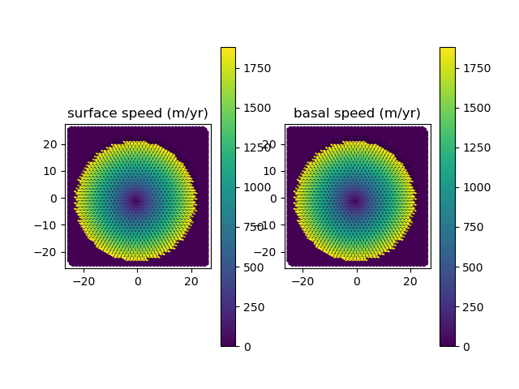
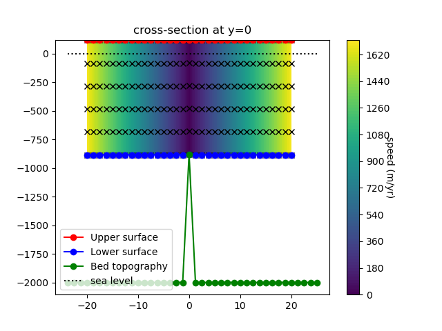

.. _landice_circular_shelf:

circular_shelf
==============

The ``landice/circular_shelf`` test group implements a circular and radially
symmetric ice shelf with a constant thickness that is grounded at its center.
The purpose is to provide a regression test for ice shelf velocity.  There is
not an analytic solution, and the test case is not meant to be run forward in
time beyond the initial diagnostic solve, because the ice shelf would quickly
unground and become an iceberg.  Because of the presence of floating ice,
this test group is only appropriate to use with the FO velocity solver.

As defined, the test uses a grid resolution of 1250 m and 5 vertical layers.

The test group includes a single test cases, a decomposition test.  The test
has 3 steps,
``setup_mesh``, which defines the mesh and initial conditions for the model;
``run_model``, which runs the model; and ``visualize``,
which optionally plots the results of the test case (PNG files, plot windows,
or both).

   Plot of modeled velocity generated by the visualization step.

   Cross section plot of modeled velocity generated by the visualization
   step.

config options
--------------

The test group uses the following default config options:

.. code-block:: cfg

    # config options for circular_shelf test cases
    [circular_shelf]

    # sizes (in cells) for the uniform mesh
    nx = 40
    ny = 46

    # resolution (in m) for the uniform mesh
    dc = 1250.0

    # number of levels in the mesh
    levels = 5

    # whether to use large basal friction or Dirichlet conditions at bed
    use_mu = False

    # option to make the grounded area 7 cells instead of 1
    use_7cells = True

    # config options related to visualization for circular_shelf test cases
    [circular_shelf_viz]

    # which time index to visualize
    time_slice = 0

    # whether to save image files
    save_images = True

    # whether to hide figures (typically when save_images = True)
    hide_figs = True

decomposition_test
------------------

``landice/circular_shelf/decomposition_test`` runs a single velocity solve
on 1 (``1proc_run`` step) and then on 4 processors
(``4proc_run`` step) to make sure the resulting velocity solution has small
errors consistent with known non-bit-for-bit decomposition differences of the
Albany FO velocity solver.
