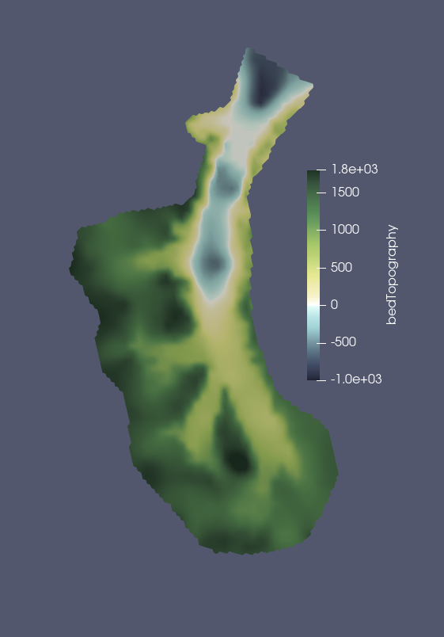

.. _landice_crane:

crane
=============

The ``landice/crane`` test group includes a test case for creating a
mesh for Crane Glacier, Antarctica. The optimization for basal friction
happens outside of COMPASS because it requires expert usage and takes a
larger amount of computing resources than COMPASS is typically run with.

   Bed topography in meters above sea level on Crane 500m-1km mesh.

The test group includes a single test case that creates the variable resolution mesh.

config options
--------------

The test group uses the following default config options.  At this point only
the mesh generation options are adjusted through the config file.

.. code-block:: cfg

    # config options for mesh_gen test case
    [mesh]
    
    # number of levels in the mesh
    levels = 10
    
    # Bounds of Crane regional mesh
    x_min = -2.442e6
    x_max = -2.246e6
    y_min = 1.124e6
    y_max = 1.334e6
    
    # distance from ice margin to cull (km).
    # Set to a value <= 0 if you do not want
    # to cull based on distance from margin.
    cull_distance = -1.0
    
    # mesh density parameters
    # minimum cell spacing (meters)
    min_spac = 5.e2
    # maximum cell spacing (meters)
    max_spac = 1.e3
    # log10 of max speed for cell spacing
    high_log_speed = 2.5
    # log10 of min speed for cell spacing
    low_log_speed = 0.75
    # distance at which cell spacing = max_spac
    high_dist = 1.e5
    # distance within which cell spacing = min_spac
    low_dist = 5.e4
    
    # mesh density parameters used if use_bed = True
    # These settings are taken from the Humboldt mesh
    # and have not yet been evaluated for Crane.
    # distance at which bed topography has no effect
    high_dist_bed = 1.e5
    # distance within which bed topography has maximum effect
    low_dist_bed = 5.e4
    # Bed elev beneath which cell spacing is minimized
    low_bed = 50.0
    # Bed elev above which cell spacing is maximized
    high_bed = 100.0
    
    # mesh density functions
    use_speed = True
    use_dist_to_grounding_line = True
    use_dist_to_edge = False
    use_bed = False

mesh_gen
--------

``landice/crane/default`` creates a variable resolution mesh.
The default is 500m-1km resolution with mesh density determined by
observed ice speed and distance to grounding line. There is no model
integration step.
