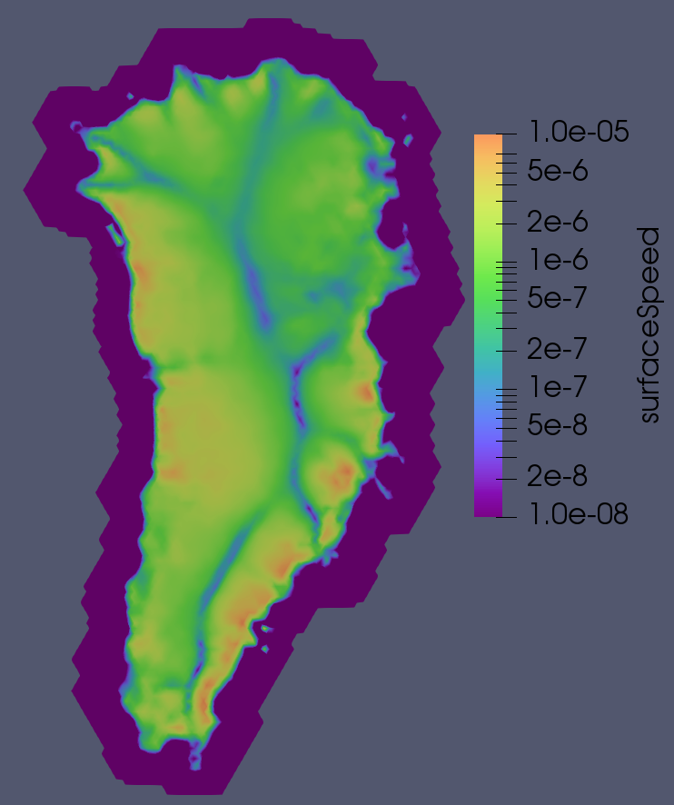

.. _landice_greenland:

greenland
=========

The ``landice/greenland`` test group runs tests with a coarse (20-km)
`Greenland mesh <https://web.lcrc.anl.gov/public/e3sm/mpas_standalonedata/mpas-albany-landice/gis20km.210608.nc>`_.

   FO velocity solution visualized in Paraview.

The test group includes 3 test cases, each of which has one or more steps
that are variants on ``run_model`` (given other names in the decomposition and
restart test cases to distinguish multiple model runs), which performs time
integration of the model. There is a fourth test case, ``mesh_gen``, that
creates a variable resolution Greenland Ice Sheet mesh, with the step ``mesh``.

The test cases in this test group can run with either the SIA or FO velocity
solvers. Running with the FO solver requires a build of MALI that includes
Albany, but the SIA variant of the test can be run without Albany.  The FO
version uses no-slip basal boundary condition. There is no integration step
for the test case ``mesh_gen``.

config options
--------------

The ``mesh_gen`` test case uses the default config options below.
The other test cases do not use config options.

.. code-block:: cfg

    [mesh]

    # number of levels in the mesh
    levels = 10

    # distance from ice margin to cull (km).
    # Set to a value <= 0 if you do not want
    # to cull based on distance from margin.
    cull_distance = 10.0

    # mesh density parameters
    # minimum cell spacing (meters)
    min_spac = 3.e3
    # maximum cell spacing (meters)
    max_spac = 30.e3
    # log10 of max speed for cell spacing
    high_log_speed = 2.5
    # log10 of min speed for cell spacing
    low_log_speed = 0.75
    # distance at which cell spacing = max_spac
    high_dist = 1.e5
    # distance within which cell spacing = min_spac
    low_dist = 5.e4

    # mesh density functions
    use_speed = True
    use_dist_to_grounding_line = False
    use_dist_to_edge = True

smoke_test
----------

``landice/greenland/smoke_test`` is the default version of the greenland test
case for a short (5-day) test run.

decomposition_test
------------------

``landice/greenland/decomposition_test`` runs short (5-day) integrations of the
model forward in time on 1 (``1proc_run`` step) and then on 4 cores
(``4proc_run`` step) to make sure the resulting prognostic variables are
bit-for-bit identical between the two runs.

restart_test
------------

``landice/greenland/2000m/restart_test`` first run a short (5-day) integration
of the model forward in time (``full_run`` step).  Then, a second step
(``restart_run``) performs a 3-day, then a 2-day run, where the second begins
from a restart file saved by the first. Prognostic variables are compared
between the "full" and "restart" runs at year 2 to make sure they are
bit-for-bit identical.

mesh_gen
-------------

``landice/greenland/mesh_gen`` creates a variable resolution mesh based
on the the config options listed above. This will not be the same as the
pre-generated 20 km mesh used in the other three test cases because it uses
a newer version of Jigsaw. Note that the basal friction optimization is
performed separately and is not part of this test case.
