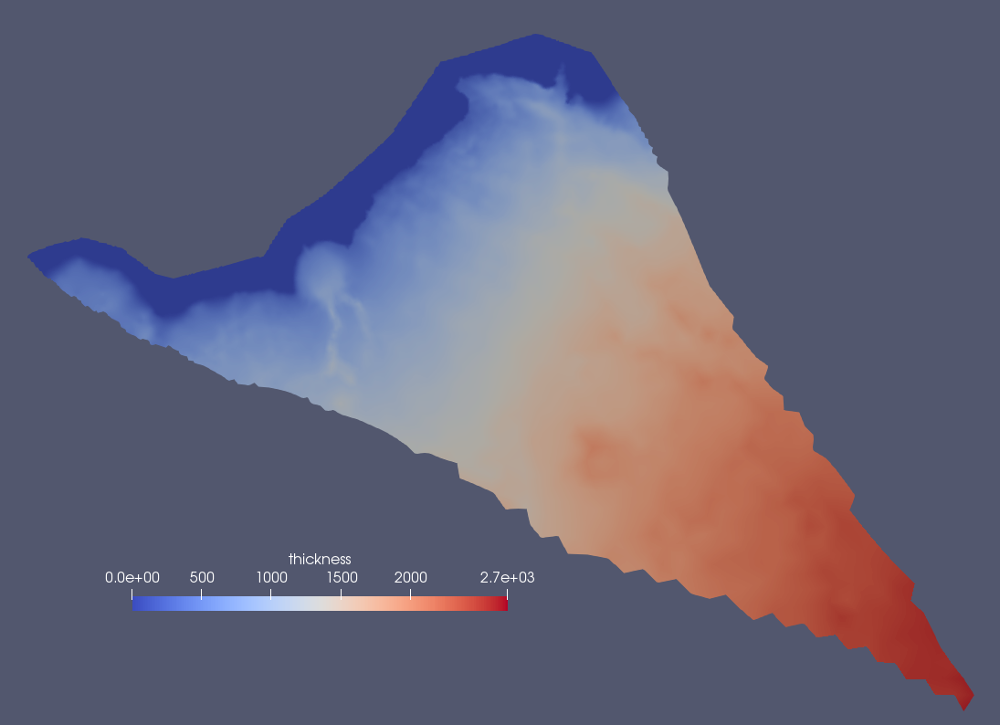

.. _landice_humboldt:

humboldt
========

The ``landice/humboldt`` test group creates a 1-10km Humboldt Glacier mesh. 

   Ice thickness on Humboldt 1-10km variable resolution mesh.

The test group includes a single test case that creates the variable resolution mesh.

config options
--------------

The test group uses the following default config options:

.. code-block:: cfg

    # number of levels in the mesh
    levels = 10

    # distance from ice margin to cull (km).
    # Set to a value <= 0 if you do not want
    # to cull based on distance from margin.
    cullDistance = 5.0

default
-------

``landice/humboldt/default`` createst the 1-10km variable resolution mesh. 
There is no model integration step.
