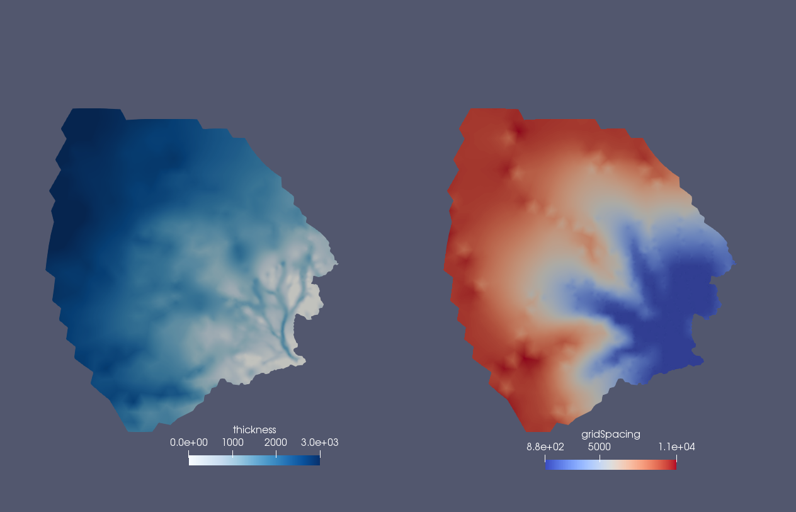

.. _landice_kangerlussuaq:

kangerlussuaq
=============

The ``landice/kangerlussuaq`` test group includes a test case for creating a
mesh for Kangerlussuaq Glacier, Greenland. The optimization for basal friction
happens outside of COMPASS because it requires expert usage and takes a
larger amount of computing resources than COMPASS is typically run with.

   Ice thickness and grid spacing in meters on Kangerlussuaq 1-10km variable resolution mesh.

The test group includes a single test case that creates the variable resolution mesh.

config options
--------------

The test group uses the following default config options.  At this point only
the mesh generation options are adjusted through the config file.

.. code-block:: cfg

    [mesh]

    # number of levels in the mesh
    levels = 10

    # distance from ice margin to cull (km).
    # Set to a value <= 0 if you do not want
    # to cull based on distance from margin.
    cull_distance = 5.0

    # mesh density parameters
    # minimum cell spacing (meters)
    min_spac = 1.e3
    # maximum cell spacing (meters)
    max_spac = 1.e4
    # log10 of max speed (m/yr) for cell spacing
    high_log_speed = 2.5
    # log10 of min speed (m/yr) for cell spacing
    low_log_speed = 0.75
    # distance at which cell spacing = max_spac (meters)
    high_dist = 1.e5
    # distance within which cell spacing = min_spac (meters)
    low_dist = 1.e4

    # mesh density functions
    use_speed = True
    use_dist_to_grounding_line = False
    use_dist_to_edge = True

    # Whether to interpolate data (controls run_optional_interpolation)
    interpolate_data = False
    # path to directory containing BedMachine and Measures datasets
    # (default value is for Perlmutter)
    data_path = /global/cfs/cdirs/fanssie/standard_datasets/GIS_datasets/

    # geojson used to create the cull mask in mesh generation
    geojson_filename = greenland_only_outline_45km_buffer_latlon_singlepart.geojson

    # filename of the BedMachine thickness and bedTopography dataset
    # (default value is for Perlmutter)
    bedmachine_filename = BedMachineGreenland-v6_edits_floodFill_extrap.nc

    # filename of the MEaSUREs ice velocity dataset
    # (default value is for Perlmutter)
    measures_filename = greenland_vel_mosaic500_extrap.nc

    # projection of the source datasets, according to the dictionary keys
    # create_scrip_file_from_planar_rectangular_grid from MPAS_Tools
    src_proj = gis-gimp

    # number of processors to use for mbtempest
    nProcs = 128

mesh_gen
--------

``landice/kangerlussuaq/default`` creates a variable resolution mesh.
The default is 1-10km resolution with mesh density determined by
observed ice speed and distance to ice margin. There is no model
integration step.

If optional BedMachine and/or MEaSUREs datasets are configured, they are
subset to the mesh bounding box from ``[mesh]`` before SCRIP generation and
conservative remapping to reduce memory and runtime.
The base-mesh projection used in ``build_mali_mesh()`` is fixed for this test
case.
