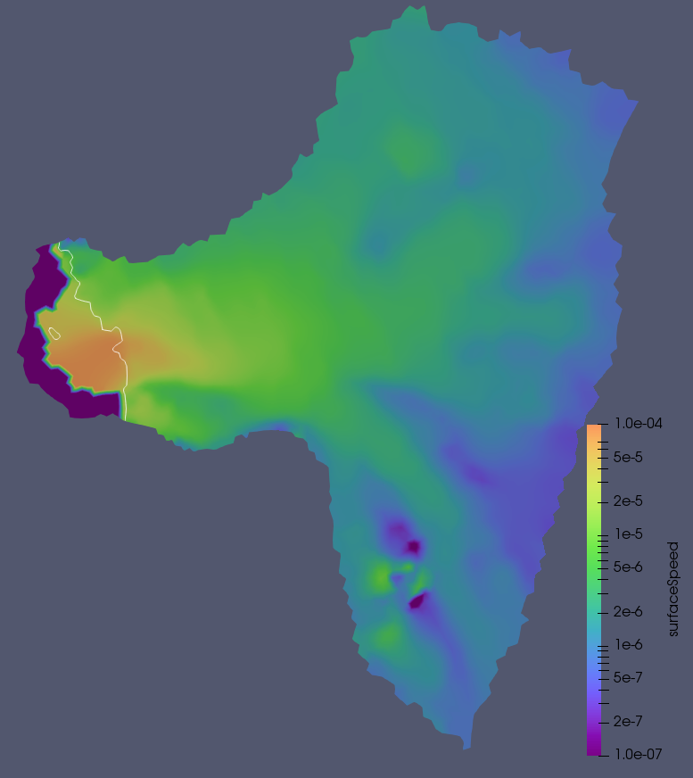

.. _landice_thwaites:

thwaites
=========

The ``landice/thwaites`` test group runs tests with a coarse (4-14-km)
`Thwaites Glacier mesh <https://web.lcrc.anl.gov/public/e3sm/mpas_standalonedata/mpas-albany-landice/thwaites.4km.210608.nc>`_.
The purpose of this test group is to provide a realistic glacier that
includess an ice shelf.
The mesh and initial condition are already generated.  In the future,
additional test cases may be added for generating a new version of the
Thwaites mesh at different resolutions and using different data sources.

   FO velocity solution visualized in Paraview.  Grounding line position
   shown with a white line.

The test group includes 2 test cases, each of which has one or more steps
that are variants on ``run_model`` (given other names in the decomposition and
restart test cases to distinguish multiple model runs), which performs time
integration of the model.  There is a not an explicit smoke test, but the
``full_run`` step of the ``restart_test`` can be used as a smoke test.

The test cases in this test group can only be run with the FO velocity
solvers. Running with the FO solver requires a build of MALI that includes
Albany.

config options
--------------

There are no config options specific to this test group.

decomposition_test
------------------

``landice/thwaites/decomposition_test`` runs short (2-day) integrations of the
model forward in time on 16 (``16proc_run`` step) and then on 32 cores
(``32proc_run`` step) to make sure the resulting prognostic variables are
bit-for-bit identical between the two runs.

restart_test
------------

``landice/thwaites/restart_test`` first runs a short (5-day) integration
of the model forward in time (``full_run`` step).  Then, a second step
(``restart_run``) performs two subsequent 2 and 3 day integrations, where the
second begins from a restart file saved by the first. Prognostic variables
are compared between the "full" and "restart" runs to make sure they are
bit-for-bit identical.
