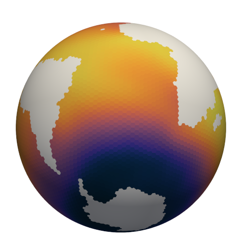
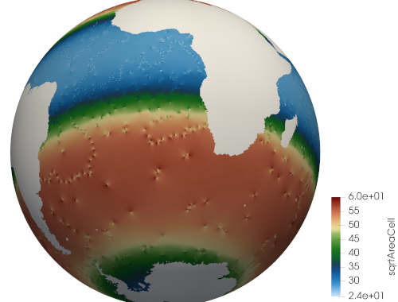

.. _ocean_global_ocean:

global_ocean
============

The ``ocean/global_ocean/`` configuration defines meshes,
initial conditions, testing, and spin-up for global, realistic ocean domains.
Currently, two mesh resolutions---:ref:`global_ocean_mesh_qu240` and
:ref:`global_ocean_mesh_ec30to60`, along with their variants with
:ref:`global_ocean_ice_shelf_cavities`---have been ported from COMPASS legacy,
with many more to follow in the coming months.

compass will be the tool used to create ocean meshes and initial conditions for
future versions of `E3SM <https://e3sm.org/>`_.

The ``global_ocean`` configuration a test case for creating each mesh, test
cases for creating each of the 4 supported initial-conditions variants using
that mesh, a number of test cases aimed at regression testing, and a spin-up
test case for each mesh that produces an initial condition appropriate for
incorporation into E3SM.  (compass does *not* provide the tools for
creating many of the files needed for full E3SM coupling, a process that
requires expert help from the E3SM development team.)

Shared config options
---------------------

All ``global_ocean`` test cases start the following shared config options.
Note that meshes and test cases may modify these options, as noted below.

.. code-block:: cfg

    # options for global ocean testcases
    [global_ocean]

    ## each mesh should replace these with appropriate values in its config file

    ## config options related to the mesh step
    # number of cores to use
    mesh_cores = 1
    # minimum of cores, below which the step fails
    mesh_min_cores = 1
    # maximum memory usage allowed (in MB)
    mesh_max_memory = 1000
    # maximum disk usage allowed (in MB)
    mesh_max_disk = 1000

    ## config options related to the initial_state step
    # number of cores to use
    init_cores = 4
    # minimum of cores, below which the step fails
    init_min_cores = 1
    # maximum memory usage allowed (in MB)
    init_max_memory = 1000
    # maximum disk usage allowed (in MB)
    init_max_disk = 1000
    # number of threads
    init_threads = 1

    ## config options related to the forward steps
    # number of cores to use
    forward_cores = 4
    # minimum of cores, below which the step fails
    forward_min_cores = 1
    # number of threads
    forward_threads = 1
    # maximum memory usage allowed (in MB)
    forward_max_memory = 1000
    # maximum disk usage allowed (in MB)
    forward_max_disk = 1000

    ## metadata related to the mesh
    # whether to add metadata to output files
    add_metadata = True
    # the prefix (e.g. QU, EC, WC, SO)
    prefix = PREFIX
    # a description of the mesh
    mesh_description = <<<Missing>>>
    # a description of the bathymetry
    bathy_description = <<<Missing>>>
    # a description of the mesh with ice-shelf cavities
    init_description = <<<Missing>>>
    # E3SM version that the mesh is intended for
    e3sm_version = 2
    # The revision number of the mesh, which should be incremented each time the
    # mesh is revised
    mesh_revision = <<Missing>>
    # the minimum (finest) resolution in the mesh
    min_res = <<<Missing>>>
    # the maximum (coarsest) resolution in the mesh, can be the same as min_res
    max_res = <<<Missing>>>
    # the maximum depth of the ocean, always detected automatically
    max_depth = autodetect
    # the number of vertical levels, always detected automatically
    levels = autodetect

    # the date the mesh was created as YYMMDD, typically detected automatically
    creation_date = autodetect
    # The following options are detected from .gitconfig if not explicitly entered
    author = autodetect
    email = autodetect
    # The URL of the pull request documenting the creation of the mesh
    pull_request = <<<Missing>>>

    # config options related to initial condition and diagnostics support files
    # for E3SM
    [files_for_e3sm]

    # whether to generate an ocean initial condition in E3SM
    enable_ocean_initial_condition = true
    # whether to generate graph partitions for different numbers of ocean cores in
    # E3SM
    enable_ocean_graph_partition = true
    # whether to generate a sea-ice initial condition in E3SM
    enable_seaice_initial_condition = true
    # whether to generate SCRIP files for later use in creating E3SM mapping files
    enable_scrip = true
    # whether to generate region masks, transects and mapping files for use in both
    # online analysis members and offline with MPAS-Analysis
    enable_diagnostics_files = true

    ## the following relate to the comparison grids in MPAS-Analysis to generate
    ## mapping files for.  The default values are also the defaults in
    ## MPAS-Analysis.  Coarser or finer resolution may be desirable for some MPAS
    ## meshes.

    # The comparison lat/lon grid resolution in degrees
    comparisonLatResolution = 0.5
    comparisonLonResolution = 0.5

    # The comparison Antarctic polar stereographic grid size and resolution in km
    comparisonAntarcticStereoWidth = 6000.
    comparisonAntarcticStereoResolution = 10.

    # The comparison Arctic polar stereographic grid size and resolution in km
    comparisonArcticStereoWidth = 6000.
    comparisonArcticStereoResolution = 10.

The ``mesh_*``, ``init_*`` and ``forward:*`` config options are used to specify
the resources used in in the ``mesh`` step of the :ref:`global_ocean_mesh`,
the ``initial_state`` step of the :ref:`global_ocean_init` and the
:ref:`global_ocean_forward`, respectively.  These values will differ between
test cases and meshes.

The next group of config options (``add_metadata`` to ``pull_request``) specify
metadata related to the mesh and initial condition.  These will be filled in
based on the mesh and initial condition of the particular test case.

The final group are used in the :ref:`global_ocean_files_for_e3sm`.

.. _global_ocean_metadata:

Metadata
--------

Most ``global_ocean`` test cases produce output files in NetCDF format.  The
MPAS development team `decided in April 2020 <https://github.com/MPAS-Dev/MPAS-Model/pull/507>`_
to add a standardized set of metadata to these files to document the mesh and
initial condition, and to provide provenance describing the environment used to
create the mesh.

compass adds the following fields to most NetCDF files (those related to the
initial condition are not added to mesh files, because the initial condition
is not yet known at the time of mesh creation):

.. code-block:: none

    :MPAS_Mesh_Short_Name = "QU240E2r1" ;
    :MPAS_Mesh_Long_Name = "QU240kmL16E3SMv2r1" ;
    :MPAS_Mesh_Prefix = "QU" ;
    :MPAS_Mesh_E3SM_Version = "2" ;
    :MPAS_Mesh_Pull_Request = "https://github.com/MPAS-Dev/compass/pull/28" ;
    :MPAS_Mesh_QU_Revision = "1" ;
    :MPAS_Mesh_QU_Version_Author = "Xylar Asay-Davis" ;
    :MPAS_Mesh_QU_Version_Author_E-mail = "xylar@lanl.gov" ;
    :MPAS_Mesh_QU_Version_Creation_Date = "210116" ;
    :MPAS_Mesh_QU_Minimum_Resolution_km = "240" ;
    :MPAS_Mesh_QU_Maximum_Resolution_km = "240" ;
    :MPAS_Mesh_QU_Maximum_Depth_m = "3000.0" ;
    :MPAS_Mesh_QU_Number_of_Levels = "16" ;
    :MPAS_Mesh_Description = "MPAS quasi-uniform mesh for E3SM version 2 at 240-km global resolution with 16 vertical level" ;
    :MPAS_Mesh_Bathymetry = "Bathymetry is from GEBCO 2019, combined with BedMachine Antarctica around Antarctica." ;
    :MPAS_Initial_Condition = "Polar science center Hydrographic Climatology (PHC)" ;
    :MPAS_Mesh_COMPASS_Version = "1.0.0" ;
    :MPAS_Mesh_JIGSAW_Version = "0.9.12" ;
    :MPAS_Mesh_JIGSAW-Python_Version = "0.2.1" ;
    :MPAS_Mesh_MPAS-Tools_Version = "0.2.0" ;
    :MPAS_Mesh_NCO_Version = "4.9.7" ;
    :MPAS_Mesh_ESMF_Version = "8.0.1" ;
    :MPAS_Mesh_geometric_features_Version = "0.1.13" ;
    :MPAS_Mesh_Metis_Version = "5.1.0" ;
    :MPAS_Mesh_pyremap_Version = "0.0.8" ;

Most of these options can be modified by the user by editing config options.
The most convenient way to do this is to add them to the user config file
when you are :ref:`setup_overview` or :ref:`suite_overview`.  In particular,
you may wish to set:

.. code-block:: cfg

    # options for global ocean testcases
    [global_ocean]

    ## metadata related to the mesh
    # whether to add metadata to output files
    add_metadata = True
    # the date the mesh was created as YYMMDD, typically detected automatically
    creation_date = autodetect
    # The following options are detected from .gitconfig if not explicitly entered
    author = autodetect
    email = autodetect
    # The URL of the pull request documenting the creation of the mesh
    pull_request = <<<Missing>>>

.. _global_ocean_meshes:

Meshes
------

The process for creating global ocean meshes is described below in the
:ref:`global_ocean_mesh`.  compass currently supports 4 meshes.  Two are at
such coarse horizontal resolution (240 km) that they are mostly useful for
testing purposes, not scientific simulations.  The remaining meshes, which vary
in resolution between 30 and 60 km, are used as the lowest resolution meshes
in E3SM's `science campaigns <https://e3sm.org/research/science-campaigns/>`_.

.. _global_ocean_mesh_qu240:

QU240
^^^^^

The quasi-uniform 240-km (QU240) mesh, is a global mesh with approximately
240-km horizontal resolution everywhere (as the name implies).
:ref:`global_ocean_ice_shelf_cavities` around Antarctica are excluded from the
mesh.  This mesh is used as part of the :ref:`ocean_suite_nightly` to perform
regression and performance testing in a coarse but realistic model
configuration.  This mesh is also being used in studies of
`climate reproducibility <https://e3sm.org/can-we-switch-computers-an-application-of-e3sm-climate-reproducibility-tests/>`_.

.. _global_ocean_mesh_quwisc240:

QUwISC240
^^^^^^^^^

The quasi-uniform 240-km mesh with ice-shelf cavities (QUwISC240) is nearly
identical to the :ref:`global_ocean_mesh_qu240` except that it includes the
:ref:`global_ocean_ice_shelf_cavities` around Antarctica in the ocean domain.

MPAS-Ocean's treatment of ice-shelf cavities requires and iterative adjustment
step to make the ``landIcePressure`` compatible with the ``ssh`` (see
:ref:`ocean_ssh_adjustment`).  This process is relatively time consuming,
requiring a short forward run for each iteration, meaning that QUwISC240 is
less efficient for regression and performance testing than QU240.  However,
it is useful for low-resolution testing that exercises compass and MPAS-Ocean
functionality related to ice-shelf cavities and sub-ice-shelf freshwater
fluxes.

.. _global_ocean_mesh_ec30to60:

EC30to60
^^^^^^^^

The eddy-closure 30- to 60-km (EC30to60) mesh is the coarsest MPAS-Ocean mesh
used for scientific simulations.  It is coarse enough that it requires the
`Gent-McWilliams eddy closure <https://doi.org/10.1175/1520-0485(1990)020<0150:IMIOCM>2.0.CO;2>`
as a parameterization of mixing from mesoscale ocean eddies.

.. image:: images/ec30to60.png
   :width: 500 px
   :align: center

The image above shows the resolution (as measured by :math:`\sqrt{A_c}`, where
:math:`A_c` is the area of a cell in the mesh).  The resolution is
approximately zonally invariant and transitions smoothly between three target
resolutions as a function of latitude: ~30 km at around the equator, ~60 km
at mid-latitudes and ~35 km near the the poles.

.. _global_ocean_mesh_ecwisc30to60:

ECwISC30to60
^^^^^^^^^^^^

The eddy-closure 30- to 60-km mesh with ice-shelf cavities (ECwISC30to60) is
nearly identical to the :ref:`global_ocean_mesh_ec30to60` except that it
includes the :ref:`global_ocean_ice_shelf_cavities` around Antarctica in the
ocean domain.

A variant of this mesh has been used for low resolution simulations as part of
the `E3SM v1 Cryosphere Campaign <https://e3sm.org/research/cryosphere-ocean/v1-cryosphere-ocean/>`_.

.. _global_ocean_ice_shelf_cavities:

Ice-shelf cavities
------------------

The inclusion of ice-shelf cavities and melt rates below ice shelves around
Antarctica is a major objective of the
`E3SM v1 Cryosphere Campaign <https://e3sm.org/research/cryosphere-ocean/v1-cryosphere-ocean/>`_.
Sub-ice-shelf melt rates are needed in order to estimate future mass loss
from the Antarctic Ice Sheet.  Along with dynamic ocean boundaries, they are an
important component in future coupling between MPAS-Ocean and MALI.

Each of the ``global_ocean`` :ref:`global_ocean_meshes` can support a variant
with ice-shelf cavities along with one without.  Meshes with cavities include
the ``wISC`` suffix for "with ice-shelf cavities" attached to the mesh prefix
(e.g. ``QU`` or ``EC``).  Currently all meshes include both variants but we
anticipate that future meshes may include only the variant with or without
cavities.

MPAS-Ocean implements the topography of ice-shelf cavities by allowing the
sea-surface height (SSH) to follow the ice shelf-ocean interface (the ice
draft).  The sea surface is depressed by applying the pressure of the overlying
ice shelf as a top boundary condition.  The :ref:`ocean_vertical` in ice-shelf
cavities is a bit more complex than the simpler z* coordinate used elsewhere
in the ocean domain because ocean layers have to be made thicker or their
slope has to be reduced via smoothing to prevent the Haney number
(`Haney 1991 <https://doi.org/10.1175/1520-0485(1991)021%3C0610:OTPGFO%3E2.0.CO;2>`_)
from becoming too large.

Around Antarctica, the topographic data currently used to construct initial
conditions in compass comes from
`BedMachineAntarctica <https://sites.uci.edu/morlighem/dataproducts/bedmachine-antarctica/>`_.
This dataset is better equipped to provide the ice draft than the pressure from
the weight of the ice shelf.  Ideally, the initial ice draft and the ice-shelf
pressure would be consistent with one another, so that the SSH would remain
nearly stationary in time once the MPAS-Ocean simulation starts.  In practice,
this is difficult to achieve.

Typically, ice shelves are assumed to be freely floating on the ocean with
negligible bridging stresses, meaning that the ice draft and the weight
of the ice are related through the average density of the ice and of the
displaced ocean water in a given column.  However, in most circumstances it is
hard to accurately determine the average density of displaced ocean water, and
details of the numerical algorithm for computing the horizontal pressure
gradient can also affect how consistent the ice draft and pressure fields are.

MPAS-Ocean achieves a consistent ice draft and ice-shelf pressure by:

1. making an initial guess that the displaced ocean density is the same as the
   density in the top ocean layer and

2. iteratively performing short (typically 1-hour) forward simulations in which
   the SSH is free to evolve, then modifying the ice-shelf pressure to attempt
   to compensate for changes in the SSH during the forward run.

We have found this approach to be robust over a range of resolutions from <1 km
to 240 km and in both idealized and realistic model configurations.

.. _global_ocean_bgc:

Biogeochemsitry
---------------

<<<I need help here!!!>>>

.. _global_ocean_forward:

Forward step
------------

The only step shared across many ``global_ocean`` test cases is ``forward``
(though I doesn't always go by that name), which integrates the MPAS-Ocean
model in time in "forward" mode.

As a user, your main way of altering forward runs is by changing namelist
options directly in ``namelist.ocean`` or modifying streams in
``streams.ocean``.  However, there are a few parameters related to forward runs
you can change in the config file for a test case.  Since some test cases like
:ref:`global_ocean_restart_test` and :ref`global_ocean_spinup` have more than
one forward run, it is convenient to change options like ``forward_cores`` once
in the config file, knowing that this will change the target number of cores
of all forward model runs in the test case.  The same applies to the other
``forward_*`` config options that change the minimum cores allowed, the number
of threads, and (in the future) the maximum memory and disk usage.

.. _global_ocean_test_cases:

Test cases
----------

``global_ocean`` includes 9 types of test cases (each with different versions
for different meshes, initial conditions, time integrators, etc.).

.. _global_ocean_mesh:

mesh test case
^^^^^^^^^^^^^^

The ``ocean/global_ocean/<mesh>/mesh`` test case (where ``<mesh>`` is the name
of a mesh, e.g. :ref:`global_ocean_mesh_qu240`) creates a "base" horizontal
mesh covering the globe with a distribution of resolution according to the
specifications of the mesh.  The base mesh is created using the
`JIGSAW <https://github.com/dengwirda/jigsaw>`_ and
`JIGSAW-Python <https://github.com/dengwirda/jigsaw-python>`_ tools.  Then, a
mask for "land" (i.e. non-ocean) cells is created and the mesh is culled so
that only ocean cells are retained. The data set determining which cells are
land vs. ocean depends on whether ice-shelf cavities are included in the mesh
or not (see :ref:`global_ocean_ice_shelf_cavities`).  A coastline from
`Natural Earth <https://www.naturalearthdata.com/downloads/110m-physical-vectors/110m-coastline/>`_
is combined with either the edge of Antarctic Ice Sheet (AIS) or the edge of the
grounded portion of the AIS from
`BedMachineAntarctica <https://sites.uci.edu/morlighem/dataproducts/bedmachine-antarctica/>`_.
These coastlines come from the
`geometric_features <https://github.com/MPAS-Dev/geometric_features>`_ package.

For most meshes, tools and data sets from the
``geometric_features`` and from the
`mpas_tools <https://github.com/MPAS-Dev/MPAS-Tools>`_ package are used to
ensure that some transects such the thin opening at Gibraltar connecting the
Mediterranean Sea to the Atlantic Ocean (so-called "critical passages") are
represented by contiguous ocean cells while others such as the Antarctic
Peninsula (so-called "critical land blockages") are blocked by land with no
ocean connectivity.

As part of culling the mesh, adding critical passages, and removing critical
land blockages, there is also a step in which a "flood fill" is performed to
ensure that all parts of the global ocean are connected to one another by at
least one neighboring cell.

.. _global_ocean_init:

init test case
^^^^^^^^^^^^^^

Once the horizontal mesh has been created, the next step is to create a
vertical mesh and and initial condition.

The default vertical coordinate depends on the mesh being used, as described
in :ref:`global_ocean_meshes`.  Possible grid types are described in
:ref:`ocean_vertical` and include ``uniform``, ``tanh_dz``, ``60layerPHC``,
``42layerWOCE``, and ``100layerE3SMv1``.

compass supports two different types of initial conditions.  One is derived
from the Polar science center Hydrographic Climatology
(`PHC <http://psc.apl.washington.edu/nonwp_projects/PHC/Climatology.html>`_).
The other is the UK MetOffice's EN4 estimated climatology for the year 1900
(`EN4_1900 <https://www.metoffice.gov.uk/hadobs/en4/download-en4-2-0.html>`_).

Either initial condition can also be combined with ecosystem tracers used in
simulations with active :ref:`global_ocean_bgc` if ocean biogeochemsitry is
enabled.  This dataset is from <<<need some help here!!!>>>.

Thus, there are 4 combinations of initial conditions, ``PHC``, ``PHC_BGC``,
``EN4_1900`` and ``EN4_1900_BGC``.  All subsequent tests
(:ref:`global_ocean_performance_test`, :ref:`global_ocean_restart_test`, etc.)
could potentially start from any of these initial conditions, meaning that
a performance test starting from PHC should be thought of as a different test
from one starting from EN4_1900.  Therefore, it is convenient to house both
the ``init`` test case and all subsequent test cases that depend on it within
a subdirectory with the name of the initial condition.  The relative paths
associate with each initial condition for a given ``<mesh>`` are:

* ``ocean/global_ocean/<mesh>/PHC/init``

* ``ocean/global_ocean/<mesh>/PHC_BGC/init``

* ``ocean/global_ocean/<mesh>/EN4_1900/init``

* ``ocean/global_ocean/<mesh>/EN4_1900_BGC/init``

.. _global_ocean_performance_test:

performance_test test case
^^^^^^^^^^^^^^^^^^^^^^^^^^

The ``performance_test`` test case runs a short forward integration, then
performs validation of prognostic variables (layer thickness, velocity,
temperature and salinity) and, if applicable, variables related to fluxes
below ice shelves and those associated with :ref:`global_ocean_bgc`. The
duration of the forward run depends on the mesh and the time integrator.

Depending on the mesh, versions of the test may exist with both or either of
the split-explict (base on `Higdon 2005 <https://doi.org/10.1016/j.jcp.2004.12.011>`_)
or the 4th-order Runge-Kutta
(`RK4 <https://en.wikipedia.org/wiki/Runge%E2%80%93Kutta_methods>`_) time
integrator. Each of these possible variants is given its own subdirectory.
Thus, for a given mesh ``<mesh>`` and initial condition ``<ic>``, one or
more of these versions of the ``performance_test`` will be available:

* ``ocean/global_ocean/<mesh>/<ic>/performance_test/split_explicit``

* ``ocean/global_ocean/<mesh>/<ic>/performance_test/RK4``

Versions of this test cases is currently available for all meshes, but not
necessarily for all combinations of initial conditions and time integrators.

.. _global_ocean_restart_test:

restart_test test case
^^^^^^^^^^^^^^^^^^^^^^

The ``restart_test`` test case runs a short forward integration, saving an
intermediate restart file.  Then, in a second forward step, the test continues
the run from the restart file.  Output from the two steps (``full_run`` and
``restart_run``) are compared to make sure prognostic variables (layer
thickness, velocity, temperature and salinity) are unchanged.

As with the :ref:`global_ocean_performance_test`, ``restart_test`` can
be run with either or both of the split-explicit or RK4 time integrator. Thus,
for a the :ref:`global_ocean_mesh_qu240` or :ref:`global_ocean_mesh_quwisc240`
mesh (currently the only supported meshes) and initial condition ``<ic>``, one
or more of these versions of the ``restart_test`` will be available:

* ``ocean/global_ocean/QU240/<ic>/restart_test/split_explicit``

* ``ocean/global_ocean/QU240/<ic>/restart_test/RK4``

* ``ocean/global_ocean/QUwISC240/<ic>/restart_test/split_explicit``

* ``ocean/global_ocean/QUwISC240/<ic>/restart_test/RK4``

.. _global_ocean_decomp_test:

decomp_test test case
^^^^^^^^^^^^^^^^^^^^^

The ``decomp_test`` test case runs a short forward integration with 4 cores
(``4proc``) and then performs the same run again in another step with 8 cores
(``8proc``).  Prognostic variables (layer thickness, velocity, temperature and
salinity) are compared to make sure they are unchanged.

As with the :ref:`global_ocean_performance_test`, ``decomp_test`` can
be run with either or both of the split-explicit or RK4 time integrator. Thus,
for a the :ref:`global_ocean_mesh_qu240` or :ref:`global_ocean_mesh_quwisc240`
mesh (currently the only supported meshes) and initial condition ``<ic>``, one
or more of these versions of the ``decomp_test`` will be available:

* ``ocean/global_ocean/QU240/<ic>/decomp_test/split_explicit``

* ``ocean/global_ocean/QU240/<ic>/decomp_test/RK4``

* ``ocean/global_ocean/QUwISC240/<ic>/decomp_test/split_explicit``

* ``ocean/global_ocean/QUwISC240/<ic>/decomp_test/RK4``

.. _global_ocean_threads_test:

threads_test test case
^^^^^^^^^^^^^^^^^^^^^^

The ``threads_test`` test case runs a short forward integration with 1 thread
and 4 cores (``1thread``) and then performs the same run again in another step
with 2 threads and 4 cores (``2thread``).  Prognostic variables (layer
thickness, velocity, temperature and salinity) are compared to make sure they
are unchanged.

As with the :ref:`global_ocean_performance_test`, ``threads_test`` can
be run with either or both of the split-explicit or RK4 time integrator. Thus,
for a the :ref:`global_ocean_mesh_qu240` or :ref:`global_ocean_mesh_quwisc240`
mesh (currently the only supported meshes) and initial condition ``<ic>``, one
or more of these versions of the ``threads_test`` will be available:

* ``ocean/global_ocean/QU240/<ic>/threads_test/split_explicit``

* ``ocean/global_ocean/QU240/<ic>/threads_test/RK4``

* ``ocean/global_ocean/QUwISC240/<ic>/threads_test/split_explicit``

* ``ocean/global_ocean/QUwISC240/<ic>/threads_test/RK4``

.. _global_ocean_analysis_test:

analysis_test test case
^^^^^^^^^^^^^^^^^^^^^^^

The ``analysis_test`` is used to test the proper function and validate the
output from a large number of MPAS-Ocean's "analysis members".  Analysis
members allow MPAS-Ocean to compute analysis during the model run, meaning
much of the same infrastructure and functionality used in the forward model
can also be used for analysis.  Analysis members are also useful for analysis
that is too large or time consuming to perform after the simulation has
completed, or where storing the required data to disk would be infeasible.

The analysis members tested in this test case are:

* ``globalStats``

* ``surfaceAreaWeightedAverages``

* ``waterMassCensus``

* ``layerVolumeWeightedAverage``

* ``zonalMean``

* ``okuboWeiss``

* ``meridionalHeatTransport``

* ``highFrequencyOutput``

* ``eliassenPalm``

* ``mixedLayerDepths``

* ``debugDiagnostics``

* ``eddyProductVariables``

* ``oceanHeatContent``

* ``mixedLayerHeatBudget``

For more information on these analysis members, see the
`MPAS-Ocean user's guide <https://doi.org/10.5281/zenodo.1246893>`_.

As with the :ref:`global_ocean_performance_test`, ``analysis_test`` can
be run with either or both of the split-explicit or RK4 time integrator. Thus,
for a the :ref:`global_ocean_mesh_qu240` or :ref:`global_ocean_mesh_quwisc240`
mesh (currently the only supported meshes) and initial condition ``<ic>``, one
or more of these versions of the ``analysis_test`` will be available:

* ``ocean/global_ocean/QU240/<ic>/analysis_test/split_explicit``

* ``ocean/global_ocean/QU240/<ic>/analysis_test/RK4``

* ``ocean/global_ocean/QUwISC240/<ic>/analysis_test/split_explicit``

* ``ocean/global_ocean/QUwISC240/<ic>/analysis_test/RK4``

.. _global_ocean_daily_output_test:

daily_output_test test case
^^^^^^^^^^^^^^^^^^^^^^^^^^^

The ``daily_output_test`` is similar to the :ref:`global_ocean_analysis_test`:
it is used to run and validate the ``timeSeriesStatsDaily`` analysis member.
The reason for a separate test is that the ``daily_output_test`` must run for
a full day to produce useful output, significantly longer than the
:ref:`global_ocean_analysis_test`.

The ``timeSeriesStatsDaily`` performs daily averages of a large number of
model variables.  The variables in this test are kept in sync with the default
output of the ``timeSeriesStatsMonthly`` analysis member used in E3SM.  This
test is used to gain confidence that E3SM output from MPAS-Ocean will have the
expected variables and formatting.  For example, the test is currently being
used in an effort to improve compliance to the
`CF Conventions <https://cfconventions.org/>` in the output metadata.

As with the :ref:`global_ocean_performance_test`, ``daily_output_test`` can
be run with either or both of the split-explicit or RK4 time integrator. Thus,
for a the :ref:`global_ocean_mesh_qu240` or :ref:`global_ocean_mesh_quwisc240`
mesh (currently the only supported meshes) and initial condition ``<ic>``, one
or more of these versions of the ``daily_output_test`` will be available:

* ``ocean/global_ocean/QU240/<ic>/daily_output_test/split_explicit``

* ``ocean/global_ocean/QU240/<ic>/daily_output_test/RK4``

* ``ocean/global_ocean/QUwISC240/<ic>/daily_output_test/split_explicit``

* ``ocean/global_ocean/QUwISC240/<ic>/daily_output_test/RK4``

.. _global_ocean_spinup:

spinup test case
^^^^^^^^^^^^^^^^

One of the main purposes of compass is to provide a way of spinning up
MPAS-Ocean initial conditions to dissipate transients that result from starting
the simulation from rest.  Particularly for high resolution meshes, surface
waves with fast time scales and large amplitude must be damped (by applying
Rayleigh friction), first aggressively, then more gently, before damping is
disabled.

The ``spinup`` test case is implemented differently for each of the
:ref:`global_ocean_meshes`.  For example, for the :ref:`global_ocean_mesh_qu240`
and ref:`global_ocean_mesh_quwisc240` meshes, we perform only 1 day of damping
(and even this is likely unnecessary), followed by a 1-day simulation without
damping.  In contrast, for the :ref:`global_ocean_mesh_ec30to60`
and ref:`global_ocean_mesh_ecwisc30to60` meshes, we perform a 10-day spin-up
with aggressive damping, followed by 10 more days without damping. Higher
resolution meshes in :ref:`legacy_compass` require several stages of damping,
each over several days before damping can be removed.

As with the :ref:`global_ocean_performance_test`, ``spinup`` can
be run with either or both of the split-explicit or RK4 time integrator.
Thus, for a given mesh ``<mesh>`` and initial condition ``<ic>``, one or
more of these versions of the ``performance_test`` will be available:

* ``ocean/global_ocean/<mesh>/<ic>/spinup/split_explicit``

* ``ocean/global_ocean/<mesh>/<ic>/spinup/RK4``

Versions of this test cases is currently available for all meshes, but not
necessarily for all combinations of initial conditions and time integrators.

The :ref:`ocean_suite_qu240_spinups`, :ref:`ocean_suite_ec30to60` and
:ref:`ocean_suite_ecwisc30to60` are are :ref:`ocean_suites` designed to make
it easier to run the standard spin-up test cases for each mesh along with
the related :ref:`global_ocean_mesh`, :ref:`global_ocean_init`, and
:ref:`global_ocean_files_for_e3sm`.

.. _global_ocean_files_for_e3sm:

files_for_e3sm test case
^^^^^^^^^^^^^^^^^^^^^^^^

After running the :ref:`global_ocean_spinup`, users may be interested in
preparing a number of files needed for including a new mesh in E3SM.  These
files include: MPAS-Ocean and MPAS-Seaice initial conditions (including
:ref:`global_ocean_metadata`);
`SCRIP files <https://earthsystemmodeling.org/docs/release/ESMF_8_0_1/ESMF_refdoc/node3.html#SECTION03028100000000000000>`_;
partition files, created with
`gpmetis <http://glaros.dtc.umn.edu/gkhome/metis/metis/overview>`_, for
splitting the mesh across a number of possible core counts; and
a mask file for MPAS-Ocean's ``mocStreamfunction`` analysis member.  In the
near future, mask and mapping files for
`MPAS-Analysis <https://mpas-dev.github.io/MPAS-Analysis/stable/>`_ will also
be added.

The resulting files are symlinked in a subdirectory of the test case called
``assembled_files``.  This directory contains subdirectories with the same
structure as the `E3SM data server <https://web.lcrc.anl.gov/public/e3sm/>`_.
For new meshes, these files can be uploaded by an expert from the E3SM team
along with additional files required for full E3SM integration.  Currently,
there is not a way to use new meshes in E3SM without help from an expert from
the E3SM team.
