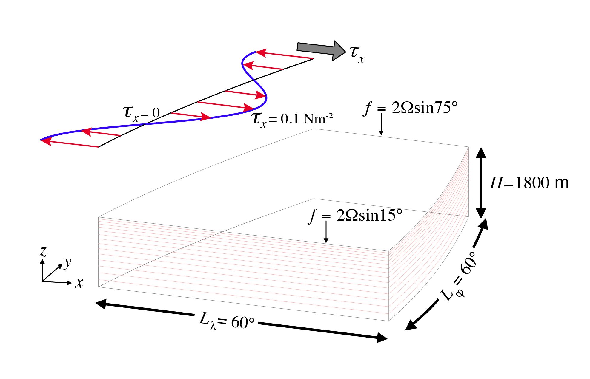

.. _baroclinic_gyre:

baroclinic_gyre
===============

The ``baroclinic_gyre`` test group implements variants of the
baroclinic ocean gyre set-up from the `MITgcm test case`_.

This test simulates a baroclinic, wind and buoyancy-forced, double-gyre ocean 
circulation. The grid employs spherical polar coordinates with 15 vertical 
layers. The configuration is similar to the double-gyre setup first solved 
numerically in `Cox and Bryan (1984) <https://journals.ametsoc.org/view/journals/phoc/14/4/1520-0485_1984_014_0674_anmotv_2_0_co_2.xml>`_: 
the model is configured to represent an enclosed sector of fluid on a sphere, 
spanning the tropics to mid-latitudes,
:math:`60^{\circ} \times 60^{\circ}` in lateral extent.
The fluid is :math:`1.8`\ km deep and is forced by a zonal wind stress which 
is constant in time, :math:`\tau_{\lambda}`, varying sinusoidally in the
north-south direction.

  Schematic of simulation domain and wind-stress forcing function for 
  baroclinic gyre numerical experiment. The domain is enclosed by solid walls. 
  From `MITgcm test case`_.

Forcing
-------

The Coriolis parameter, :math:`f`, is defined
according to latitude :math:`\varphi`

.. math::
      f(\varphi) = 2 \Omega \sin( \varphi )

with the rotation rate, :math:`\Omega` set to 
:math:`\frac{2 \pi}{86164} \text{s}^{-1}` (i.e., corresponding to the 
standard Earth rotation rate, using the CIME constant to ensure consistency).
The sinusoidal wind-stress variations are defined according to

.. math::
      \tau_{\lambda}(\varphi) = -\tau_{0}\cos \left(2 \pi \frac{\varphi-\varphi_o}{L_{\varphi}} \right)

where :math:`L_{\varphi}` is the lateral domain extent
(:math:`60^{\circ}`), :math:`\varphi_o` is set to :math:`15^{\circ} \text{N}` 
and :math:`\tau_0` is :math:`0.1 \text{ N m}^{-2}`.
:ref:`baroclinic_gyre.cfg` summarizes the configuration options used in this 
simulation. 

Temperature is restored in the surface layer to a linear profile:

.. math::
      {\cal F}_\theta = - U_{piston} (\theta-\theta^*), \phantom{WWW}
   \theta^* = \frac{\theta_{\rm max} - \theta_{\rm min}}{L_\varphi} (\varphi_{\rm max} - \varphi) + \theta_{\rm min}
   :label: baroc_restore_theta

where the piston velocity :math:`U_{piston}` (in m.s^{-1}) is calculated by 
applying a relaxation timescale of 30 days (set in config file) over the 
thickness of the top layer (50 m by default) and 
:math:`\theta_{\rm max}=30^{\circ}` C, :math:`\theta_{\rm min}=0^{\circ}` C.

Initial state
-------------

Initially the fluid is stratified with a reference potential temperature 
profile that varies from (approximately) :math:`\theta=30.6 \text{ } ^{\circ}`\ C
in the surface layer to :math:`\theta=1.56 \text{ } ^{\circ}`\ C in the 
bottom layer. To ensure that the profile is independent of the vertical 
discretization, the profile is now set by a surface value (at the top 
interface) and a bottom value (at the bottom interface), set in the ``.cfg`` 
file. The default values have been chosen for the layer values (calculated 
with ``zMid``) to approximate the discrete values presented in the MITgcm 
test case. The temperature functional form (and inner parameter ``cc``  was 
determined by fitting an analytical function to the MITgcm discrete layer 
values (originally ranging from 2 to :math:`30 \text{ } ^{\circ}`\ C. If the 
``bottom_depth`` is different from the default 1800m value, the temperature 
profile is stretched in the vertical to fit the surface and bottom 
temperature constraints, but the thermocline depth and the discrete layer 
values will move away from the MITgcm test case.  
The equation of state used in this experiment is linear:

.. math::
      \rho = \rho_{0} ( 1 - \alpha_{\theta}\theta^{\prime} )
  :label: rho_lineareos

with :math:`\rho_{0}=999.8\,{\rm kg\,m}^{-3}` and
:math:`\alpha_{\theta}=2\times10^{-4}\,{\rm K}^{-1}`. The salinity is set to 
a uniform value of :math:`S=34`\ psu (set in the `.cfg` file) 
Given the linear equation of state, in this configuration the model state 
variable for temperature is equivalent to either in-situ temperature, 
:math:`T`, or potential temperature, :math:`\theta`. For simplicity, here we 
use the variable :math:`\theta` to represent temperature.

Analysis
--------

For scientific validation, this test case is meant to be run to quasi-steady 
state and its mean state compared to the MITgcm test case and / or 
theoretical scaling. This is done through an analysis step in the 
``3_year_test`` case. Note that 3 years are likely insufficient to bring the 
test case to full equilibrium.  Examples of qualitative plots include: 
i) equilibrated SSH contours on top of surface heat fluxes, 
ii) barotropic streamfunction (compared to MITgcm or a barotropic gyre test 
case).

Examples of checks against theory include: 
iii) max of simulated barotropic streamfunction ~ Sverdrup transport, 
iv) simulated thermocline depth ~ scaling argument for penetration depth 
(Vallis (2017) or Cushman-Roisin and Beckers (2011)).

Consider the Sverdrup transport:

.. math:: \rho v_{\rm bt} = \hat{\boldsymbol{k}} \cdot \frac{ \nabla  \times \vec{\boldsymbol{\tau}}}{\beta}

If we plug in a typical mid-latitude value for :math:`\beta` 
(:math:`2 \times 10^{-11}` m\ :sup:`-1` s\ :sup:`-1`) and note that 
:math:`\tau` varies by :math:`0.1` Nm\ :sup:`2` over :math:`15^{\circ}` 
latitude, and multiply by the width of our ocean sector, we obtain an 
estimate of approximately 20 Sv.

This scaling is obtained via thermal wind and the linearized barotropic 
vorticity equation), the depth of the thermocline :math:`h` should scale as:

.. math:: h = \left( \frac{w_{\rm Ek} f^2 L_x}{\beta \Delta b} \right) ^2 = \left( \frac{(\tau / L_y) f L_x}{\beta \rho'} \right) ^2

where :math:`w_{\rm Ek}` is a representive value for Ekman pumping, 
:math:`\Delta b = g \rho' / \rho_0`
is the variation in buoyancy across the gyre,
and :math:`L_x` and :math:`L_y` are length scales in the
:math:`x` and :math:`y` directions, respectively.
Plugging in applicable values at :math:`30^{\circ}`\ N,
we obtain an estimate for :math:`h` of 200 m.

.. _baroclinic_gyre.cfg:

config options
--------------

All 2 test cases share the same set of config options:

.. code-block:: cfg

    # Options related to the vertical grid
    [vertical_grid]
    
    # the type of vertical grid
    grid_type = linear_dz
    
    # the linear rate of thickness (m) increase for linear_dz
    linear_dz_rate = 10.
    
    # Number of vertical levels
    vert_levels = 15
    
    # Total water column depth in m
    bottom_depth = 1800.
    
    # The type of vertical coordinate (e.g. z-level, z-star)
    coord_type = z-star
    
    # Whether to use "partial" or "full", or "None" to not alter the topography
    partial_cell_type = None
    
    # The minimum fraction of a layer for partial cells
    min_pc_fraction = 0.1
    
    
    # config options for the baroclinic gyre
    [baroclinic_gyre]
    # Basin dimensions
    lat_min = 15
    lat_max = 75
    lon_min = 0
    lon_max = 60
    
    # Initial vertical temperature profile (C)
    initial_temp_top = 33.
    initial_temp_bot = 1.
    
    # Constant salinity value (also used in restoring)
    initial_salinity = 34.
    
    # Maximum zonal wind stress value (N m-2)
    wind_stress_max = 0.1
    
    # Surface temperature restoring profile
    restoring_temp_min = 0.
    restoring_temp_max = 30.
    
    # Restoring timescale for surface temperature (in days)
    restoring_temp_timescale = 30.

    # config options for the post processing (moc and viz)
    [baroclinic_gyre_post]
    # latitude bin increment for the moc calculation
    dlat = 0.25
    # number of years to average over for the mean state plots
    time_averaging_length = 1

performance_test
----------------

``ocean/baroclinic_gyre/performance_test`` is the default version of the
baroclinic_gyre test case for a short (3 time steps) test run and validation 
of prognostic variables for regression testing.

3_year_test
-----------

``ocean/baroclinic_gyre/3_year_test`` is an additional version of the
baroclinic_gyre test case with a longer (3-year) spin-up. By default, it 
includes monthly mean output, and plots the mean state of the simulation for 
the last 1 year (option in the config file). Note that for the 80km 
configuration, the estimated time to equilibration is roughly 50 years 
(approx 3 hours of compute time on default layout). This can be done by 
running the ``forward`` step several times (adding 3 years each time), or by
editing the ``forward/namelist.ocean`` file to set the ``config_run_duration``
to the desired simulation duration.
For a detailed comparison of the mean state against theory and results from 
other models, the mean state at 100 years may be most appropriate to be 
aligned with the MITgcm results. 

.. _MITgcm test case: https://mitgcm.readthedocs.io/en/latest/examples/baroclinic_gyre/baroclinic_gyre.html
