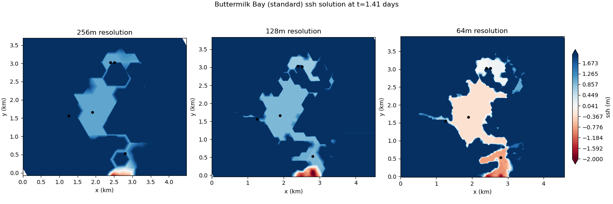
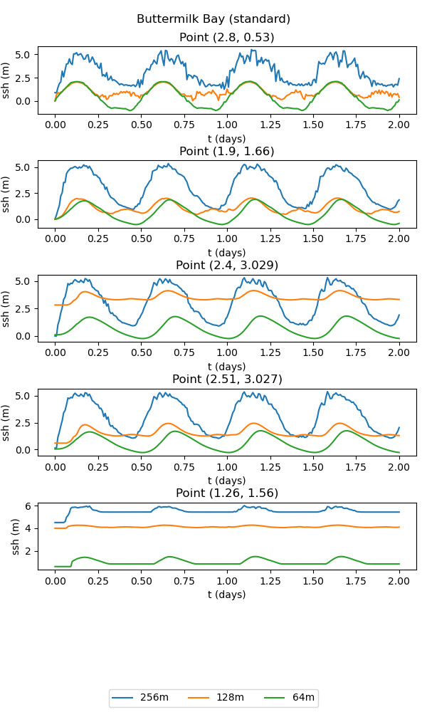
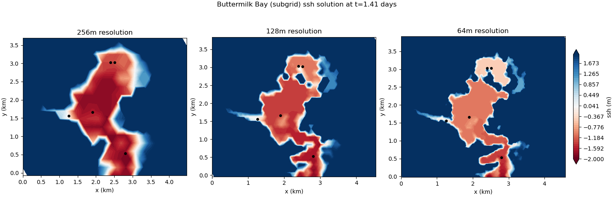
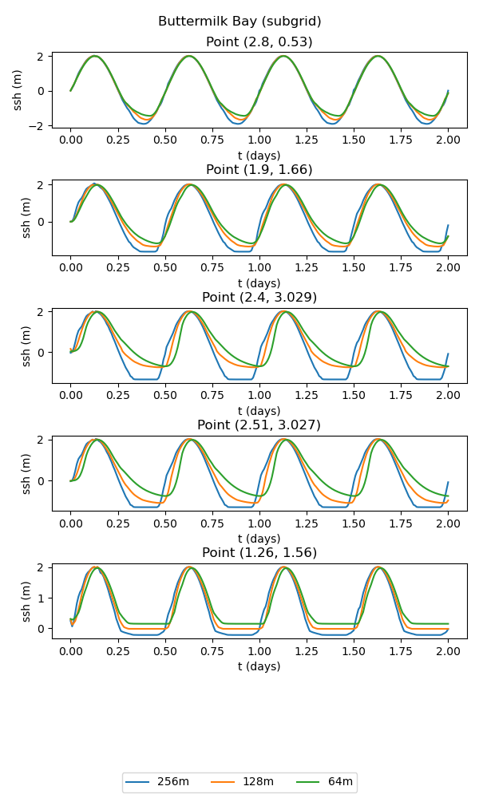

.. _ocean_buttermilk_bay:

buttermilk_bay
==============

The ``buttermilk_bay`` test group implements a realistic regional
simulation of tidally forced circulation in a multi-bay system 
connected by narrow channels. The computational domain is 
`Buttermilk Bay, Massachusetts <https://tinyurl.com/4zpz36ft>`_.

.. _ocean_buttermilk_bay_default:

default
-------

The ``default`` test case implements the Buttermilk Bay test case found in 
`Kennedy et al. (2019) <https://doi.org/10.1016/j.ocemod.2019.101491>`_.
The tidal forcing is applied to a portion of the bottom boundary with an
amplitude of 2 m and a period of 0.5 days. 

By default, the resolution is varied from  256 m to 64 m by doubling the resolution,
with the time step proportional to resolution.
The wetting/drying ramp feature (``config_zero_drying_velocity_ramp = .true.``)
is used by default for both the standard and subgrid versions of this test case. 
The result of the ``viz`` step of the test case is plots of the solution at 
different times, a time series at various points, and a convergence plot.

standard
~~~~~~~~
The standard version of the test case uses the standard wetting and drying
approach. At coarser resolutions, the bathymetric representation lacks
sufficient detail to resolve the connectivity between the upper and lower
bays. As a consequence, the results of the simulation are quite poor:

subgrid
~~~~~~~
The subgrid version of the test case includes a subgrid correction scheme
to incorporate the effects of subgrid scale bathymetric variations on 
the flow. This allows the small-scale connectivity between bays to be
represented, leading to significant improvements over the standard
wetting and drying approach:

config options
~~~~~~~~~~~~~~

The ``buttermilk_bay`` config options include:

.. code-block:: cfg

    # config options for buttermilk bay
    [buttermilk_bay]
    
    # dimensions of domain in x and y directions (m)
    Lx = 4608
    Ly = 4608
    
    # a list of resolutions (m) to test
    resolutions = 256, 128, 64
    
    # time step per resolution (s/m), since dt is proportional to resolution
    dt_per_m = 0.02
    
    # the number of cells per core to aim for
    goal_cells_per_core = 300
    
    # the approximate maximum number of cells per core (the test will fail if too
    # few cores are available)
    max_cells_per_core = 3000
    
    # config options for visualizing drying slope ouptut
    [buttermilk_bay_viz]
    
    # coordinates (in km) for timeseries plot
    points = [2.8, 0.53], [1.9, 1.66], [2.4, 3.029], [2.51, 3.027], [1.26, 1.56]
    
    # generate contour plots at a specified interval between output timesnaps
    plot_interval = 1 

resolutions
~~~~~~~~~~~

The default resolutions (in m) used in the test case are:

.. code-block:: cfg

    resolutions = 256, 128, 64

To alter the resolutions used in this test, you will need to create your own
config file (or add a ``buttermilk_bay`` section to a config file if you're
already using one).  The resolutions are a comma-separated list of the
resolution of the mesh in meters.  If you specify a different list
before setting up ``buttermilk_bay``, steps will be generated with the requested
resolutions.  (If you alter ``resolutions`` in the test case's config file in
the work directory, nothing will happen.) The resolution value along the values
of ``Lx`` and ``Ly`` are used to determine the number of cells in the x and y
directions used to generate the mesh.

time step
~~~~~~~~~

The time step for forward integration is determined by multiplying the
resolution by ``dt_per_m``, so that coarser meshes have longer time steps.
You can alter this before setup (in a user config file) or before running the
test case (in the config file in the work directory).

cores
~~~~~

The number of cores (and the minimum) is proportional to the number of cells,
so that the number of cells per core is roughly constant.  You can alter how
many cells are allocated to each core with ``goal_cells_per_core``.  You can
control the maximum number of cells that are allowed to be placed on a single
core (before the test case will fail) with ``max_cells_per_core``.  If there
aren't enough processors to handle the finest resolution, you will see that
the step (and therefore the test case) has failed.

viz
~~~

The visualization step can be configured to plot the timeseries for an 
arbitrary set of coordinates by setting ``points``. By default, these
are set to the locations used in Kennedy et al. 2019. Also, the interval
between contour plot time snaps can be controlled with ``plot_interval``.
