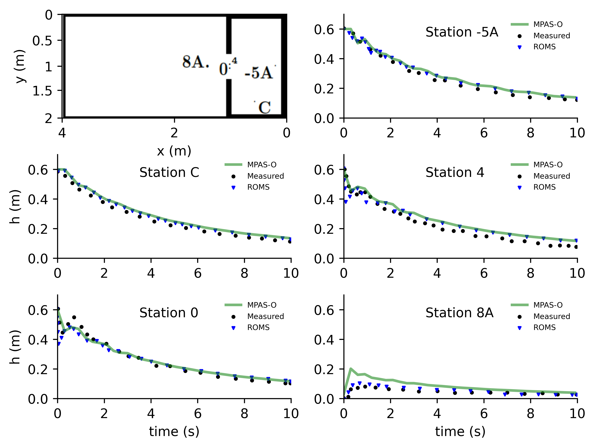

.. _ocean_dam_break:

dam_break
=============

The ``ocean/dam_break`` test group reproducs the dam break test case
from `Warner et al. (2013) <http://dx.doi.org/10.1016/j.cageo.2013.05.004>`_.

The domain is a rectangular box divided into a dammed region with sea surface
height of 0.6 m and a floodplain region with sea surface height equal to the
minimum layer thickness. By default, there are 3 vertical layers. Horizontal
resolutions of 40 cm and 120 cm are available.

The test group includes 1 test case.  The test case has 3 steps. The
``initial_state`` defines the mesh and initial conditions for the model. The
``forward`` step runs MPAS-Ocean in forward mode and allows water from the
dammed region to flow into the floodplain region. The ``viz`` step performs
visualization of the time evolution of SSH at a series of sites. These plots
are used to compare the MPAS-Ocean output with experimental data and the
solution from the ROMS model.

config options
--------------

The config options for this test case are:

.. code-block:: cfg

   # Options related to the vertical grid
   [vertical_grid]
   
   # Number of vertical levels # redundant with config_dam_break_vert_levels
   vert_levels = 3

default
-------

``ocean/dam_break/40cm/default`` is the default version of the dam break
test case for validation of sea surface height through visual inspection
against experimental data and ROMS solutions.
