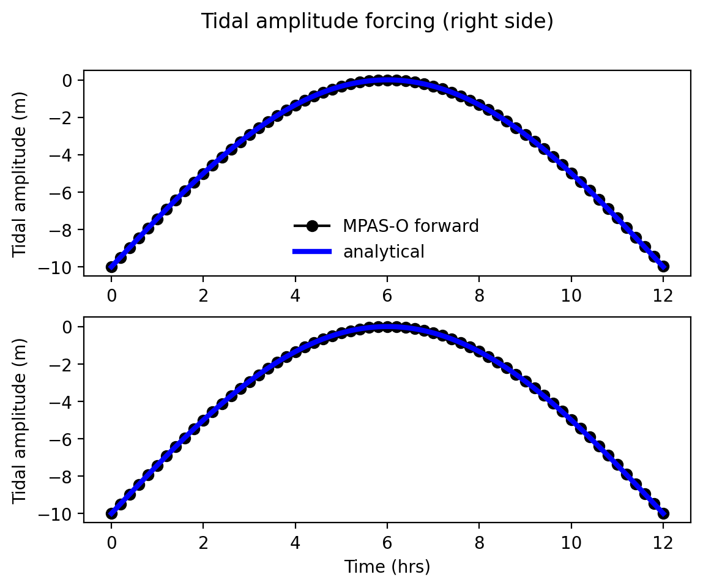

.. _ocean_drying_slope:

drying_slope
=============

The ``ocean/drying_slope`` test group reproducs the tidal channel flow test case
from `Warner et al. (2013) <http://dx.doi.org/10.1016/j.cageo.2013.05.004>`_
which was originally presented in
`Oey (2005) <https://doi.org/10.1016/j.ocemod.2004.06.002>`_.

The domain is 2-d with a channel sloping in the x-dimension and periodic in the
y-dimension. The channel length is set to 25 km and slopes with an aspect ratio
of 0.1. The channel width is 6km for all simulations. The channel is initialized
as dry with a minimum layer thickness. The water level at the seaward end is
oscillated sinusoidally with a period of 0.5 days as

.. math::
   \zeta_{east} = 10.0 \sin(\pi/0.5t) - 10.0

Temperature and salinity are constant throughout the domain with values of 20
degC and 35 PSU, respectively. Two different linear drag bottom roughness
factors of 0.0025 and 0.01 are applied in separate simulations.

By default, there are 10 vertical layers. The sigma vertical coordinate is
used. Horizontal resolution of 250m and 1 km are available.

The test group includes 1 test case.  The test case has 4 steps. The
``initial_state`` defines the mesh and initial conditions for the model. For
the ``sigma`` vertical coordiante, two ``forward`` steps are run, one for each
Rayleigh damping coefficient; for the ``single_layer`` case, one ``forward``
step is run at one value of the explicit bottom drag coefficient. The ``viz``
step performs visualization of the ssh field. For the ``sigma`` case, the
``viz`` step also produces a comparison plot with the analytical solution as
well as the solution from the ROMS model.

.. image:: images/drying_slope_validation.png
   :width: 500 px
   :align: center

config options
--------------

The config options for this test case are:

.. code-block:: cfg

   # Options related to the vertical grid
   [vertical_grid]
   
   # the type of vertical grid
   grid_type = uniform
   
   # Number of vertical levels
   bottom_depth = 10.
   
   # Number of vertical levels
   vert_levels = 10
   
   # Thickness of each layer in the thin film region
   thin_film_thickness = 1.0e-3
   
   # Whether to use "partial" or "full", or "None" to not alter the topography
   partial_cell_type = None
   
   # The minimum fraction of a layer for partial cells
   min_pc_fraction = 0.1
   
   # config options for drying slope test cases
   [drying_slope]
   
   # the number of grid cells in x
   nx = 6
   
   # Length over which wetting and drying actually occur
   Ly_analysis = 25.
   
   # Domain length
   Ly = 30.
   
   # Bottom depth at the right side of the domain
   right_bottom_depth = 10.
   
   # Bottom depth at the left side of the domain
   left_bottom_depth = 0.
   
   # Plug width as a fraction of the domain
   plug_width_frac = 0.0
   
   # Plug temperature
   plug_temperature = 20.0
   
   # Background temperature
   background_temperature = 20.0
   
   # Background salinity
   background_salinity = 35.0
   
   # Coriolis parameter
   coriolis_parameter = 0.0

   # time step in s per km of horizontal resolution
   dt_per_km = 30
   
   # Number of tasks at 1km resolution
   ntasks_baseline = 4
   
   # Minimum number of tasks
   min_tasks = 1
   
   # config options for visualizing drying slope ouptut
   [drying_slope_convergence]
   
   resolutions = 0.25, 0.5, 1, 2
   
   # config options for visualizing drying slope ouptut
   [drying_slope_viz]
   
   # whether to generate movie
   generate_movie = False
   
   # frames per second for movies
   frames_per_second = 30
   
   # movie format
   movie_format = mp4

All units are mks.

default
-------

``ocean/drying_slope/${COORD}/${METHOD}/${RES}/default`` is the default version
of the drying slope test case for two short (12h) test runs with two different
drag coefficients and validation of sea surface height through visual inspection
against analytic and ROMS solutions. ``RES`` is either 250m or 1km. ``COORD``
is either ``single_layer`` or ``sigma``. The wetting and drying ``METHOD`` is
either ``standard`` or ``ramp``. The ``ramp`` method ramps velocities and
velocity tendencies over a given layer thickness range rather than a binary
switch at the minimum thickness.

convergence
-----------

``ocean/drying_slope/${COORD}/${METHOD}/convergence`` is a convergence test in
horizontal resolution and time. It produces a convergence plot for the
resolutions specified in the config file. ``COORD`` is either ``single_layer``
or ``sigma``. The wetting and drying ``METHOD`` is either ``standard`` or
``ramp``. If the other of the two methods has already been run, its convergence
curve will be included in the plot.

decomp
------

``ocean/drying_slope/${RES}/${COORD}/decomp`` is identical to the default version
of the drying slope test case except it is run twice, on 1 processor and 12
processors and the results of each are compared. ``RES`` is either 250m or 1km.
``COORD`` is either ``single_layer`` or ``sigma``. The ``sigma`` case uses a
Rayleigh drag coefficient of 0.01. Rayleigh drag is not compatible with
``single_layer`` so implicit drag with a constant coefficient is used.

loglaw
------

``ocean/drying_slope/${RES}/${COORD}/loglaw`` is identical to the ``default``
test except that the log-law option for implicit bottom drag is used. ``RES``
is either 250m or 1km. ``COORD`` is either ``single_layer`` or ``sigma``.
