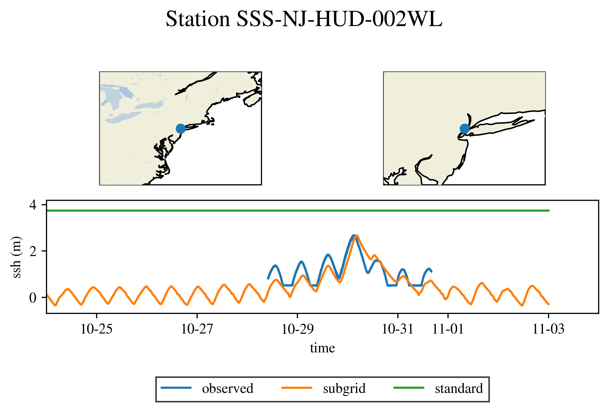
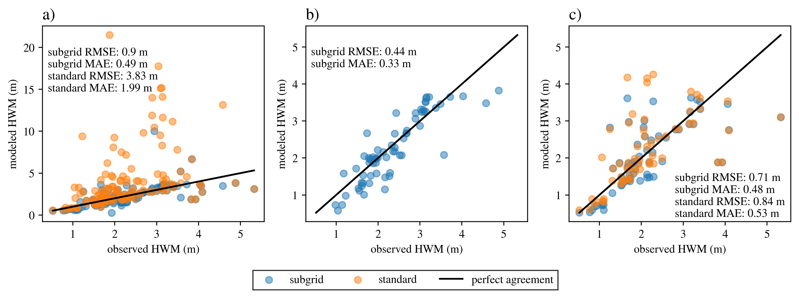
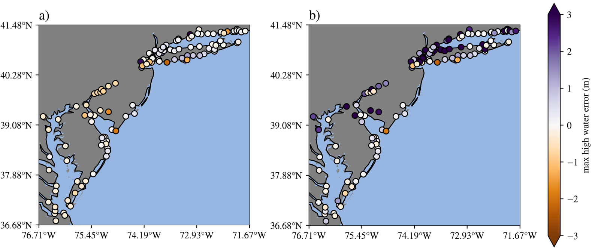

.. _ocean_hurricane:

hurricane
=========

The ``ocean/hurricane`` test group defines meshes,
initial conditions, forward simulations, and validation for global,
realistic ocean domains with regional refinement. These simulations
are forced with time-varying atmospheric reanalysis data for tropical
cyclone events and tides. The meshes contain refined regions in order
to resolve coastal estuaries, making it possible to simulate the
storm surge that results from a given hurricane event. Additionally, the
simulations use tidal potential forcing and MPAS-Ocean's wetting and drying
scheme to simulate coastal inundation. The forward simulations can optionally
be run with a subgrid-scale correction scheme that accounts for fine-scale
bathymetric variation in partially-wet cells, improving the flood prediction
accuracy. ``hurricane`` currently supports 3 meshes (DEQU120at30cr10rr2,
DEVR45to5rr1, RRS6to18) and one storm, Hurricane Sandy.

These tests are configured to use the barotropic, single layer configuration
of MPAS-Ocean. Each mesh is created to contain the floodplain, which is used to
simulate coastal inundation using the wetting and drying scheme.

The time stepping options to run the simulations include the fourth
order Runge-Kutta scheme (RK4), and two local time-stepping schemes.
The first LTS scheme is based on a strong stability preserving Runge-Kutta
scheme of order three and is called LTS3, see 
`Lilly et al. (2023) <https://doi.org/10.1029/2022MS003327>`_
for details.
The second LTS scheme is based on a forward-backward Runge-Kutta scheme
of order two and is called FB-LTS.
Each test case in the ``ocean/hurricane`` test group has a counterpart 
for each LTS scheme which is identified by appending the test case name
with ``_lts`` for LTS3 and ``_fblts`` for FB-LTS.

Shared config options
---------------------

All ``hurricane`` test cases start the following shared config options.
Note that meshes and test cases may modify these options, as noted below.

.. code-block:: cfg

    # options for spherical meshes
    [spherical_mesh]

    ## config options related to the step for culling land from the mesh
    # number of cores to use
    cull_mesh_cpus_per_task = 18
    # minimum of cores, below which the step fails
    cull_mesh_min_cpus_per_task = 1
    # maximum memory usage allowed (in MB)
    cull_mesh_max_memory = 1000

    # Elevation threshold to use for including land cells
    floodplain_elevation = 10.0
    # Resolution threshold to use for including land cells
    floodplain_resolution = 10.0
    # Floodplain region extent GEOJSON file
    floodplain_geojson = floodplain.geojson
    # Minimum depth to enforce outside floodplain region
    min_depth_outside_floodplain = 1.0

    # options for global ocean testcases
    [global_ocean]

    # The following options are detected from .gitconfig if not explicitly entered
    author = autodetect
    email = autodetect

    # options for hurricane testcases
    [hurricane]

    ## config options related to the initial_state step
    # number of MPI tasks to use
    init_ntasks = 512
    # minimum of MPI tasks, below which the step fails
    init_min_tasks = 512
    # maximum memory usage allowed (in MB)
    init_max_memory = 1000
    # number of threads
    init_threads = 1

    ## config options related to the forward steps
    # number of MPI tasks to use
    forward_ntasks = 1024
    # minimum of MPI tasks, below which the step fails
    forward_min_tasks = 1024
    # maximum memory usage allowed (in MB)
    forward_max_memory = 1000
    # number of threads
    forward_threads = 1

    [hurricane_analysis]

    # start and end dates for setting time period in timeseries plots
    plot_min_date = 2012 10 24 00 00
    plot_max_date = 2012 11 04 00 00

    # runs to include in analysis
    # others can be added as comma separated list in the format
    #   run_name:path/to/file,other_run:path/to/other/file
    #   - the name before the : is the label to be use in legend labels
    #   - the path after the : is the path to the pointwiseStats.nc file
    #     (not including file name)
    analysis_runs = MPAS-O:./

    plot_station_dems = False

.. _ocean_hurricane_meshes:

Meshes
------

The process for creating hurricane meshes is described below in the
mesh test case. ``hurricane`` currently supports 3 meshes, each with differing
levels of refinement. The coarsest mesh (DEQU120at30cr10rr2) uses a global
quasi-uniform horizontal resolution of 120 km with 30 km Atlantic refinement
and floodplain refinement down to 2 km, and is primarily for testing purposes.
The intermediate mesh (DEVR45to5rr1) uses a variable horizontal resolution of
45 km to 5 km scaled by bathymetry with floodplain refinement down to 1 km.
The finest mesh (RRS6to18) is reproduced from the ``global_ocean`` test group.
These meshes are designed to work with the barotropic, single layer
``hurricane`` configurations, and they do not include ice-shelf cavities.

.. _ocean_hurricane_mesh_dequ120at30cr10rr2:

DEQU120at30cr10rr2
^^^^^^^^^^^^^^^^^^
The quasi-uniform 120 km mesh with regional refinement (DEQU120at30cr10rr2)
uses the following resolutions: (1) global horizontal resolution of 120 km,
(2) 30 km refinement in the Atlantic Ocean, (3) 10 km refinement along the
Mid-Atlantic Bight, and (4) 2 km refinement along the coastal floodplain. The
floodplain is defined by a 10 m elevation threshold. This mesh is primarily for
testing purposes.

.. _ocean_hurricane_mesh_devr45to5rr1:

DEVR45to5rr1
^^^^^^^^^^^^
The variable-resolution 45 km to 5 km mesh with regional refinement
(DEVR45to5rr1) uses the following resolutions: (1) global horizontal resolution
ranging from 45 km over the deep ocean to 5 km over the shallow ocean, (2) 1 km
refinement along the Mid-Atlantic Bight and the coastal floodplain. The
floodplain is defined by a 40 m elevation threshold, and only where refinement
exceeds 4 km. This mesh is designed for predicting hurricane flooding along the
US East Coast, such as the flooding caused by hurricanes Sandy and Irene.

.. _ocean_hurricane_mesh_rrs6to18:

RRS6to18
^^^^^^^^
The RRS6to18 mesh is a high-resolution global mesh with Rossby-radius-scaling
of horizontal resolution from 18 km down to 6 km, designed for E3SMv3. This
mesh is reproduced here from the ``global_ocean`` test group. The ``hurricane``
version of this mesh includes a floodplain with an extent prescribed by a
GEOJSON region file. Additionally, the floodplain is constrained by a 20 m
elevation threshold, and only where refinement exceeds 16 km. The use of this
mesh for flooding simulations is experimental.

.. _ocean_hurricane_test_cases:

Test cases
----------

.. _ocean_hurricane_mesh:

mesh test case
^^^^^^^^^^^^^^
The mesh test case uses the ``mesh`` step from the ``global_ocean`` test group
to generate the global mesh based on a specified mesh resolution function.
Next, bathymetry/topography data is interpolated onto the mesh from the NASA
Shuttle Radar Topography Mission 15 arcsecond (STRM15+) data product. This
interpolation step is necessary, because the topography in the floodplain is
used to set a mask for the cell culling process. The land cells above the
``floodplain_elevation`` are then culled from the mesh. The floodplain can be
further constrained by a refinement threshold ``floodplain_resolution``, or a
region GEOJSON file ``floodplain_geojson``. Finally, the bathymetry is
re-interpolated onto the mesh since this data is not carried over from the
cell culling process.

.. _ocean_hurricane_mesh_lts:

If either LTS option is selected for the mesh test case, an additional step
is carried out after the mesh culling. This step appropriately flags 
the cells of the mesh according to a user defined criterion in order to
use time-steps of different sizes on different regions of the mesh.
The parallel partitioning is modified accordingly to achieve proper
load balancing.

.. _ocean_hurricane_init:

init test case
^^^^^^^^^^^^^^
The ``init`` test performs steps to set up the vertical mesh,
initial conditions, atmospheric forcing, and parameterized wave and bottom
drag, and prepares the station locations for timeseries output.

interpolate atmosphere forcing step
"""""""""""""""""""""""""""""""""""
The CFSv2 reanalysis wind vector components and atmospheric pressure fields
for the storm event are interpolated onto the horizontal mesh at hourly
intervals. These are read in and used to update the atmospheric forcing in the
forward run.

create pointstats file step
"""""""""""""""""""""""""""
In order to perform validation of the forward simulation, timeseries data
is recorded at mesh cell centers which are closest to observation stations.
This step reads in the observation station locations and finds the cells
closest to them. A file is created that is the input to the
``pointWiseStats`` analysis member for the forward run.

compute topographic wave drag step
""""""""""""""""""""""""""""""""""
The reciprocal of the e-folding time, ``r_inv``, from the HyCOM model,
is computed in this step. See 
`Buijsman et al. (2016) <https://doi.org/10.1175/JPO-D-15-0074.1>`_ 
for details on the computation. This coefficient is needed to account 
for the topographic wave drag tendency in the model.

initial state step
""""""""""""""""""
The initial state step runs MPAS-Ocean in init mode to create the initial
condition file for the forward run. The vertical mesh is setup for a
single layer case and the ssh with a thin layer on land for wetting and
drying cases.

.. _ocean_hurricane_init_subgrid:

If the ``subgrid`` option is selected, the Digital Elevation Model (DEM) and
Land Use/Land Cover (LULC) tiles are processed to create look-up tables for
the forward step corrections, and the DEM tiles are averaged to create the
coastal and floodplain topography.

.. _ocean_hurricane_init_lts:

If either LTS option is selected for the init test case, the modified
partitioning done in the mesh step is used to run MPAS-Ocean init mode.

.. _ocean_hurricane_sandy:

sandy test case
^^^^^^^^^^^^^^^
The sandy test case is responsible for the forward model simulation and
analysis.

forward step
""""""""""""
The forward step runs the model simulation of the storm. The simulation
begins with a spinup period, where the tides and atmospheric forcing
are ramped to their full value to avoid shocking the system.

.. _ocean_hurricane_sandy_subgrid:

If the ``subgrid`` option is selected, look-up tables are used to make the
DEM and LULC corrections in the forward mode.

.. _ocean_hurricane_sandy_lts:

If either LTS option is selected for the sandy test case, the LTS scheme
is used to advance the solution in time rather than the default RK4 scheme.

analysis step
"""""""""""""
The analysis step plots the timeseries data at each observation station
to compare the modeled and observed data. Both NOAA and USGS station data
are used for the validation.

