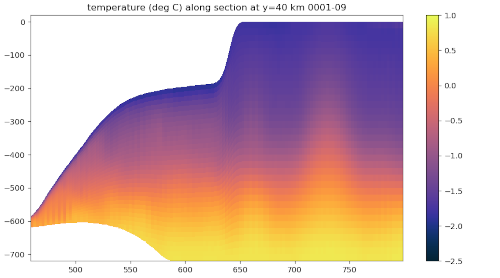

.. _ocean_isomip_plus:

isomip_plus
===========

The ``ocean/isomip_plus`` test group includes variants of the Ice Sheet-Ocean
Model Intercomparison Project, second phase (ISOMIP+) experiments from
`Asay-Davis et al. (2016) <https://doi.org/10.5194/gmd-9-2471-2016>`_.  These
experiments use `idealized ice-shelf geometry <https://doi.org/10.5880/PIK.2016.002>`_
from the Marine Ice SheetModel Intercomparison Project, third phase (MISMIP+;
see `Cornford et al. 2020 <https://doi.org/10.5194/tc-14-2283-2020>`_)
performed with the BISICLES ice-sheet model.

Currently, only the Ocean0 experiment is supported but the plan is to add the
Ocean1 and Ocean2 experiments in the next few months, and the Ocean3 and Ocean4
experiments at a later date, once MPAS-Ocean supports moving grounding lines.

By default, the test case is available at 2 km and 5 km horizontal resolution
with a z-star :ref:`dev_ocean_framework_vertical`.  The test case has 36
vertical layers, each of 20-m thickness outside of the ice-shelf cavity.

The initial temperature for the whole domain is constant (1 degree Celsius),
while salinity varies linearly with depth from 34.5 PSU at the sea surface
to 34.7 PSU at the sea floor, which is at a constant at 2000 m depth.  The
conceptual overlying ice shelf depresses the sea surface height buy as much as
1990 m (leaving a 10-m water column) for the first 30 km in y.  Over the next
30 km, it rises to 1490 m, then fairly abruptly to zero over the next 15 km,
where it remains for the second half of the domain.  The ice shelf occupies
these first 75 km of the domain: fluxes from ice-shelf melting are only applied
in this region.

   A cross section through the center (y = 40 km) of the ISOMIP+ Ocean0 test
   case at 5 km resolution, showing potential temperature averaged over month
   9 of the simulation.

The ``isomip_plus`` test cases are composed of 3 steps that run by default:
``initial_state``, which defines the mesh, interpolates the ice geometry, and
computes the initial conditions for the model; ``ssh_adjustment``, which
modifies the ``landIcePressure`` field to balance the ``ssh`` field, see
:ref:`ocean_ssh_adjustment`; and ``performance``, which performs a 1-hour time
integration of the model and compares the results with a baseline if one is
provided.

Four additional steps can optionally be run: ``simulation``, which performs
one month of simulation, then updates the "evaporative" fluxes used in the test
case to prevent sea level from rising significantly due to meltwater inflow at
the ice-shelf base; ``streamfunction``, which computes the barotropic
(vertically integrated) and overturning streamfunctions; ``viz``, which plots
time series and movies of various variables of interest; and ``misomip``, which
interpolates the results to the MISOMIP comparison grid.

shared config options
---------------------

The ``isomip_plus`` test cases share the following config options:

.. code-block:: cfg

    # Options related to the vertical grid
    [vertical_grid]

    # the type of vertical grid
    grid_type = uniform

    # Number of vertical levels
    vert_levels = 36

    # Depth of the bottom of the ocean
    bottom_depth = 720.0

    # The type of vertical coordinate (e.g. z-level, z-star)
    coord_type = z-star

    # Whether to use "partial" or "full", or "None" to not alter the topography
    partial_cell_type = None

    # The minimum fraction of a layer for partial cells
    min_pc_fraction = 0.1

    # Options relate to adjusting the sea-surface height or land-ice pressure
    # below ice shelves to they are dynamically consistent with one another
    [ssh_adjustment]

    # the number of iterations of ssh adjustment to perform
    iterations = 10

    # config options for ISOMIP+ test cases
    [isomip_plus]

    # number of cells over which to smooth topography
    topo_smoothing = 1.0

    # minimum thickness of the ice shelf, below which it is removed ("calved")
    min_ice_thickness = 100.0

    # a scalar by which the ice draft will be scaled (squashed).  This is
    # convenient for testing vertical coordinates
    draft_scaling = 1.0

    # Minimum number of vertical levels in a column
    minimum_levels = 3

    # Minimum thickness of the initial ocean column (to prevent 'drying')
    min_column_thickness = 10.0

    # Minimum fraction of a cell that contains ocean (as opposed to land or
    # grounded land ice) in order for it to be an active ocean cell.
    min_ocean_fraction = 0.5

    # Threshold used to determine how far from the ice-shelf the sea-surface height
    # can be adjusted to keep the Haney number under control
    min_smoothed_draft_mask = 0.01

    # Minimum fraction of a cell that contains land ice in order for it to be
    # considered a land-ice cell by MPAS-Ocean (landIceMask == 1).
    min_land_ice_fraction = 0.5

    # the initial temperature at the sea surface
    init_top_temp = -1.9
    # the initial temperature at the sea floor
    init_bot_temp = 1.0
    # the initial salinity at the sea surface
    init_top_sal = 33.8
    # the initial salinity at the sea floor
    init_bot_sal = 34.7

    # the restoring temperature at the sea surface
    restore_top_temp = -1.9
    # the restoring temperature at the sea floor
    restore_bot_temp = 1.0
    # the restoring salinity at the sea surface
    restore_top_sal = 33.8
    # the restoring salinity at the sea floor
    restore_bot_sal = 34.7

    # restoring rate (1/days) at the open-ocean boundary
    restore_rate = 10.0

    # the "evaporation" rate  (m/yr) near the open-ocean boundary used to keep sea
    # level from rising
    restore_evap_rate = 200.0

    # southern boundary of restoring region (m)
    restore_xmin = 790e3
    # northern boundary of restoring region (m)
    restore_xmax = 800e3

    # Coriolis parameter (1/s) for entire domain
    coriolis_parameter = -1.409e-4

    # initial value for the effective density (kg/m^3) of seawater for entire
    # domain
    effective_density = 1026.

    # config options for computing ISOMIP+ streamfunctions
    [isomip_plus_streamfunction]

    # the resolution of the overturning streamfunction in m
    osf_dx = 2e3
    osf_dz = 5.

    # config options for visualizing ISOMIP+ ouptut
    [isomip_plus_viz]

    # whether to plot the Haney number
    plot_haney = True

    # whether to plot the barotropic and overturning streamfunctions
    plot_streamfunctions = True

    # frames per second for movies
    frames_per_second = 30

    # movie format
    movie_format = mp4

    # the y value at which a cross-section is plotted (in m)
    section_y = 40e3

You can modify the horizontal mesh, vertical grid, geometry, and initial
temperature and salinity of the test case by altering these options.

Ocean0
------

``ocean/isomip_plus/2km/z-star/Ocean0`` and
``ocean/isomip_plus/5km/z-star/Ocean0``

This test case is initialized with "warm" ocean conditions: 1 degree C at the
sea floor, decreasing to -1.9 degrees C at the ocean surface.  These conditions
are approximately similar to those in the warmest waters on the Antarctic
continental shelf in the Amundsen and Bellingshausen Seas.  At the northern
boundary, the temperature is restored to the same warm profile, leading to a
vigorous circulation under the ice shelf that continually supplies heat and
produces relatively high melt rates.  Because of the rigorous flow, the
simulation reaches a quasi-steady state in 1-2 years.

Performance run
---------------

By default, ``isomip_plus`` test cases are configured for "performance" runs.
The initial condition is created, the the sea surface height and ice-shelf
pressure are adjusted to be in balance.  Then, a simulation is performed for
only 1 simulated hour (appropriate for regression testing).  Finally,
potential temperature and salinity are plotted at the top and bottom of the
ocean and along a cross section of through the middle (y = 40 km) of the
domain.

Simulation run
--------------

``isomip_plus`` test cases can be manually configured for longer simulation
runs.  First, do a performance run as described above (the default when you
just do ``compass run`` in the test case work directory).

Then, edit the config file in the work directory (e.g. ``Ocean0.cfg``) to set
``setup_to_run = simulation streamfunction viz`` in the ``[test_case]`` section
at the very top.  With this setting, one month of simulation will be performed,
then the streamfunctions will be computed based on the latest results in the
``streamfunction`` step and time series plots and movies will be updated in
the ``viz`` step.  You can manually keep running ``compass run`` in the test
case directory to run a month at a time, or you can create a job script to
run ``compass run`` repeatedly (say 240 times for a 20-year simulation) inside
a for-loop.