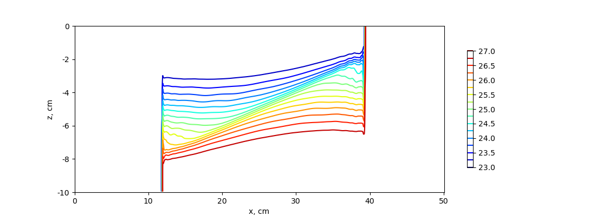
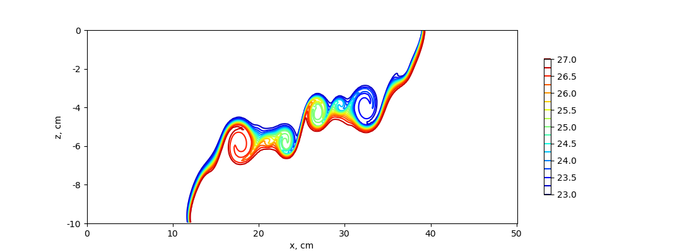

.. _ocean_lock_exchange:

lock_exchange
=============

The ``ocean/lock_exchange`` test group implements the test case from
`Huang, Hao, et al. (2023) <https://doi.org/10.5194/gmd-16-109-2023>`_
to describe a lock-exchange scenario in which two fluids with 
different densities are separated by a vertical board in a rectangular
tank. At time t=0, the central board is disengaged and the gravitational 
adjustment will proceed.

The domain is a rectangular tank periodic y with a horizontal length of 
50 cm and a static water height of 10 cm without the topographic change 
in the tank. The horizontal and vertical resolution are both 0.001 m.
Salinity is constant throughout the domain (at 35 PSU) and the initial
velocity in zero. The initial density is bimodal with the lower density
of 1023.05 kg m\ :sup:`-3` on the left side of the domain and the higher
density of 1026.95 kg m\ :sup:`-3` on the right side.
By default, the z-star vertical coordinate is used.

The test group includes two test cases. The first one uses the standard
hydrostaic model to obtain the density profile after 5s, whereas the
second test uses the nonhydrostatic model. All test cases have 3 steps:
``initial_state``, which defines the mesh and initial conditions for the model,
``forward``, which performs time integration of the model, and ``visualize``,
which plots the density profile obtained with the model (hydrostatic or
nonhydrostatic). Both test cases use the RK4 time-stepping scheme with a 
time-step of 0.001s.

config options
--------------

Both test cases share the same set of config options:

.. code-block:: cfg

    # config options for the horizontal grid
    [horizontal_grid]

    #Number of cells in the x-direction
    nx = 500

    #Number of cells in the y-direction
    ny = 4

    #Distance from two cell centers (m)
    dc = 0.001

    # Options related to the vertical grid
    [vertical_grid]

    #Depth of the bottom of the ocean (m)
    bottom_depth = 0.1

    #Number of vertical levels
    vert_levels = 100

    # the type of vertical grid
    grid_type = uniform

    # The type of vertical coordinate (e.g. z-level, z-star)
    coord_type = z-star

    # Whether to use "partial" or "full", or "None" to not alter the topography
    partial_cell_type = None

    # config options for the solitary wave testcase
    [lock_exchange]

    #Alpha in eos
    eos_linear_alpha = 0.2

    #Beta in eos
    eos_linear_beta = 0.8

    #Reference temperature (degC)
    eos_linear_Tref = 10.0

    #Reference salinity (PSU)
    eos_linear_Sref = 35.0

    #Reference density (kg m^{-3})
    eos_linear_densityref = 1000.0

    #Half of the domain (m)
    middle = 0.25

    #Lower density (kg m^{-3})
    lower_density = 1023.05

    #Higher density (kg m^{-3})
    higher_density = 1026.95

    # config options for the solitary wave testcase
    [visualize]

    #Reference length (m)
    L0 = 0.5

    #Reference height (m)
    a0 = 0.1

    #Time (s) at which plotting the variables
    plotTime = 5

hydro
-----

The hydrostatic test case uses the standard hydrostatic model
to run the lock-exchange test. The density plot shows that 
the density fronts cannot develop in the upper and lower layer.
This happens because of the hydrostatic assumption, which 
prevents the generation of the Kelvin-Helmholtz instability.

nonhydro
--------

The hydrostatic test case uses the nonhydrostatic model
to run the lock-exchange test. Compared to the hydrostatic 
formulation, an additional vertical momentum
equation is solved and to compute the contribution of the 
nonhydrostatic pressure a three-dimensional elliptic equation
is solved at every time-step. The density plot at t=5s
shows that the Kelvin-Helmholtz instability process develops 
rapidly in this configuration, causing vigorous turbulent 
mixing to develop on the interface between high and 
low-density water.

