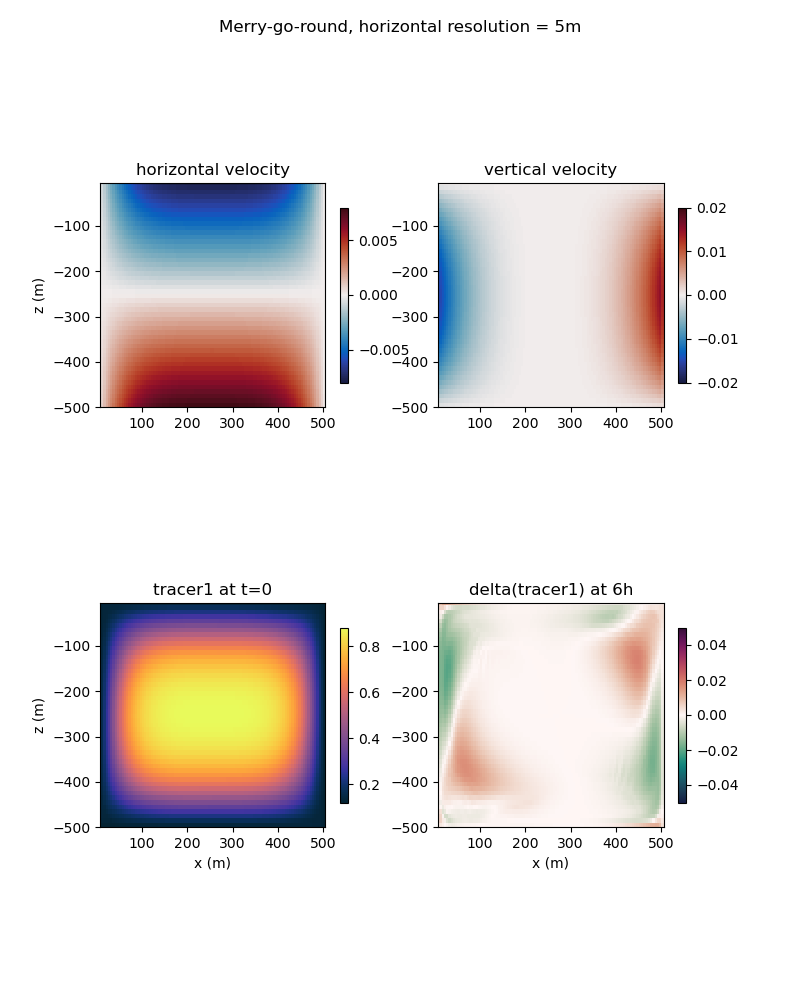

.. _ocean_merry_go_round:

merry_go_round
==============

The ``ocean/merry_go_round`` test group induces a convective cell in a horizontal domain to
determine the convergence of tracer advection with resolution (and time step).

The domain is solid on the zonal boundaries and perodic on the meridional boundaries.
Salinity is constant throughout the domain (at 35 PSU).  The initial temperature is high (at 30
degC) on the right side of the domain and low (at 5 degC) on the left side of the domain. This
field initiates a convective cell in the zonal and vertical dimensions. Debug tracer, tracer1,
is initialized with a high value in the center of domain and gradually transitions to a lower
value at the edges of the domain. Tracer concentration contours match the streamlines of the
convective cell such that an accurate tracer advection scheme would result in no change in the
tracer field in time.

The domain is 500 m in the zonal and vertical dimensions and 4 cells wide in the meridional
dimension. The default resolution is 5 m in the horizontal and 10 m in the vertical. For the
convergence test case, the horizontal and vertical resolutions are refined by a factor of 2 each.
The time step is 12 min for the default case, and refined by a factor of 2 for the convergence
test case.

The test group includes 2 test cases, the default test case and the convergence test case. 
Both test cases have an ``initial_state`` step, which defines the mesh and initial conditions
for the model, a ``forward`` step, which performs time integration of the model, and a ``viz``
step, which performs visualization of vertical cross-sections through the domain. The
convergence test case runs all three steps for three resolutions, 1.25 m, 2.5m, and 5 m. The
convergence test case also includes an ``analysis`` step which produces a convergence plot.

.. image:: images/merry-go-round_convergence.png
   :width: 500 px
   :align: center

config options
--------------

All 3 test cases share the same set of config options:

.. code-block:: cfg

    # Options related to the vertical grid
    [vertical_grid]
    
    # the type of vertical grid
    grid_type = uniform
    
    # Number of vertical levels
    vert_levels = 50
    
    # Depth of the bottom of the ocean
    bottom_depth = 500.0
    
    # The type of vertical coordinate (e.g. z-level, z-star)
    coord_type = z-level
    
    # Whether to use "partial" or "full", or "None" to not alter the topography
    partial_cell_type = None
    
    # The minimum fraction of a layer for partial cells
    min_pc_fraction = 0.1
    
    # config options for merry-go-round testcases
    [merry_go_round]
    
    # temperature on the right of the domain
    temperature_right = 30.
    
    # temperature on the left of the domain
    temperature_left = 5.
    
    # background salinity
    salinity_background = 35.
    
    # background tracer2 concentration
    tracer2_background = 10.
    
    # background tracer3 concentration
    tracer3_background = 20.

All units are mks, with temperature in degrees Celsius and salinity in PSU.

default
-------

``ocean/merry_go_round/default`` is the default version of the merry-go-round test case for a
short (6h) test run and validation of prognostic variables for regression testing.

convergence_test
----------------

``ocean/merry_go_round/convergence_test`` performs 6-hour integrations of the model forward in
time at 3 different resolutions (at 3 different time steps). Results of this test demonstrate
the convergence of the tracer advection scheme with diffusion and source terms turned off.
