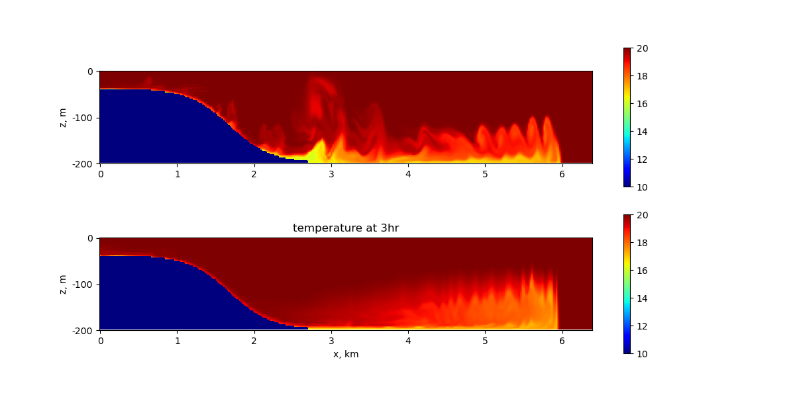

.. _ocean_overflow:

overflow
========

The ``ocean/overflow`` test group induces a density current flowing down a
continental slope and includes four test cases. 

The first two are based on 
`Petersen et al. 2015 <https://doi.org/10.1016/j.ocemod.2014.12.004>`_.
The domain is periodic on the zonal boundaries and solid on the meridional
boundaries. Salinity is constant throughout the domain (at 35 PSU).  The
initial temperature is bimodal with low temperature throughout the continental
shelf region of 10 deg C and high temperature over the slope and deep ocean of
20 deg C. This perturbation initiates slumping of the cold, denser water mass
and flow down the slope as a bottom boundary current.

.. image:: images/overflow.png
   :width: 500 px
   :align: center

By default, the sigma coordinate is used. There appears to be an
implementation error for other vertical coordinate options. For the default
test case, the horizontal resolution is 10 km. For the RPE test case, the
horizontal resolution is 2 km.

Test cases three and four have a different setup (mesh and initial conditions) 
based on the MITgcm test available at
`https://mitgcm.readthedocs.io/en/latest/examples/plume_on_slope/plume_on_slope.html`.
The domain is 200m deep and 6.4km across, with an horizontal resolution of 20m and 
60 layers in the vertical. The initial temperature is again bimodal with low 
temperature throughout the continental shelf region of 10 deg C and high temperature 
over the slope and deep ocean of 20 deg C. By default, the z-star coordinate system 
is used. The ``nonhydro`` test uses the nonhydrostatic formulation and has a run duration
of 30min. The ``hydro_vs_nonhydro`` test compares the solutions obtained with the 
hydrostatic and nonhydrostatic model after 3h.

All test cases have two steps, ``initial_state``, which defines the mesh and initial 
conditions for the model, and ``forward``, which performs time integration of the model. 
For the RPE test, there is an additional ``analysis`` step which computes the RPE through
time in relation to the initial RPE and visualizes vertical cross-sections
through the center of the domain. For the ``hydro_vs_nonhydro`` test, there is an additional 
``visualization`` step that plots the temperature profiles obtained with the 
hydrostatic and nonhydrostatic model after 3h.

config options
--------------

The ``default`` and ``rpe_test`` test cases share this set of config options:

.. code-block:: cfg

    # Options related to the overflow case
    [overflow]
    
    # The width of the domain in the across-slope dimension (km)
    width = 40
    
    # The length of the domain in the along-slope dimension (km)
    length = 200

    # Viscosity values to test for rpe test case
    viscosities = 1, 5, 10, 100, 1000

The ``nonhydro`` and ``hydro_vs_nonhydro`` tests share different config options:

.. code-block:: cfg

   # config options for the horizontal grid
   [horizontal_grid]

   #Number of cells in the x-direction
   nx = 320

   #Number of cells in the y-direction
   ny = 4

   #Distance from two cell centers
   dc = 20.0

   # Options related to the vertical grid
   [vertical_grid]

   #Depth of the bottom of the ocean
   bottom_depth = 200.0

   #Number of vertical levels
   vert_levels = 60

   # the type of vertical grid
   grid_type = uniform

   # The type of vertical coordinate (e.g. z-level, z-star)
   coord_type = z-star

   # Whether to use "partial" or "full", or "None" to not alter the topography
   partial_cell_type = None

   # config options for the solitary wave testcase
   [hydro_vs_nonhydro]

   #Lateral position of the shelf-break
   xs = 4700.0

   #Length-scale of the slope
   Ls = 533.3333

   #Beta in eos
   eos_linear_beta = 0.8

   #Reference salinity
   eos_linear_Sref = 35.0

   #Reference density
   eos_linear_densityref = 1000.0

   #Density variation per layer
   rhoz = -2.0e-4

   #Lower temperature
   lower_temperature = 10.0

   #Higher temperature
   higher_temperature = 20.0

   # config options for the solitary wave testcase
   [visualize]

   #Time at which plotting the variables
   plotTime = 6

default
-------

``ocean/overflow/default`` is the default version of the
overflow test case for a short (12 min) test run and validation of
prognostic variables for regression testing.

rpe_test
--------

Since mixing is a strong function of horizontal viscosity, this test case
``ocean/overflow/rpe_test`` performs 40-hour integrations of the model forward
in time at 5 different values of the viscosity (with steps named
``rpe_test_1_nu_1``, ``rpe_test_2_nu_5``, etc.). Results of these tests have
been used to evaluate spurious dissipation in relation to different models and
vertical grid choices
(`Petersen et al. 2015 <https://doi.org/10.1016/j.ocemod.2014.12.004>`_).

nonhydro
--------

``ocean/overflow/nonhydro`` uses the nonhydrostatic formulation. After the mesh and
initial conditions are generated, the nonhydrostatic model is run for 30min using
the RK4 time-stepping scheme with a time-step of 0.5s.

hydro_vs_nonhydro
-----------------

``ocean/overflow/hydro_vs_nonhydro`` compares the solutions obtained with 
the hydrostatic and nonhydrostatic model. After the creation of the mesh 
and initial conditions, an hydrostatic and a nonhydrostatic simulation 
are run using the RK4 time-stepping scheme with a time-step of 0.5s.
The temperature profile at 3h is plotted for the hydrostatic
and nonhydrostatic case. The plot shows that a Kelvin-Helmholtz instability
develops in the nonhydrostatic case, leading to entrainment of
ambient fluid into plumes, whereas the hydrostatic model fails to
capture the correct physics.

