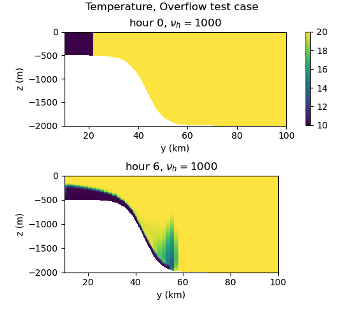

.. _ocean_overflow:

overflow
========

The ``ocean/overflow`` test group induces a density current flowing down a
continental slope and is documented in 
`Petersen et al. 2015 <https://doi.org/10.1016/j.ocemod.2014.12.004>`_.

The domain is periodic on the zonal boundaries and solid on the meridional
boundaries. Salinity is constant throughout the domain (at 35 PSU).  The
initial temperature is bimodal with low temperature throughout the continental
shelf region of 10 deg C and high temperature over the slope and deep ocean of
20 deg C. This perturbation initiates slumping of the cold, denser water mass
and flow down the slope as a bottom boundary current.

By default, the sigma coordinate is used. There appears to be an
implementation error for other vertical coordinate options. For the default
test case, the horizontal resolution is 10 km. For the RPE test case, the
horizontal resolution is 2 km.

The test group includes 2 test cases.  All test cases have 2 steps,
``initial_state``, which defines the mesh and initial conditions for the model,
and ``forward``, which performs time integration of the model. For the RPE
test, there is an additional ``analysis`` step which computes the RPE through
time in relation to the initial RPE and visualizes vertical cross-sections
through the center of the domain.

config options
--------------

All 3 test cases share the same set of config options:

.. code-block:: cfg

    # Options related to the overflow case
    [overflow]
    
    # The width of the domain in the across-slope dimension (km)
    width = 40
    
    # The length of the domain in the along-slope dimension (km)
    length = 200

    # Viscosity values to test for rpe test case
    viscosities = 1, 5, 10, 100, 1000

default
-------

``ocean/overflow/default`` is the default version of the
overflow test case for a short (12 min) test run and validation of
prognostic variables for regression testing.

rpe_test
--------

Since mixing is a strong function of horizontal viscosity, this test case
``ocean/overflow/rpe_test`` performs 40-hour integrations of the model forward
in time at 5 different values of the viscosity (with steps named
``rpe_test_1_nu_1``, ``rpe_test_2_nu_5``, etc.). Results of these tests have
been used to evaluate spurious dissipation in relation to different models and
vertical grid choices
(`Petersen et al. 2015 <https://doi.org/10.1016/j.ocemod.2014.12.004>`_).
