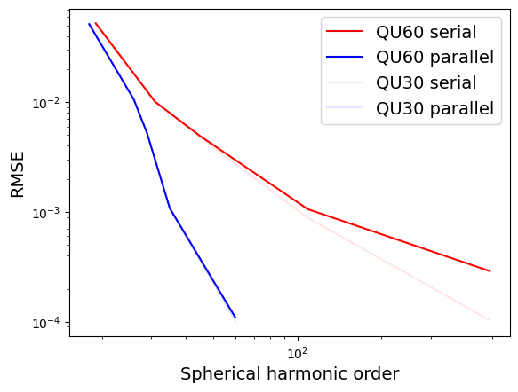
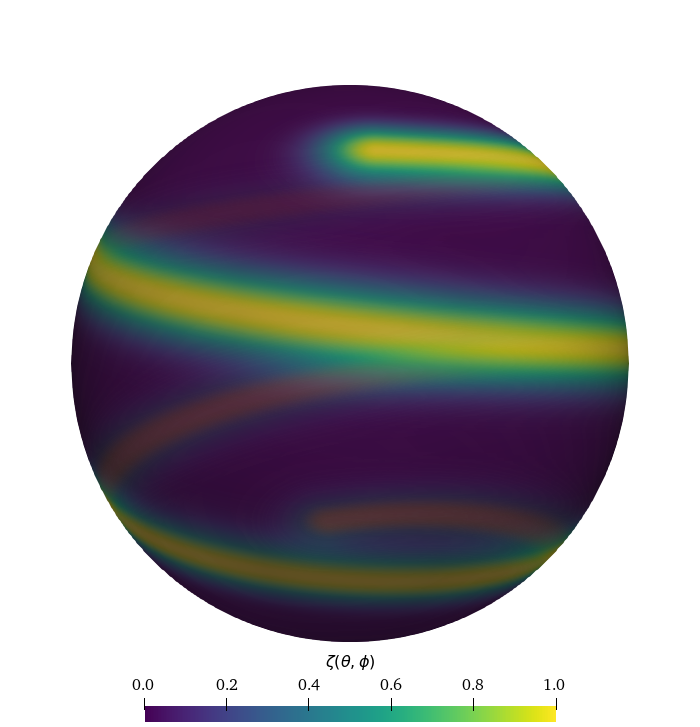

.. _ocean_spherical_harmonic_transform:

spherical_harmonic_transform
============================

The ``spherical_harmonic_transform`` test group implements test cases
for the spherical harmonic transformation implementations in 
MPAS-Ocean. These tests involve computing the forward and inverse spherical 
harmonic transform of a certain order for an analytical function.
The truncation errors for each order are compared with the analytical 
function.

For ocean simulations, the spherical harmonic transformation capability
is used to compute the self attraction and loading forcing for tides.

Two different implementations are used in this test group:

- The first is a "serial" algorithm which involves an interpolation
  from the MPAS mesh to a Guassian grid and  then uses a fast shperical
  harmonic library, SHTns, to compute the forward and inverse 
  transformations. The approximate function is then interpolated back 
  to the MPAS mesh.
  Since the SHTns library dosen't use distributed memory parallelism,
  the function values are first gathered onto a single MPI rank that
  is responsible for the interpolation and forward and inverse 
  transformations. Finally, a scatter is performed to return the local
  approximate function values to each core.
- The second implimentation is a "parallel" algoritm which does not use
  a fast library, but instead computes the spherical harmonic transform
  directly on the unstructured mesh using an MPI All_Reduce.

In order for this test case to run properly for the "serial" algorithm,
MPAS-Ocean must be compiled with the ``USE_SHTNS=true`` and 
``OPENMP=false`` options. 

The test group includes 1 test case with 3 steps:

- ``mesh`` creates a quasi uniform MPAS mesh on the sphere
- ``init`` runs MPAS-Ocean init mode to compute the shperical harmonic
  transformations                
- ``analysis`` reads the error values from the MPAS log files and 
  generates a convergence plot which will look like the image below:

.. _ocean_spherical_harmonic_transform_qu_convergence:

qu_convergence
--------------

The ``qu_convergence`` test case uses quasi-uniform meshes and an analyitical 
function that is a sprial:

config options
~~~~~~~~~~~~~~

Here, we give config options for the ``qu_convergence`` test case.

.. code-block:: cfg

  # options for the QU mesh convergence test case for spherical harmonic transforms
  [qu_convergence]
  
  # a list of resolutions to test
  resolutions = 60, 30
  
  # a list of spherical harmoic orders to test for the parallel algorithm
  parallel_N = 18, 26, 29, 35, 60
  
  # a list of Gaussian grid resolutions (number of latitudes) for the serial algorithm
  serial_nLat = 40, 64, 92, 220, 980

resolutions
~~~~~~~~~~~

To alter the resolutions used in this test, you will need to create your own
config file (or add a ``qu_convergence`` section to a config file if you're
already using one).  The resolutions are a comma-separated list of the
quasi-uniform resolution of the mesh in km.  If you specify a different list
before setting up ``qu_convergence``, steps will be generated with the requested
resolutions.  (If you alter ``resolutions`` in the test case's config file in
the work directory, nothing will happen.)

parallel_N
~~~~~~~~~~

For each resolution, the spherial harmonic orders for the parallel algorithm
are specified as a comma separated list for the ``parallel_N`` option.
You can alter this before setup (in a user config file)
or before running the test case (in the config file in the work directory).

serial_nLat
~~~~~~~~~~~

For each resolution, the number of latitudes in the Gaussian grid for
the serial algorithm are specified as a comma separated list for the
``serial_nLat`` option.  This is related to the spherical harmonic order 
by: N = nLat/2 - 1. You can alter this before setup (in a user config file)
or before running the test case (in the config file in the work directory).

