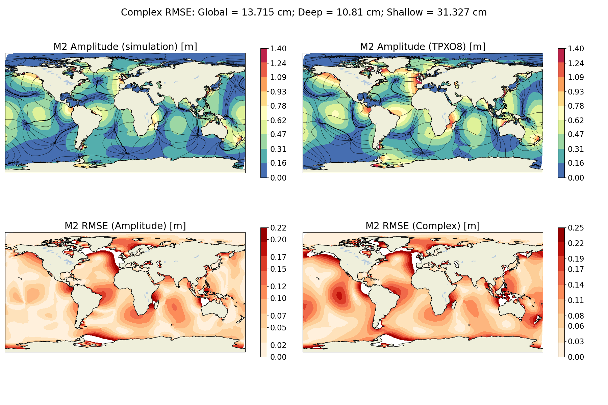
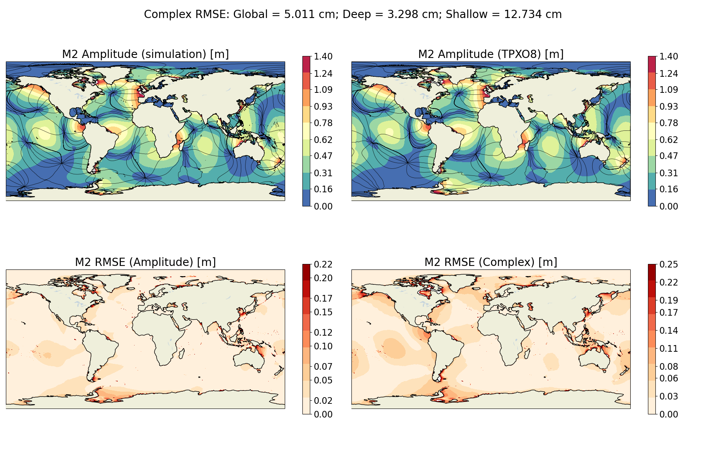

.. _ocean_tides:

tides
=====

The ``ocean/tides`` test group defines meshes,
initial conditions, forward simulations, and validation for global,
realistic ocean domains. These are single layer, barotropic simulations
forced with tidal potential. Self-attraction and loading effects are included
as well as a parameterization for topographic wave drag.
Currently the `Zarron and Egbert (2006) <https://doi.org/10.1175/JPO2878.1>`_
wave drag parameterization is the default option. But MPAS-Ocean also supports
the `local generation formula <https://doi.org/10.5194/gmd-14-1125-2021>`_ and
`Jayne and St.Laurent (2001) <https://doi.org/10.1029/2000GL012044>`_.
Wetting and drying is turned on in these configurations to prevent minimum
depth issues.
The tidal solution is decomposed into harmonic constituents during the 
simulation and are compared with the TPXO database.
Currently, the icosaheral 7 and vr45to5 meshes are supported with
more mesh resolutions to be added in the future.

Shared config options
---------------------

All ``tides`` test cases start the following shared config options.
Note that meshes and test cases may modify these options, as noted below.

.. code-block:: cfg

    # options for spherical meshes
    [spherical_mesh]
    
    ## config options related to the step for culling land from the mesh
    # number of cores to use
    cull_mesh_cpus_per_task = 18
    # minimum of cores, below which the step fails
    cull_mesh_min_cpus_per_task = 1 
    # maximum memory usage allowed (in MB)
    cull_mesh_max_memory = 1000
    
    # for icosahedral meshes, whether to use cell_width to determine the number of
    # subdivisions or to use subdivisions directly
    icosahedral_method = subdivisions
    
    
    # options for global ocean testcases
    [global_ocean]
    
    # The following options are detected from .gitconfig if not explicitly entered
    author = autodetect
    email = autodetect
    
    [vertical_grid]
    
    grid_type = uniform
    vert_levels = 1 
    bottom_depth = 6000
    
    
    # options for tides testcases
    [tides]
    
    ## config options related to the initial_state step
    # number of cores to use
    init_cores = 36
    # minimum of cores, below which the step fails
    init_min_cores = 8 
    # maximum memory usage allowed (in MB)
    init_max_memory = 1000
    # number of threads
    init_threads = 1 
    
    ## config options related to the forward steps
    # number of cores to use
    forward_ntasks = 180
    # minimum of cores, below which the step fails
    forward_min_tasks = 160
    # maximum memory usage allowed (in MB)
    forward_max_memory = 1000
    # number of threads
    forward_threads = 1 
    
    # TPXO version for validation 
    tpxo_version = TPXO9

.. _tides_mesh:

mesh test case
--------------
The mesh test case produces the horizontal mesh. The base mesh has global coverage
and is culled to remove land cells. Cells beneath ice shelves are retained in the mesh.

Icos7
^^^^^
This mesh is an Icosahedral mesh with 7 refienemnt steps, resulting in a globally uniform
resolution of about 60km. This mesh is meant for efficient testing of tidal physics and
does not produce very accurate global tides (Deep RMSE M2 ~11cm).

VR45to5
^^^^^^^
This is a variable resolution mesh that ranges between 45km to 5km
at the coasts. It uses refiniment criteria based on depth and bathymetric slope.
More details can be found in `Barton et al. (2022) <https://doi.org/10.1029/2022MS003207>`_.
This mesh achieves a more accurate tidal result competitive with other non-data assimilative
models (Deep RMSE M2 ~3.3cm).

.. _tides_init:

init test case
--------------
The init test performs steps to set up the vertical mesh, initial conditions,
atmospheric forcing, and prepares the station locations for timeseries output.

remap bathymetry step
^^^^^^^^^^^^^^^^^^^^^
This step performs an integral remap of bathymetric data onto the MPAS-O mesh

calculate wave drag step
^^^^^^^^^^^^^^^^^^^^^^^^^^
In this step, a several values are calculated and interpolated onto
the MPAS-O mesh to be used in the topographic wave drag parameterization.
The climatological depth-averaged and bottom bouancy frequency values are
interpolated from WOA are interpolated onto the MPAS mesh. The bathymetric
gradients are also computed along with the standard deviaion of the subgrid
bathymetry.

initial state step
^^^^^^^^^^^^^^^^^^
The initial state step runs MPAS-Ocean in init mode to create the initial
condition file for the forward run. The vertical mesh is setup for a
single layer. This step also computes the adjusted sea surface height,
accounting for land ice pressure.

.. _tides_forward:

forward test case
-----------------
The forward test case is responsible for the forward model simulation and
analysis.

forward step
^^^^^^^^^^^^
The forward step runs a 125 day model simulation. The simulation
begins with a spinup period, where the tides 
are ramped to their full value to avoid shocking the system.
The harmonic analysis period begins following this spinup period.

analysis step
^^^^^^^^^^^^^
The analysis step extracts the harmonic constituent amplitude and phase values
at each cell center from the TPXO database. The TPXO values are used to compute
global, shallow, and deep RMS errors. The global MPAS-O and TPXO solutions are 
plotted along with the spatial error fields. Below is an example of the type 
of plots produced for the 5 major constituents.

For the Icos7 mesh:

And for the VR45to5 case:

