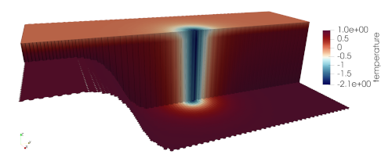

.. _ocean_ziso:

ziso
====

The ``ocean/ziso`` test group implements variants of the Zonally Idealized
Southern Ocean (ZISO) test case from
`Ringler et al. (2016) <https://doi.org/10.1175/JPO-D-16-0096.1>`_.  From that
paper:

    The test case is zonally uniform with respect to all boundary conditions
    and forcing. The 1000 km spanned in the zonal direction :math:`L_x` is
    periodic, and the 2000 km spanned in the meridional direction :math:`L_y`
    is bounded by walls with a no-slip boundary condition.

    The bathymetry :math:`h(y)` is specified as:

    .. math::

        h(y) = H_s + \frac{1}{2}(H - H_s)\left[1 +
               \mathrm{tanh}\left( \frac{y - Y_s}{W_s}\right)\right],

    where :math:`H = 2500` m is the maximum depth, :math:`H_s = 500` m is the
    shelf depth, :math:`Y_s = 250` km is the center y position of the shelf,
    and :math:`W_s = 500` km is the center y position of the shelf break.

See that paper for more details on the test case.

The implementation of ``ziso`` in ``compass`` includes two test cases,
``default`` and ``with_frazil``.  Both test cases have 2 steps,
``initial_state``, which defines the mesh and initial conditions for the model,
and ``forward``, which performs time integration of the model.

Currently, the only version of the test case is at 20-km horizontal resolution,
but versions of the test case at finer horizontal resolution are expected to
be ported form :ref:`legacy_compass` in the coming months.

shared config options
---------------------

Both ``ziso`` test cases share the following config options:

.. code-block:: cfg

    # Options related to the vertical grid
    [vertical_grid]

    # the type of vertical grid
    grid_type = 100layerE3SMv1

    # Depth of the bottom of the ocean
    bottom_depth = 2500.0

    # The type of vertical coordinate (e.g. z-level, z-star)
    coord_type = z-star

    # Whether to use "partial" or "full", or "None" to not alter the topography
    partial_cell_type = full

    # The minimum fraction of a layer for partial cells
    min_pc_fraction = 0.1

    # config options for Zonally periodic Idealized Southern Ocean (ZISO)
    # testcases
    [ziso]

    # meridional position where wind stress switches to easterly
    wind_transition_position = 800000.0

    # meridional extent over which the easterly wind stress is applied"
    antarctic_shelf_front_width = 600000

    # Maximum zonal wind stress value in the shelf front region, following Stewart
    # et al. (2013)
    wind_stress_shelf_front_max = -0.05

    # Meridional extent of the domain
    meridional_extent = 2.0e6

    # Shelf depth in the domain
    shelf_depth = 500.0

    # Shelf half width
    slope_half_width = 1.0e5

    # Slope center position
    slope_center_position = 5.0e5

    # Reference coriolis parameter
    reference_coriolis = -1e-4

    # Meridional gradient of coriolis parameter
    coriolis_gradient = 1e-11

    # Maximum zonal wind stress value
    wind_stress_max = 0.2

    # Mean restoring temperature
    mean_restoring_temp = 3.0

    # Tanh coefficient in restoring temperature
    restoring_temp_dev_ta = 2.0

    # Linear coefficient in restoring temperature
    restoring_temp_dev_tb = 2.0

    # Time scale for interior restoring of temperature
    restoring_temp_tau = 30.0

    # Restoring piston velocity for surface temperature
    restoring_temp_piston_vel = 1.93e-5

    # Vertical e-folding scale in restoring temperature for northern wall
    restoring_temp_ze = 1250.0

    # E-folding distance parameter for the sponge vertical temperature profile
    restoring_sponge_l = 8.0e4

    # Initial temperature profile constant
    initial_temp_t1 = 6.0

    # Initial temperature profile tanh coefficient
    initial_temp_t2 = 3.6

    # Initial temperature profile tanh length scale
    initial_temp_h1 = 300.0

    # Initial temperature profile linear coefficient
    initial_temp_mt = 7.5e-5

    # Temperature anomaly to produce frazil
    frazil_temperature_anomaly = -3.0

They use a vertical coordinate that has 100, non-uniform layers distributed
in the functional form given by the ``100layerE3SMv1`` grid type (with much
higher vertical resolution at the surface than at depth) but renormalized so
that the maximum depth is 2500 m.

The parameters can be altered to change the domain geometry or the initial
condition.

default
-------

``ocean/ziso/20km/default`` is the default version of the ZISO
test case from `Ringler et al. (2016) <https://doi.org/10.1175/JPO-D-16-0096.1>`_.
The ``default`` test case also includes particles from the Lagrangian, in Situ,
Global, High-Performance Particle Tracking (LIGHT;
`Wolfram et al. 2015 <https://doi.org/10.1175/JPO-D-14-0260.1>`_) framework.

The initial salinity is constant at 34 PSU and the initial temperature is warm
at the surface and cooler at depth:

.. image:: images/ziso.png
   :width: 500 px
   :align: center

The test case includes a very short (3 time step) test run and validation of
prognostic and particle-relate variables for regression testing.

long
----

Results in Ringler et al. (2016) are shown from longer simulations.  The
``ocean/ziso/<resolution>/long`` test cases provide a variant on these original
simulations. As in the ``default`` test, this test not include particle
dynamics. Unlike ``default``, this test case is configured for a longer
simulation (10 day) that demonstrates how to use the configuration might be
used for for scientific work.

particles
---------

These ZISO test cases include particles from the Lagrangian, In situ, Global,
High-Performance Particle Tracking (LIGHT) framework for regression testing.
Otherwise, the ``particles`` tests are identical to ``default``.
Particle-relate variables are also included in the test-case validation.

with_frazil
-----------

``ocean/ziso/20km/with_frazil`` uses an different initial
temperature field that is cold enough to produce frazil ice:

The config options that control this initial state are:

.. code-block:: cfg

    # namelist options for Zonally periodic Idealized Southern Ocean (ZISO)
    # testcases
    [ziso]

    # Initial temperature profile constant
    initial_temp_t1 = 0.0

    # Initial temperature profile tanh coefficient
    initial_temp_t2 = -1.0

    # Initial temperature profile tanh length scale
    initial_temp_h1 = 300.0

    # Initial temperature profile linear coefficient
    initial_temp_mt = 0.0

MPAS-Ocean's capability for producing frazil ice is enabled in this test case,
whereas this test case does not include lagrangian particles from LIGHT.

The test case includes a very short (1 min 30 sec) test run, the results of
which are used to check prognostic and frazil-related variables during
regression testing.
